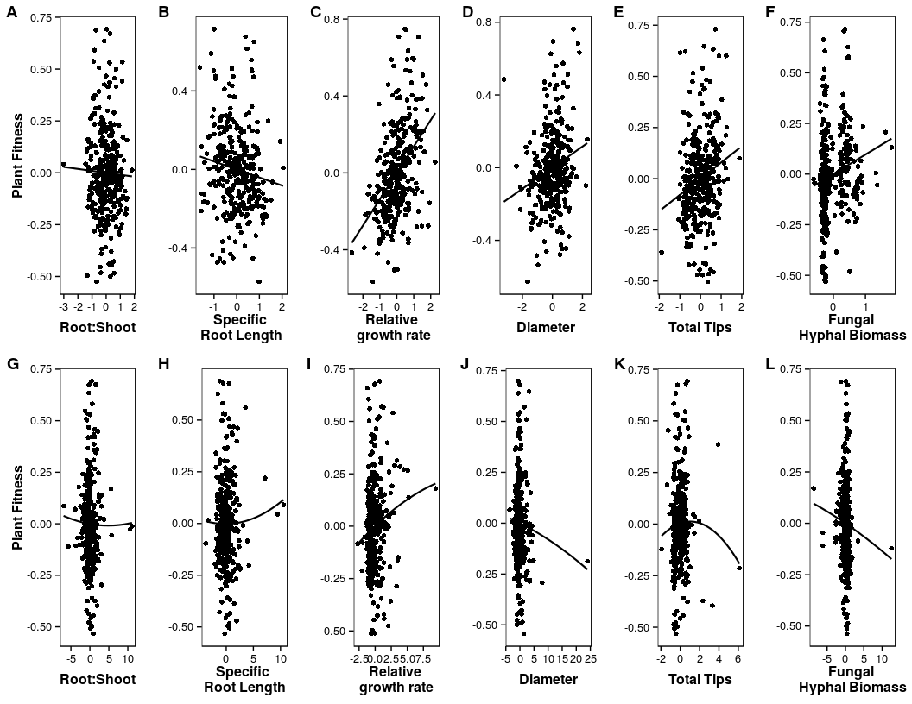
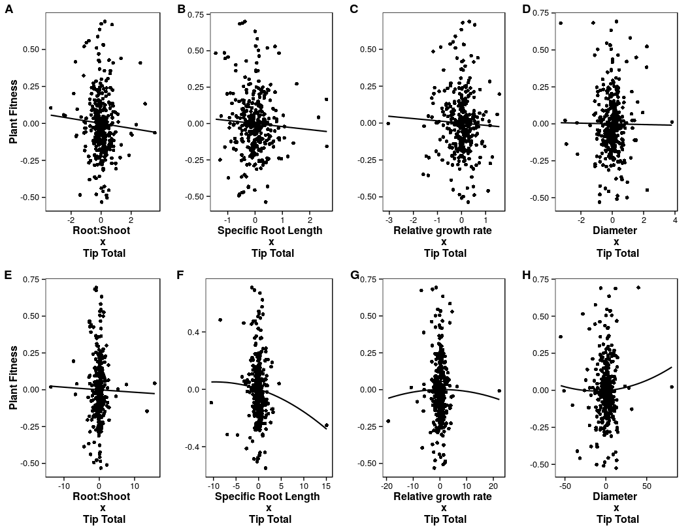
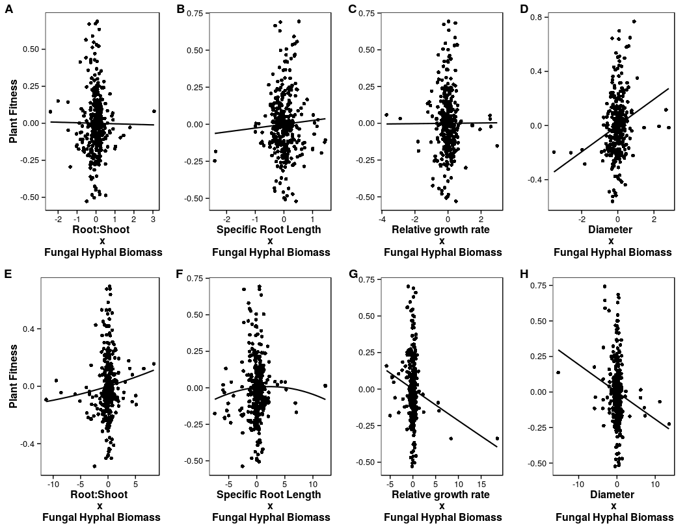
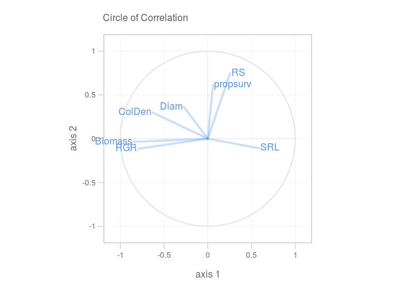
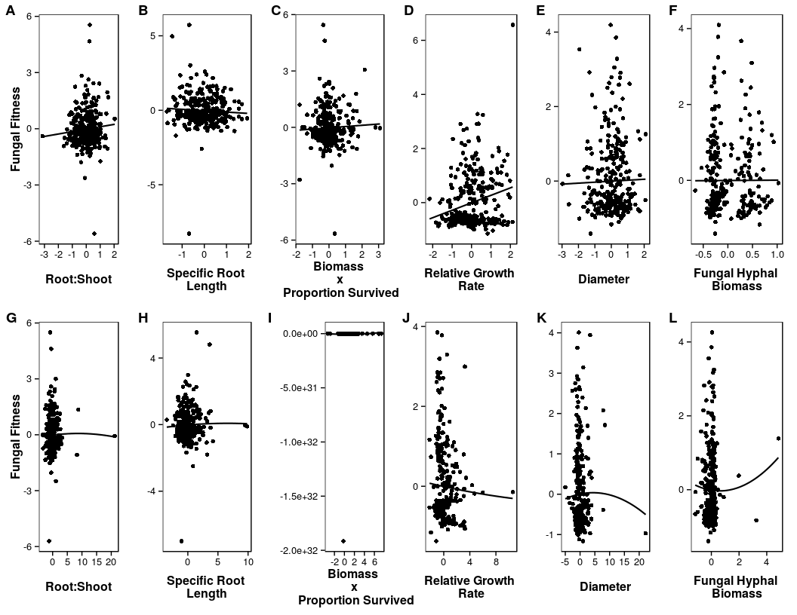
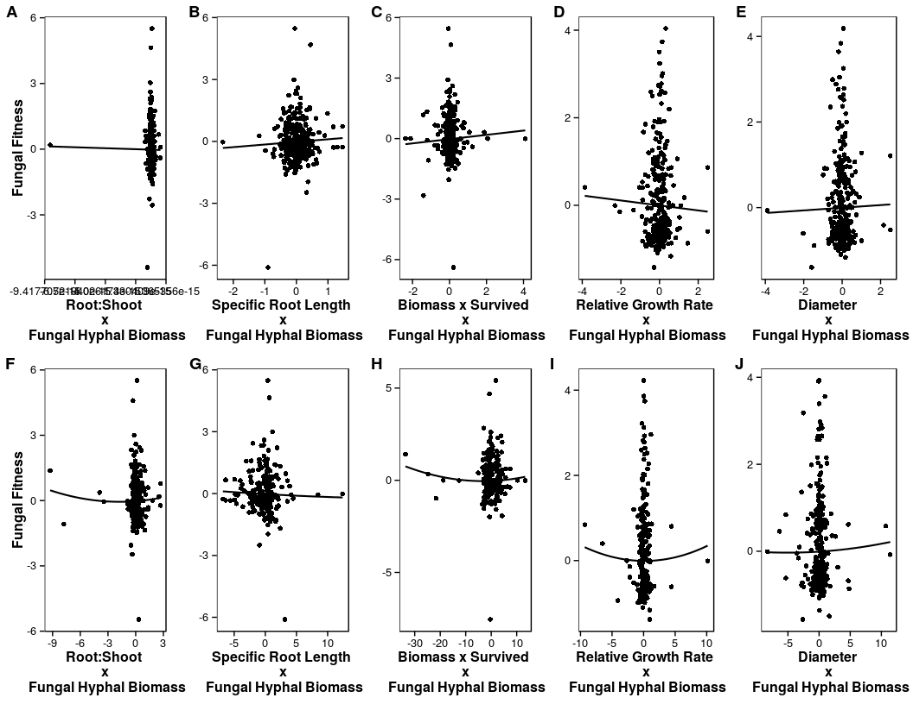
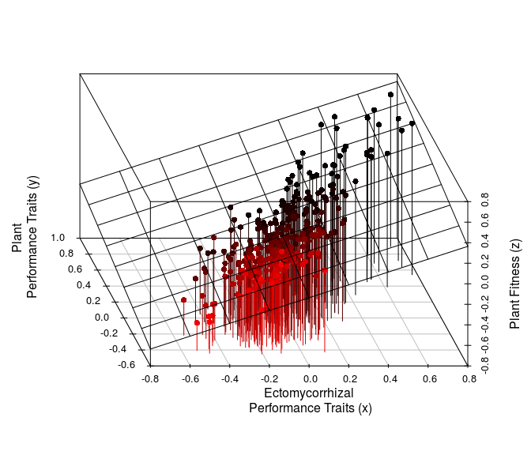
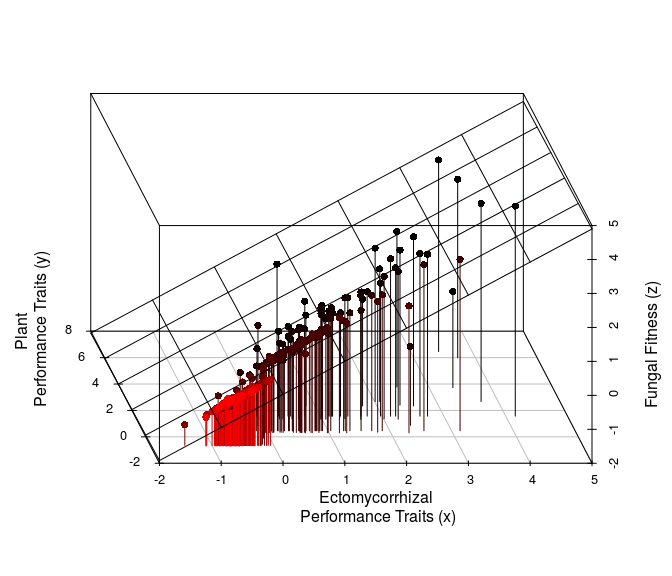

# 2012 Monterey Pine Common Garden SSA
Megan Rua  

Previous attempts at this analysis have been run as Purdue Prelim 2013 and ESA Prelim

**July 11, 2014** First attempt at SSA for plant fitness model.

**July 14, 2014** Continue to work on the plant fitness model

**July 15, 2014** Analyses with spelling errors removed from OTU names and broader fungal classifications (Phylum, Order, Genus, Family). First attempt at SSA for fungal fitness model. Combination analyses also.

**July 16, 2014** NMDS Analyses with relativized OTUs. Tip analyses with scale(tips) in order to remove effects of the outlier from ID = 16.

**July 21, 2014** Met with Jason on friday, July 18, 2014 to discuss analyses. He had a number of suggestions including adding two new columns to the fungal traits (exploration type and fungal type). Additional analyses include:

  * 1. Seperate out other fungi
  * 2. Random effect for plant family
  * 3. Ignore fungal identity and use only tip number as a fungal trait
  * 4. Consider different plant fitness measurements: Relative Growth Rate (RGR) = $\frac{ln_{final} - ln_{initial}}{Number of Days}$, Root:Shoot
  * 5. Use fungal ID (Russula, Tomentetlla etc) as a trait [may need to be run with fungi at higher order]
  * 6. Use family means for trait effects as it may allow for use of percent survival as plant fitness measure

**July 22, 2014** Today I'll attempt to use fungal identity as a trait for Phylum, Order (fixed misspellings in Order)

**July 23, 2014** Continue Order analysis from yesterday and work on Genera and Species analyses

**August 5, 2014** After meeting with Jason number of suggestions regarding the analyses:
  
  * 1. Seperate model for specific root length (root length / dry mass) instead of root length
  * 2. Run analyses based on Tomentella / big orders as response variable (presence/absence, zero-inflated poisson)
  * 3. Turn exploration type into a quantitative trait. Per Hobbie and Ager 2010 can try proportion: $\frac{Number of Species per Type}{Total Identified Species}$. 
  * 4. Try analyses using exploration type properties (Hydrophilic vs Hydrophobic, Low Biomass vs. High Biomass)

**September 14, 2015** First run of model while at NIMBioS. Try using methods advised by Steve for modeling community data (model based analysis of multivariate abundance data)

**September 16, 2015** NMDS and mvabund by fungal traits

**September 17, 2015** Survival Analysis

**September 22, 2015** SSA: try to incorporate stabilizing / diversifying selection

**October 22, 2015** Subset data to make sure only ECM for community analyses

**October 23, 2015** Further subset data to prune out rare species

**November 6, 2015** Add interactions!

**November 19, 2015** After a skype meeting with Jason, he had a number of suggestions:
  
  * 1. Seperate analyses with survivorship (Y/N) as a response variable as an alternative proxy for fitness
  
    * OR aggregate fitness proxy by multiplying biomass x proportion survived
    
  * 2. Look at compatability with fungal OTUs as a trait of the plant. For example, use three most common OTUs/Families as predictor variables (for determining plant fitness) or as proxies for fungal fitness.
  
      * Could be interesting from either the plan or fungus point of view. 
      
  * 3. Potential quantative measures of fungal traits:
    
    * ratio of high:low biomass or hydrophilic:hydrophobic
    * type of sporocarp produced
    * enzyme activities across genus
    * Diversity measures: observed, shannon, chao1
    
**November 30, 2015** First hack at incorporating survivorship into plant fitness proxy by multiplying plant biomass by proportion survival (by family).

**December 1, 2015** Second hack at incorporating survivorship into plant fitness by using it as an alternative proxy for fitness.

**December 7, 2015** Incorporate ratios of fungal traits as potential quantitative measures of fungal traits. Utilize the interaction model with Biomass (December 7-8), Biomass x PropSurv (December 9), PropSurv as proxies for plant fitness

First load what I think are the necessary packages:

```r
library(ggplot2)
library(grid)
library(plyr)
library(nlme)
library(lme4)
library(reshape2)
library(ecodist)
library(vegan)
library(xtable)
library(scatterplot3d)
```

Functions necessary:

```r
#Function for ggplots -- a two-panel plot is calculated/performed-found online
multiplot <- function(..., plotlist=NULL, cols) {
  require(grid)
  
  # Make a list from the ... arguments and plotlist
  plots <- c(list(...), plotlist)
  
  numPlots = length(plots)
  
  # Make the panel
  plotCols = cols                          # Number of columns of plots
  plotRows = ceiling(numPlots/plotCols) # Number of rows needed, calculated from # of cols
  
  # Set up the page
  grid.newpage()
  pushViewport(viewport(layout = grid.layout(plotRows, plotCols)))
  vplayout <- function(x, y)
    viewport(layout.pos.row = x, layout.pos.col = y)
  
  # Make each plot, in the correct location
  for (i in 1:numPlots) {
    curRow = ceiling(i/plotCols)
    curCol = (i-1) %% plotCols + 1
    print(plots[[i]], vp = vplayout(curRow, curCol ))
  }
  
}
```
Dataset contstruction
-------------------------------------------------

First the molecular data (2013 Monterey Common Garden Molecular Data 071814.csv): 

```r
#laptop computer
#MP<-read.table('C:/Users/Megan Rua/Dropbox/Experiments/2012 Monterey Pine Common Garden Experiment/Molecular Work/2013 Monterey Common Garden Molecular Data 071814.csv', header=T, sep=',')   
#NIMBioS computer
MP<-read.table('/home/megan.rua/Dropbox/Experiments/2012 Monterey Pine Common Garden Experiment/Molecular Work/2013 Monterey Common Garden Molecular Data 091615.csv', header=T, sep=',')
names(MP)
```

```
##  [1] "ID"                 "Code"               "Date.Collected"    
##  [4] "Initials"           "Date.Processed"     "Morphotype"        
##  [7] "Morphotype.Abbrev." "Num.Tips"           "Plate.Main"        
## [10] "Tip.1.Location"     "Tip.2.Location"     "Plate.Back.Up"     
## [13] "Back.Up.Location"   "Notes"              "Seq.Plate"         
## [16] "Seq.Loc"            "CAP3"               "OTU"               
## [19] "Phylum"             "Order"              "Genus"             
## [22] "Family"             "ExploreType"        "Fungal.Type"       
## [25] "Reference"          "Species.Hypothesis" "X"                 
## [28] "SH.Name"            "Score"              "E.value"           
## [31] "Prcnt"              "MisM"               "Qstart"            
## [34] "Qend"               "Rstart"             "Rend"
```
Next the plant trait data (2013 Monterey Common Garden Data.csv):

```r
#laptop computer
#bio<-read.table('C:/Users/Megan Rua/Dropbox/Experiments/2012 Monterey Pine Common Garden Experiment/2013 Monterey Common Garden Data.csv', header=T, sep=',')   
#NIMBioS computer
bio<-read.table('/home/megan.rua/Dropbox/Experiments/2012 Monterey Pine Common Garden Experiment/2013 Monterey Common Garden Data.csv', header=T, sep=',') 
names(bio)
```

```
##  [1] "ID"                     "Code"                  
##  [3] "Cone.Num"               "Name"                  
##  [5] "Source"                 "Diameter.1..mm."       
##  [7] "Height.1..cm."          "Notes.4.30.13"         
##  [9] "Height.2..cm."          "Notes.5.28.13"         
## [11] "Height.3..cm."          "Notes.8.1.13"          
## [13] "Height.4..cm."          "Notes.8.17.13"         
## [15] "Date.Collected"         "Date.Dead"             
## [17] "Days.Dead"              "Survival.5.4.13"       
## [19] "Survival.5.7.13"        "Survival.5.10.13"      
## [21] "Survival.5.13.13"       "Survival.5.15.13"      
## [23] "Survival.5.17.13"       "Survival.5.19.13"      
## [25] "Survival.5.22.13"       "Survival.5.25.13"      
## [27] "Survival.5.27.13"       "Survival.5.29.13"      
## [29] "Survival.5.30.13"       "Num.Root.Intersections"
## [31] "Date"                   "Root.Wgt"              
## [33] "Shoot.Wgt"
```
Next merge with plant traits

```r
MP.merge<-merge( MP, bio, by='ID', all.y = F, all.x=F, sort=F )
```

Create a dataframe with the variables of interest:

```r
test<-data.frame(cbind(ID=MP.merge$ID,
                       tips=MP.merge$Num.Tips, 
                       RootSecs=MP.merge$Num.Root.Intersections, 
                       Root=MP.merge$Root.Wgt, Shoot=MP.merge$Shoot.Wgt, 
                       Biomass = MP.merge$Root.Wgt + MP.merge$Shoot.Wgt,
                       Diam = MP.merge$Diameter.1..mm., 
                       HgtFinal = MP.merge$Height.4..cm.,
                       HgtInit = MP.merge$Height.1..cm.))
test2<-cbind(test,OTU=MP.merge$OTU,Source=MP.merge$Name,Code=MP.merge$Code.x, 
             Phylum = MP.merge$Phylum, Order = MP.merge$Order, Genus = MP.merge$Genus, 
             Family = MP.merge$Family, ExploreType = MP.merge$ExploreType,
             FungalType = MP.merge$Fungal.Type)

test2$tips[is.na(test2$tips)]<-0
test2$OTU[test2$OTU==""]<-NA
test2$Phylum[test2$Phylum==""]<-NA
test2$Order[test2$Order==""]<-NA
test2$Genus[test2$Genus==""]<-NA
test2$Family[test2$Family==""]<-NA

#Root Length
test2$RL<-(3.14*test2$RootSecs*63.617)/(2*173.2)

#Number of Tips / Root Length = Colonization Density
test2$ColDen<-test2$tips/test2$RL

#Relative Growth Rate
test2$RGR<-(log(test2$HgtFinal)-log(test2$HgtInit)/109)

#Root:Shoot
test2$RS<- test2$Root/test2$Shoot

#Specific Root Length (SRL)
test2$SRL<-test2$RL/test2$Root

#Fungal Biomass based on Exploration Type
test2$FungBiomass<-NA
test2$FungBiomass[test2$ExploreType=="contact" | test2$ExploreType=="short distance" |
                  test2$ExploreType=="medium distance smooth"]<-"Low"
test2$FungBiomass[test2$ExploreType=="medium distance fringe" | 
                  test2$ExploreType=="long distance" |
                  test2$ExploreType=="medium distance mat"]<-"High"
test2$FungBiomass[test2$ExploreType=="Unknown"]<-"Unknown"

#hydrophobocity based on Exploration Type
test2$FungHydro<-NA
test2$FungHydro[test2$ExploreType=="contact" | test2$ExploreType=="short distance" |
                  test2$ExploreType=="medium distance smooth"]<-"Hydrophilic"
test2$FungHydro[test2$ExploreType=="medium distance fringe" | 
                  test2$ExploreType=="long distance" |
                  test2$ExploreType=="medium distance mat"]<-"Hydrophobic"
test2$FungHydro[test2$ExploreType=="Unknown"]<-"Unknown"

test2<-test2[-c(516:522),]

#remove non myco
test2.myco<-test2[test2$FungalType=='Ectomycorrhiza',]
```
The data for survival is stored in a different file so first it needs to be loaded in:

```r
#NIMBioS computer
demo<-read.table('/home/megan.rua/Dropbox/Experiments/2012 Monterey Pine Common Garden Experiment/2013 Monterey Common Garden Data.csv', header=T, sep=',')
names(demo)
```

```
##  [1] "ID"                     "Code"                  
##  [3] "Cone.Num"               "Name"                  
##  [5] "Source"                 "Diameter.1..mm."       
##  [7] "Height.1..cm."          "Notes.4.30.13"         
##  [9] "Height.2..cm."          "Notes.5.28.13"         
## [11] "Height.3..cm."          "Notes.8.1.13"          
## [13] "Height.4..cm."          "Notes.8.17.13"         
## [15] "Date.Collected"         "Date.Dead"             
## [17] "Days.Dead"              "Survival.5.4.13"       
## [19] "Survival.5.7.13"        "Survival.5.10.13"      
## [21] "Survival.5.13.13"       "Survival.5.15.13"      
## [23] "Survival.5.17.13"       "Survival.5.19.13"      
## [25] "Survival.5.22.13"       "Survival.5.25.13"      
## [27] "Survival.5.27.13"       "Survival.5.29.13"      
## [29] "Survival.5.30.13"       "Num.Root.Intersections"
## [31] "Date"                   "Root.Wgt"              
## [33] "Shoot.Wgt"
```

```r
demo$Survival<-1
demo$Survival[918:920]<-NA
demo$Survival[demo$Date.Dead==""]<-0
```
Create dataframe for proportion survival:

```r
demo.tab<-table(demo$Code, demo$Survival.5.30.13)
demo.dat<-data.frame(Code=rownames(demo.tab),
                     n=demo.tab[,1],
                     y=demo.tab[,2],
                     tot=demo.tab[,1]+demo.tab[,2])
demo.dat$propsurv<-round(demo.dat$y/demo.dat$tot,4)
```
Merge the demographic data back into the main dataframe:

```r
test3<-merge(test2.myco, demo.dat, by='Code', all.y = F, all.x=F, sort=F )
```
Create a dataframe for hyphal biomass, ignore unknowns:

```r
FungBiomass.tab<-table(test3$Code, test3$FungBiomass)
FungBiomass.dat<-data.frame(Code=rownames(FungBiomass.tab),
                     high=FungBiomass.tab[,1],
                     low=FungBiomass.tab[,2],
                     rat.fungbio=round(FungBiomass.tab[,1]/FungBiomass.tab[,2],4))
```
Merge the fungal biomass data back into the main dataframe:

```r
test4<-merge(test3, FungBiomass.dat, by='Code', all.y = F, all.x=F, sort=F )
```


Plant Fitness Model: Main + Interaction Trait Effects
========================================================

Plant Fitness Model: Plant Biomass
-------------------------------------------------

Selection analysis as adapted from "Bird-mediated selection on fruit-display traits in Celtis ehrenbergiana (Cannabaceae) (2014) Evol Ecol Res. Definitely not SSA but I *think* it's a move in the right direction.

```r
OTU.raw2<-dcast(test4,Source + ID + Biomass + Diam + RGR + SRL + RS + FungalType + ExploreType + Code + propsurv + n + y + tot + rat.fungbio~test4$OTU,sum, value.var="tips")
OTU.raw2$TipTotal<-apply(OTU.raw2[,16:81],1,sum)
OTU.raw2$ColDen<-OTU.raw2$TipTotal/OTU.raw2$SRL

#rare removed
#OTU.raw2<-dcast(test2.myco,Source + ID + Biomass + Diam + RGR + SRL + RS + FungalType + ExploreType + Code~test2.myco$OTU,sum, value.var="tips")
#OTU.raw2$TipTotal<-apply(OTU.raw2[,11:66],1,sum)
#OTU.raw2$ColDen<-OTU.raw2$TipTotal/OTU.raw2$SRL
```
First, need to get the variables in order. Individual relative fitness (plant biomass) was estimated as the individual fitness measure divided by the population mean fitness. 

```r
#relative fitness
w.rel.bio<-OTU.raw2$Biomass/mean(OTU.raw2$Biomass)
w.rel.biosurv<-w.rel.bio*OTU.raw2$propsurv
```

*** Trait standardization ***
All traits need to be standardized before analysis:

```r
z<-scale(OTU.raw2[,c("RS","TipTotal","Diam","SRL","RGR","ColDen", "Biomass","rat.fungbio","propsurv")])
z.RS<-z[,1]
z.TipTotal<-z[,2]
z.Diam<-z[,3]
z.SRL<-z[,4]
z.RGR<-z[,5]
z.ColDen<-z[,6]
z.Biomass<-z[,7]
z.FungBio<-z[,8]
z.Surv<-z[,9]
```

As with the main trait effects, linear partial regression coefficients  ($\beta$) for each phenological trait indicate the strength and trend of directional selection, while quadratic regression coefficients ($\gamma$)  for each phenological trait estimate stabilizing (i.e., negative coefficient) or disruptive (i.e., positive coefficient) selection.

## Biomass * Proportion Survived as fitness proxy

#### Directional Selection
The directional selection differential ($$S_i$$) was estimated as the covariance between relative fitness and each standardized trait.
Linear:

```r
mod1a<-lm(w.rel.biosurv~z.RS)
mod2a<-lm(w.rel.biosurv~z.TipTotal)
mod3a<-lm(w.rel.biosurv~z.Diam)
mod4a<-lm(w.rel.biosurv~z.SRL)
mod5a<-lm(w.rel.biosurv~z.RGR)
#mod6a<-lm(w.rel.biosurv~z.Biomass)
mod7a<-lm(w.rel.biosurv~z.FungBio)
#mod8a<-lm(w.rel.biosurv~z.Surv)

#Interactions with Tip Total
mod9a<-lm(w.rel.biosurv~z.RS:z.TipTotal)
mod10a<-lm(w.rel.biosurv~z.Diam:z.TipTotal)
mod11a<-lm(w.rel.biosurv~z.SRL:z.TipTotal)
mod12a<-lm(w.rel.biosurv~z.RGR:z.TipTotal)
#mod13a<-lm(w.rel.biosurv~z.Biomass:z.TipTotal)
#mod14a<-lm(w.rel.biosurv~z.Surv:z.TipTotal)

#Interactions with Fungal Hyphal Biomass
mod15a<-lm(w.rel.biosurv~z.RS:z.FungBio)
mod16a<-lm(w.rel.biosurv~z.Diam:z.FungBio)
mod17a<-lm(w.rel.biosurv~z.SRL:z.FungBio)
mod18a<-lm(w.rel.biosurv~z.RGR:z.FungBio)
#mod19a<-lm(w.rel.biosurv~z.Biomass:z.FungBio)
#mod20a<-lm(w.rel.biosurv~z.Surv:z.FungBio)
```
Quadratic:

```r
mod1a<-lm(w.rel.biosurv~I(z.RS^2))
mod2a<-lm(w.rel.biosurv~I(z.TipTotal^2))
mod3a<-lm(w.rel.biosurv~I(z.Diam^2))
mod4a<-lm(w.rel.biosurv~I(z.SRL^2))
mod5a<-lm(w.rel.biosurv~I(z.RGR^2))
#mod6a<-lm(w.rel.biosurv~I(z.Biomass^2))
mod7a<-lm(w.rel.biosurv~I(z.FungBio^2))
mod8a<-lm(w.rel.biosurv~I(z.Surv^2))
#Interactions with Tip Total
mod9a<-lm(w.rel.biosurv~I(z.RS^2):I(z.TipTotal^2))
mod10a<-lm(w.rel.biosurv~I(z.Diam^2):I(z.TipTotal^2))
mod11a<-lm(w.rel.biosurv~I(z.SRL^2):I(z.TipTotal^2))
mod12a<-lm(w.rel.biosurv~I(z.RGR^2):I(z.TipTotal^2))
#mod13a<-lm(w.rel.biosurv~I(z.Biomass^2):I(z.TipTotal^2))
mod14a<-lm(w.rel.biosurv~I(z.Surv^2):I(z.TipTotal^2))
#Interactions with Fungal Hyphal Biomass
mod15a<-lm(w.rel.biosurv~I(z.RS^2):I(z.FungBio^2))
mod16a<-lm(w.rel.biosurv~I(z.Diam^2):I(z.FungBio^2))
mod17a<-lm(w.rel.biosurv~I(z.SRL^2):I(z.FungBio^2))
mod18a<-lm(w.rel.biosurv~I(z.RGR^2):I(z.FungBio^2))
#mod19a<-lm(w.rel.biosurv~z.Biomass:z.FungBio)
mod20a<-lm(w.rel.biosurv~I(z.Surv^2):I(z.FungBio^2))
```

#### Disruptive/Stabilizing selection
NO COLONIZATION DENSITY
\begin{table}[ht]
\centering
\begin{tabular}{rrrr}
  \hline
Estimate & Std. Error & t value & Pr($>$$|$t$|$) \\ 
  \hline
0.4993 & 0.0221 & 22.61 & 0.0000 \\ 
  -0.0094 & 0.0178 & -0.53 & 0.5967 \\ 
  0.0792 & 0.0218 & 3.64 & 0.0003 \\ 
  0.0581 & 0.0153 & 3.80 & 0.0002 \\ 
  -0.0409 & 0.0178 & -2.30 & 0.0222 \\ 
  0.1372 & 0.0160 & 8.59 & 0.0000 \\ 
  0.0965 & 0.0294 & 3.28 & 0.0012 \\ 
  -0.0022 & 0.0076 & -0.29 & 0.7688 \\ 
  -0.0005 & 0.0172 & -0.03 & 0.9747 \\ 
  -0.0083 & 0.0062 & -1.33 & 0.1855 \\ 
  0.0042 & 0.0084 & 0.50 & 0.6170 \\ 
  0.0268 & 0.0097 & 2.77 & 0.0060 \\ 
  -0.0124 & 0.0096 & -1.29 & 0.1974 \\ 
  -0.0166 & 0.0175 & -0.95 & 0.3415 \\ 
  -0.0023 & 0.0174 & -0.13 & 0.8955 \\ 
  -0.0208 & 0.0234 & -0.89 & 0.3742 \\ 
  -0.0153 & 0.0230 & -0.67 & 0.5062 \\ 
  -0.0017 & 0.0062 & -0.28 & 0.7829 \\ 
  0.0005 & 0.0011 & 0.44 & 0.6598 \\ 
  -0.0112 & 0.0075 & -1.50 & 0.1342 \\ 
  0.0001 & 0.0047 & 0.03 & 0.9755 \\ 
  -0.0036 & 0.0265 & -0.14 & 0.8920 \\ 
  0.0971 & 0.0240 & 4.04 & 0.0001 \\ 
  0.0257 & 0.0293 & 0.88 & 0.3819 \\ 
  0.0012 & 0.0211 & 0.06 & 0.9551 \\ 
  0.0113 & 0.0073 & 1.55 & 0.1220 \\ 
  -0.0192 & 0.0065 & -2.93 & 0.0036 \\ 
  0.0025 & 0.0062 & 0.41 & 0.6851 \\ 
  -0.0216 & 0.0080 & -2.69 & 0.0076 \\ 
   \hline
\end{tabular}
\caption{Summary Table for Plant Fitness Model: Biomass*Proportion Survived} 
\end{table}
Put the coefficients into an easily readable table:
\begin{table}[ht]
\centering
\begin{tabular}{ll}
  \hline
Trait & Bplant \\ 
  \hline
(Intercept) & 0.4993*** \\ 
  z.RS & -0.0094  \\ 
  z.TipTotal & 0.0792*** \\ 
  z.Diam & 0.0581*** \\ 
  z.SRL & -0.0409*  \\ 
  z.RGR & 0.1372*** \\ 
  z.FungBio & 0.0965**  \\ 
  I(z.RS\verb|^|2) & -0.0022  \\ 
  I(z.TipTotal\verb|^|2) & -5e-04  \\ 
  I(z.Diam\verb|^|2) & -0.0083  \\ 
  I(z.SRL\verb|^|2) & 0.0042  \\ 
  I(z.RGR\verb|^|2) & 0.0268**  \\ 
  I(z.FungBio\verb|^|2) & -0.0124  \\ 
  z.RS:z.TipTotal & -0.0166  \\ 
  z.TipTotal:z.Diam & -0.0023  \\ 
  z.TipTotal:z.SRL & -0.0208  \\ 
  z.TipTotal:z.RGR & -0.0153  \\ 
  I(z.RS\verb|^|2):I(z.TipTotal\verb|^|2) & -0.0017  \\ 
  I(z.TipTotal\verb|^|2):I(z.Diam\verb|^|2) & 5e-04  \\ 
  I(z.TipTotal\verb|^|2):I(z.SRL\verb|^|2) & -0.0112  \\ 
  I(z.TipTotal\verb|^|2):I(z.RGR\verb|^|2) & 1e-04  \\ 
  z.RS:z.FungBio & -0.0036  \\ 
  z.Diam:z.FungBio & 0.0971*** \\ 
  z.SRL:z.FungBio & 0.0257  \\ 
  z.RGR:z.FungBio & 0.0012  \\ 
  I(z.RS\verb|^|2):I(z.FungBio\verb|^|2) & 0.0113  \\ 
  I(z.Diam\verb|^|2):I(z.FungBio\verb|^|2) & -0.0192**  \\ 
  I(z.SRL\verb|^|2):I(z.FungBio\verb|^|2) & 0.0025  \\ 
  I(z.RGR\verb|^|2):I(z.FungBio\verb|^|2) & -0.0216**  \\ 
   \hline
\end{tabular}
\caption{Plant Fitness Model: Biomass*Proportion Survived } 
\end{table}
\***\, P < 0.001; \**\, P < 0.01; \*\, P < 0.05.

**Interpretation:** Interesting, the full model including interactions for both linear and quadratic effects changes some of the traits of signficance. In terms of quadratic selection coefficients, TipTotal is no long an important stabilizing force


Figures: The best way I can determine to visually display these results comes from the Sletvold et al 2010 New Phytologist manuscript where added varaible plots are used. These plots utilize residuals from linear regression models of relative fitness on all traits except for the focal trait plotted against residuals from a regression model of the focal trait on the other traits.

> Selection gradients are illustrated with added-variable plots, in which the residuals 
> from a linear regression model of relative fitness on all traits except the focal 
> trait are plotted against the residuals from a regression model of the focal trait on the other four traits. <cite>Sletvold et al 2010 New Phytologist</cite>

To me this means that the fitness trait is *not included* in the residuals for the model for the focal trait. Interested to hear Jason's thoughts.

Main Effects Figure: 

Figure 1. Trait of interest = Root:Shoot
Data for the figure:

```r
biomass.lm.noRS<-lm(w.rel.biosurv~z.TipTotal + z.Diam + z.SRL + z.RGR + z.FungBio + 
                         I(z.RS^2) + I(z.TipTotal^2) + I(z.Diam^2) + I(z.SRL^2) + I(z.RGR^2) + I(z.FungBio^2) + 
                         z.RS:z.TipTotal + z.Diam:z.TipTotal + z.SRL:z.TipTotal + z.RGR:z.TipTotal + 
                         I(z.RS^2):I(z.TipTotal^2) + I(z.Diam^2):I(z.TipTotal^2) + I(z.SRL^2):I(z.TipTotal^2) + 
                              I(z.RGR^2):I(z.TipTotal^2) + 
                         z.RS:z.FungBio + z.Diam:z.FungBio + z.SRL:z.FungBio + z.RGR:z.FungBio + 
                         I(z.RS^2):I(z.FungBio^2) + I(z.Diam^2):I(z.FungBio^2) + I(z.SRL^2):I(z.FungBio^2) + 
                              I(z.RGR^2):I(z.FungBio^2),
                         na.action=na.omit,data=OTU.raw2)
RS.lm<-lm(z.RS~z.TipTotal + z.Diam + z.SRL + z.RGR + z.FungBio + 
                         I(z.RS^2) + I(z.TipTotal^2) + I(z.Diam^2) + I(z.SRL^2) + I(z.RGR^2) + I(z.FungBio^2) + 
                         z.RS:z.TipTotal + z.Diam:z.TipTotal + z.SRL:z.TipTotal + z.RGR:z.TipTotal + 
                         I(z.RS^2):I(z.TipTotal^2) + I(z.Diam^2):I(z.TipTotal^2) + I(z.SRL^2):I(z.TipTotal^2) + 
                              I(z.RGR^2):I(z.TipTotal^2) + 
                         z.RS:z.FungBio + z.Diam:z.FungBio + z.SRL:z.FungBio + z.RGR:z.FungBio + 
                         I(z.RS^2):I(z.FungBio^2) + I(z.Diam^2):I(z.FungBio^2) + I(z.SRL^2):I(z.FungBio^2) + 
                              I(z.RGR^2):I(z.FungBio^2),
                         na.action=na.omit,data=OTU.raw2)
fig1.dat<-data.frame(noRS.resid=biomass.lm.noRS$residuals,RS.resid=RS.lm$residuals)
```
Figure Code:

```r
p1<-ggplot(fig1.dat, aes(x=RS.resid, y=noRS.resid)) +
    geom_point() +
    scale_x_continuous("Root:Shoot") +
    scale_y_continuous("Plant Fitness") + 
    #ggtitle("Selection gradient for Root:Shoot") +
    geom_smooth(method=lm, se=FALSE, lwd=0.75, color ='black') +
    theme_minimal()+
    theme(panel.grid.major = element_blank(), panel.grid.minor = element_blank(), 
        panel.background = element_blank(), panel.border = element_rect(fill = NA, colour = "black"),
        legend.position="none")
```

Figure 2. Trait of interest = Specific Root Length
Data for the figure:

```r
biomass.lm.noSRL<-lm(w.rel.biosurv~z.RS + z.TipTotal + z.Diam + z.RGR + z.FungBio + 
                         I(z.RS^2) + I(z.TipTotal^2) + I(z.Diam^2) + I(z.SRL^2) + I(z.RGR^2) + I(z.FungBio^2) + 
                         z.RS:z.TipTotal + z.Diam:z.TipTotal + z.SRL:z.TipTotal + z.RGR:z.TipTotal + 
                         I(z.RS^2):I(z.TipTotal^2) + I(z.Diam^2):I(z.TipTotal^2) + I(z.SRL^2):I(z.TipTotal^2) + 
                              I(z.RGR^2):I(z.TipTotal^2) + 
                         z.RS:z.FungBio + z.Diam:z.FungBio + z.SRL:z.FungBio + z.RGR:z.FungBio + 
                         I(z.RS^2):I(z.FungBio^2) + I(z.Diam^2):I(z.FungBio^2) + I(z.SRL^2):I(z.FungBio^2) + 
                              I(z.RGR^2):I(z.FungBio^2),
                         na.action=na.omit,data=OTU.raw2)
SRL.lm<-lm(z.SRL~z.RS + z.TipTotal + z.Diam + z.RGR + z.FungBio + 
                         I(z.RS^2) + I(z.TipTotal^2) + I(z.Diam^2) + I(z.SRL^2) + I(z.RGR^2) + I(z.FungBio^2) + 
                         z.RS:z.TipTotal + z.Diam:z.TipTotal + z.SRL:z.TipTotal + z.RGR:z.TipTotal + 
                         I(z.RS^2):I(z.TipTotal^2) + I(z.Diam^2):I(z.TipTotal^2) + I(z.SRL^2):I(z.TipTotal^2) + 
                              I(z.RGR^2):I(z.TipTotal^2) +
                         z.RS:z.FungBio + z.Diam:z.FungBio + z.SRL:z.FungBio + z.RGR:z.FungBio + 
                         I(z.RS^2):I(z.FungBio^2) + I(z.Diam^2):I(z.FungBio^2) + I(z.SRL^2):I(z.FungBio^2) + 
                              I(z.RGR^2):I(z.FungBio^2),
                         na.action=na.omit,data=OTU.raw2)
fig2.dat<-data.frame(noSRL.resid=biomass.lm.noSRL$residuals,SRL.resid=SRL.lm$residuals)
```
Figure Code:

```r
p2<-ggplot(fig2.dat, aes(x=SRL.resid, y=noSRL.resid)) +
    geom_point() +
    scale_x_continuous("Specific \nRoot Length") +
    scale_y_continuous("Plant Fitness") + 
    #ggtitle("Selection gradient for specific root length") +
    geom_smooth(method=lm, se=FALSE, lwd=0.75, color ='black') +
    theme_minimal()+
    theme(panel.grid.major = element_blank(), panel.grid.minor = element_blank(), 
        panel.background = element_blank(), panel.border = element_rect(fill = NA, colour = "black"),
        legend.position="none") +
    theme(axis.title.y = element_blank())
```

Figure 3. Trait of interest = RGR
Data for the figure:

```r
biomass.lm.noRGR<-lm(w.rel.biosurv~z.RS + z.TipTotal + z.Diam + z.SRL + z.FungBio + 
                         I(z.RS^2) + I(z.TipTotal^2) + I(z.Diam^2) + I(z.SRL^2) + I(z.RGR^2) + I(z.FungBio^2) + 
                         z.RS:z.TipTotal + z.Diam:z.TipTotal + z.SRL:z.TipTotal + z.RGR:z.TipTotal + 
                         I(z.RS^2):I(z.TipTotal^2) + I(z.Diam^2):I(z.TipTotal^2) + I(z.SRL^2):I(z.TipTotal^2) + 
                              I(z.RGR^2):I(z.TipTotal^2) + 
                         z.RS:z.FungBio + z.Diam:z.FungBio + z.SRL:z.FungBio + z.RGR:z.FungBio + 
                         I(z.RS^2):I(z.FungBio^2) + I(z.Diam^2):I(z.FungBio^2) + I(z.SRL^2):I(z.FungBio^2) + 
                              I(z.RGR^2):I(z.FungBio^2),
                         na.action=na.omit,data=OTU.raw2)
RGR.lm<-lm(z.RGR~z.RS + z.TipTotal + z.Diam + z.SRL + z.FungBio + 
                         I(z.RS^2) + I(z.TipTotal^2) + I(z.Diam^2) + I(z.SRL^2) + I(z.RGR^2) + I(z.FungBio^2) + 
                         z.RS:z.TipTotal + z.Diam:z.TipTotal + z.SRL:z.TipTotal + z.RGR:z.TipTotal + 
                         I(z.RS^2):I(z.TipTotal^2) + I(z.Diam^2):I(z.TipTotal^2) + I(z.SRL^2):I(z.TipTotal^2) + 
                              I(z.RGR^2):I(z.TipTotal^2) + 
                         z.RS:z.FungBio + z.Diam:z.FungBio + z.SRL:z.FungBio + z.RGR:z.FungBio + 
                         I(z.RS^2):I(z.FungBio^2) + I(z.Diam^2):I(z.FungBio^2) + I(z.SRL^2):I(z.FungBio^2) + 
                              I(z.RGR^2):I(z.FungBio^2),
                         na.action=na.omit,data=OTU.raw2)
fig3.dat<-data.frame(noRGR.resid=biomass.lm.noRGR$residuals,RGR.resid=RGR.lm$residuals)
```
Figure Code:

```r
p3<-ggplot(fig3.dat, aes(x=RGR.resid, y=noRGR.resid)) +
    geom_point() +
    scale_x_continuous("Relative \ngrowth rate") +
    scale_y_continuous("Plant Fitness") + 
    #ggtitle("Selection gradient \n for relative growth rate") +
    geom_smooth(method=lm, se=FALSE, lwd=0.75, color ='black') +
    theme_minimal()+
    theme(panel.grid.major = element_blank(), panel.grid.minor = element_blank(), 
        panel.background = element_blank(), panel.border = element_rect(fill = NA, colour = "black"),
        legend.position="none")+
    theme(axis.title.y = element_blank())
```

Figure 5. Trait of interest = Tip Total
Data for the figure:

```r
biomass.lm.noTT<-lm(w.rel.biosurv~z.RS + z.Diam + z.SRL + z.RGR + z.FungBio + 
                         I(z.RS^2) + I(z.TipTotal^2) + I(z.Diam^2) + I(z.SRL^2) + I(z.RGR^2) + I(z.FungBio^2) + 
                         z.RS:z.TipTotal + z.Diam:z.TipTotal + z.SRL:z.TipTotal + z.RGR:z.TipTotal + 
                         I(z.RS^2):I(z.TipTotal^2) + I(z.Diam^2):I(z.TipTotal^2) + I(z.SRL^2):I(z.TipTotal^2) + 
                              I(z.RGR^2):I(z.TipTotal^2) + 
                         z.RS:z.FungBio + z.Diam:z.FungBio + z.SRL:z.FungBio + z.RGR:z.FungBio + 
                         I(z.RS^2):I(z.FungBio^2) + I(z.Diam^2):I(z.FungBio^2) + I(z.SRL^2):I(z.FungBio^2) + 
                              I(z.RGR^2):I(z.FungBio^2),
                         na.action=na.omit,data=OTU.raw2)
TT.glm<-lm(z.TipTotal~z.RS + z.Diam + z.SRL + z.RGR + z.FungBio + 
                         I(z.RS^2) + I(z.TipTotal^2) + I(z.Diam^2) + I(z.SRL^2) + I(z.RGR^2) + I(z.FungBio^2) + 
                         z.RS:z.TipTotal + z.Diam:z.TipTotal + z.SRL:z.TipTotal + z.RGR:z.TipTotal + 
                         I(z.RS^2):I(z.TipTotal^2) + I(z.Diam^2):I(z.TipTotal^2) + I(z.SRL^2):I(z.TipTotal^2) + 
                              I(z.RGR^2):I(z.TipTotal^2) + 
                         z.RS:z.FungBio + z.Diam:z.FungBio + z.SRL:z.FungBio + z.RGR:z.FungBio + 
                         I(z.RS^2):I(z.FungBio^2) + I(z.Diam^2):I(z.FungBio^2) + I(z.SRL^2):I(z.FungBio^2) + 
                              I(z.RGR^2):I(z.FungBio^2),
                         na.action=na.omit,data=OTU.raw2)
fig5.dat<-data.frame(noTT.resid=resid(biomass.lm.noTT),
                     TT.resid=resid(TT.glm))
```
Figure Code:

```r
p5<-ggplot(fig5.dat, aes(x=TT.resid, y=noTT.resid)) +
    geom_point() +
    scale_x_continuous("Total Tips") +
    scale_y_continuous("Plant Fitness") + 
   # ggtitle("Selection gradient \n for total number of colonized tips") +
    geom_smooth(method=lm, se=FALSE, lwd=0.75, color ='black') +
    theme_minimal()+
    theme(panel.grid.major = element_blank(), panel.grid.minor = element_blank(), 
        panel.background = element_blank(), panel.border = element_rect(fill = NA, colour = "black"),
        legend.position="none")+
    theme(axis.title.y = element_blank())
```

Figure 6. Trait of interest = Diameter
Data for the figure:

```r
biomass.lm.noDiam<-lm(w.rel.biosurv~z.RS + z.TipTotal + z.SRL + z.RGR + z.FungBio + 
                         I(z.RS^2) + I(z.TipTotal^2) + I(z.Diam^2) + I(z.SRL^2) + I(z.RGR^2) + I(z.FungBio^2) + 
                         z.RS:z.TipTotal + z.Diam:z.TipTotal + z.SRL:z.TipTotal + z.RGR:z.TipTotal + 
                         I(z.RS^2):I(z.TipTotal^2) + I(z.Diam^2):I(z.TipTotal^2) + I(z.SRL^2):I(z.TipTotal^2) + 
                              I(z.RGR^2):I(z.TipTotal^2) + 
                         z.RS:z.FungBio + z.Diam:z.FungBio + z.SRL:z.FungBio + z.RGR:z.FungBio + 
                         I(z.RS^2):I(z.FungBio^2) + I(z.Diam^2):I(z.FungBio^2) + I(z.SRL^2):I(z.FungBio^2) + 
                              I(z.RGR^2):I(z.FungBio^2),
                         na.action=na.omit,data=OTU.raw2)
Diam.lm<-lm(z.Diam~z.RS + z.TipTotal + z.SRL + z.RGR + z.FungBio + 
                         I(z.RS^2) + I(z.TipTotal^2) + I(z.Diam^2) + I(z.SRL^2) + I(z.RGR^2) + I(z.FungBio^2) + 
                         z.RS:z.TipTotal + z.Diam:z.TipTotal + z.SRL:z.TipTotal + z.RGR:z.TipTotal + 
                         I(z.RS^2):I(z.TipTotal^2) + I(z.Diam^2):I(z.TipTotal^2) + I(z.SRL^2):I(z.TipTotal^2) + 
                              I(z.RGR^2):I(z.TipTotal^2) + 
                         z.RS:z.FungBio + z.Diam:z.FungBio + z.SRL:z.FungBio + z.RGR:z.FungBio + 
                         I(z.RS^2):I(z.FungBio^2) + I(z.Diam^2):I(z.FungBio^2) + I(z.SRL^2):I(z.FungBio^2) + 
                              I(z.RGR^2):I(z.FungBio^2),
                         na.action=na.omit,data=OTU.raw2)

fig6.dat<-data.frame(noDiam.resid=resid(biomass.lm.noDiam),
                     Diam.resid=resid(Diam.lm))
```
Figure Code:

```r
p6<-ggplot(fig6.dat, aes(x=Diam.resid, y=noDiam.resid)) +
    geom_point() +
    scale_x_continuous("Diameter") +
    scale_y_continuous("Plant Fitness") + 
   # ggtitle("Selection gradient for diameter") +
    geom_smooth(method=lm, se=FALSE, lwd=0.75, color ='black') +
    theme_minimal()+
    theme(panel.grid.major = element_blank(), panel.grid.minor = element_blank(), 
        panel.background = element_blank(), panel.border = element_rect(fill = NA, colour = "black"),
        legend.position="none")+
    theme(axis.title.y = element_blank())
```

Figure 7. Trait of interest = Fungal Hyphal Biomass
Data for the figure:

```r
biomass.lm.noFungBio<-lm(w.rel.biosurv~z.RS + z.TipTotal + z.Diam + z.SRL + z.RGR +
                         I(z.RS^2) + I(z.TipTotal^2) + I(z.Diam^2) + I(z.SRL^2) + I(z.RGR^2) + I(z.FungBio^2) + 
                         z.RS:z.TipTotal + z.Diam:z.TipTotal + z.SRL:z.TipTotal + z.RGR:z.TipTotal + 
                         I(z.RS^2):I(z.TipTotal^2) + I(z.Diam^2):I(z.TipTotal^2) + I(z.SRL^2):I(z.TipTotal^2) + 
                              I(z.RGR^2):I(z.TipTotal^2) + 
                         z.RS:z.FungBio + z.Diam:z.FungBio + z.SRL:z.FungBio + z.RGR:z.FungBio + 
                         I(z.RS^2):I(z.FungBio^2) + I(z.Diam^2):I(z.FungBio^2) + I(z.SRL^2):I(z.FungBio^2) + 
                              I(z.RGR^2):I(z.FungBio^2),
                         na.action=na.omit,data=OTU.raw2)
FungBio.lm<-lm(z.FungBio~z.RS + z.TipTotal + z.Diam + z.SRL + z.RGR +  
                         I(z.RS^2) + I(z.TipTotal^2) + I(z.Diam^2) + I(z.SRL^2) + I(z.RGR^2) + I(z.FungBio^2) + 
                         z.RS:z.TipTotal + z.Diam:z.TipTotal + z.SRL:z.TipTotal + z.RGR:z.TipTotal + 
                         I(z.RS^2):I(z.TipTotal^2) + I(z.Diam^2):I(z.TipTotal^2) + I(z.SRL^2):I(z.TipTotal^2) + 
                              I(z.RGR^2):I(z.TipTotal^2) + 
                         z.RS:z.FungBio + z.Diam:z.FungBio + z.SRL:z.FungBio + z.RGR:z.FungBio + 
                         I(z.RS^2):I(z.FungBio^2) + I(z.Diam^2):I(z.FungBio^2) + I(z.SRL^2):I(z.FungBio^2) + 
                              I(z.RGR^2):I(z.FungBio^2),
                         na.action=na.omit,data=OTU.raw2)

fig7.dat<-data.frame(noFungBio.resid=resid(biomass.lm.noFungBio),
                     FungBio.resid=resid(FungBio.lm))
```
Figure Code:

```r
p7<-ggplot(fig7.dat, aes(x=FungBio.resid, y=noFungBio.resid)) +
    geom_point() +
    scale_x_continuous("Fungal \nHyphal Biomass") +
    scale_y_continuous("Plant Fitness") + 
   # ggtitle("Selection gradient for diameter") +
    geom_smooth(method=lm, se=FALSE, lwd=0.75, color ='black') +
    theme_minimal()+
    theme(panel.grid.major = element_blank(), panel.grid.minor = element_blank(), 
        panel.background = element_blank(), panel.border = element_rect(fill = NA, colour = "black"),
        legend.position="none")+
    theme(axis.title.y = element_blank())
```

Figure 8. Trait of interest = I(Root:Shoot)
Data for the figure:

```r
biomass.lm.noRS.I<-lm(w.rel.biosurv~z.RS + z.TipTotal + z.Diam + z.SRL + z.RGR + z.FungBio +
                         I(z.TipTotal^2) + I(z.Diam^2) + I(z.SRL^2) + I(z.RGR^2) + I(z.FungBio^2) + 
                         z.RS:z.TipTotal + z.Diam:z.TipTotal + z.SRL:z.TipTotal + z.RGR:z.TipTotal + 
                         I(z.RS^2):I(z.TipTotal^2) + I(z.Diam^2):I(z.TipTotal^2) + I(z.SRL^2):I(z.TipTotal^2) + 
                              I(z.RGR^2):I(z.TipTotal^2) + 
                         z.RS:z.FungBio + z.Diam:z.FungBio + z.SRL:z.FungBio + z.RGR:z.FungBio + 
                         I(z.RS^2):I(z.FungBio^2) + I(z.Diam^2):I(z.FungBio^2) + I(z.SRL^2):I(z.FungBio^2) + 
                              I(z.RGR^2):I(z.FungBio^2),
                         na.action=na.omit,data=OTU.raw2)
RS.lm.I<-lm(I(z.RS^2)~z.RS + z.TipTotal + z.Diam + z.SRL + z.RGR + z.FungBio +
                         I(z.TipTotal^2) + I(z.Diam^2) + I(z.SRL^2) + I(z.RGR^2) + I(z.FungBio^2) + 
                         z.RS:z.TipTotal + z.Diam:z.TipTotal + z.SRL:z.TipTotal + z.RGR:z.TipTotal + 
                         I(z.RS^2):I(z.TipTotal^2) + I(z.Diam^2):I(z.TipTotal^2) + I(z.SRL^2):I(z.TipTotal^2) + 
                              I(z.RGR^2):I(z.TipTotal^2) + 
                         z.RS:z.FungBio + z.Diam:z.FungBio + z.SRL:z.FungBio + z.RGR:z.FungBio + 
                         I(z.RS^2):I(z.FungBio^2) + I(z.Diam^2):I(z.FungBio^2) + I(z.SRL^2):I(z.FungBio^2) + 
                              I(z.RGR^2):I(z.FungBio^2),
                         na.action=na.omit,data=OTU.raw2)
fig8.dat<-data.frame(noRS.resid.I=biomass.lm.noRS.I$residuals,RS.resid.I=RS.lm.I$residuals)
```
Figure Code:

```r
p8<-ggplot(fig8.dat, aes(x=RS.resid.I, y=noRS.resid.I)) +
    geom_point() +
    scale_x_continuous("Root:Shoot") +
    scale_y_continuous("Plant Fitness") + 
    #ggtitle("Selection gradient for Root:Shoot") +
    geom_smooth(method=lm, formula=y~poly(x,2), se=FALSE, lwd=0.75, color ='black') +
    theme_minimal()+
    theme(panel.grid.major = element_blank(), panel.grid.minor = element_blank(), 
        panel.background = element_blank(), panel.border = element_rect(fill = NA, colour = "black"),
        legend.position="none")
```

Figure 9. Trait of interest = I(Specific Root Length)
Data for the figure:

```r
biomass.lm.noSRL.I<-lm(w.rel.biosurv~z.RS + z.TipTotal + z.Diam + z.SRL + z.RGR + z.FungBio +
                         I(z.RS^2) + I(z.TipTotal^2) + I(z.Diam^2) + I(z.RGR^2) + I(z.FungBio^2) + 
                         z.RS:z.TipTotal + z.Diam:z.TipTotal + z.SRL:z.TipTotal + z.RGR:z.TipTotal + 
                         I(z.RS^2):I(z.TipTotal^2) + I(z.Diam^2):I(z.TipTotal^2) + I(z.SRL^2):I(z.TipTotal^2) + 
                              I(z.RGR^2):I(z.TipTotal^2) + 
                         z.RS:z.FungBio + z.Diam:z.FungBio + z.SRL:z.FungBio + z.RGR:z.FungBio + 
                         I(z.RS^2):I(z.FungBio^2) + I(z.Diam^2):I(z.FungBio^2) + I(z.SRL^2):I(z.FungBio^2) + 
                              I(z.RGR^2):I(z.FungBio^2),
                         na.action=na.omit,data=OTU.raw2)
SRL.lm.I<-lm(I(z.SRL^2)~z.RS + z.TipTotal + z.Diam + z.SRL + z.RGR + z.FungBio +
                         I(z.RS^2) + I(z.TipTotal^2) + I(z.Diam^2) + I(z.RGR^2) + I(z.FungBio^2) + 
                         z.RS:z.TipTotal + z.Diam:z.TipTotal + z.SRL:z.TipTotal + z.RGR:z.TipTotal + 
                         I(z.RS^2):I(z.TipTotal^2) + I(z.Diam^2):I(z.TipTotal^2) + I(z.SRL^2):I(z.TipTotal^2) + 
                              I(z.RGR^2):I(z.TipTotal^2) +
                         z.RS:z.FungBio + z.Diam:z.FungBio + z.SRL:z.FungBio + z.RGR:z.FungBio + 
                         I(z.RS^2):I(z.FungBio^2) + I(z.Diam^2):I(z.FungBio^2) + I(z.SRL^2):I(z.FungBio^2) + 
                              I(z.RGR^2):I(z.FungBio^2),
                         na.action=na.omit,data=OTU.raw2)
fig9.dat<-data.frame(noSRL.resid.I=biomass.lm.noSRL.I$residuals,SRL.resid.I=SRL.lm.I$residuals)
```
Figure Code:

```r
p9<-ggplot(fig9.dat, aes(x=SRL.resid.I, y=noSRL.resid.I)) +
    geom_point() +
    scale_x_continuous("Specific \nRoot Length") +
    scale_y_continuous("Plant Fitness") + 
    #ggtitle("Selection gradient for specific root length") +
    geom_smooth(method=lm, formula=y~poly(x,2), se=FALSE, lwd=0.75, color ='black') +
    theme_minimal()+
    theme(panel.grid.major = element_blank(), panel.grid.minor = element_blank(), 
        panel.background = element_blank(), panel.border = element_rect(fill = NA, colour = "black"),
        legend.position="none") +
    theme(axis.title.y = element_blank())
```

Figure 10. Trait of interest = RGR
Data for the figure:

```r
biomass.lm.noRGR.I<-lm(w.rel.biosurv~z.RS + z.TipTotal + z.Diam + z.SRL + z.RGR + z.FungBio +
                         I(z.RS^2) + I(z.TipTotal^2) + I(z.Diam^2) + I(z.SRL^2) + I(z.FungBio^2) + 
                         z.RS:z.TipTotal + z.Diam:z.TipTotal + z.SRL:z.TipTotal + z.RGR:z.TipTotal + 
                         I(z.RS^2):I(z.TipTotal^2) + I(z.Diam^2):I(z.TipTotal^2) + I(z.SRL^2):I(z.TipTotal^2) + 
                              I(z.RGR^2):I(z.TipTotal^2) + 
                         z.RS:z.FungBio + z.Diam:z.FungBio + z.SRL:z.FungBio + z.RGR:z.FungBio + 
                         I(z.RS^2):I(z.FungBio^2) + I(z.Diam^2):I(z.FungBio^2) + I(z.SRL^2):I(z.FungBio^2) + 
                              I(z.RGR^2):I(z.FungBio^2),
                         na.action=na.omit,data=OTU.raw2)
RGR.lm.I<-lm(I(z.RGR^2)~z.RS + z.TipTotal + z.Diam + z.SRL + z.RGR + z.FungBio +
                         I(z.RS^2) + I(z.TipTotal^2) + I(z.Diam^2) + I(z.SRL^2) + I(z.FungBio^2) + 
                         z.RS:z.TipTotal + z.Diam:z.TipTotal + z.SRL:z.TipTotal + z.RGR:z.TipTotal + 
                         I(z.RS^2):I(z.TipTotal^2) + I(z.Diam^2):I(z.TipTotal^2) + I(z.SRL^2):I(z.TipTotal^2) + 
                              I(z.RGR^2):I(z.TipTotal^2) + 
                         z.RS:z.FungBio + z.Diam:z.FungBio + z.SRL:z.FungBio + z.RGR:z.FungBio + 
                         I(z.RS^2):I(z.FungBio^2) + I(z.Diam^2):I(z.FungBio^2) + I(z.SRL^2):I(z.FungBio^2) + 
                              I(z.RGR^2):I(z.FungBio^2),
                         na.action=na.omit,data=OTU.raw2)
fig10.dat<-data.frame(noRGR.resid.I=biomass.lm.noRGR.I$residuals,RGR.resid.I=RGR.lm.I$residuals)
```
Figure Code:

```r
p10<-ggplot(fig10.dat, aes(x=RGR.resid.I, y=noRGR.resid.I)) +
    geom_point() +
    scale_x_continuous("Relative \ngrowth rate") +
    scale_y_continuous("Plant Fitness") + 
    #ggtitle("Selection gradient \n for relative growth rate") +
    geom_smooth(method=lm, formula=y~poly(x,2), se=FALSE, lwd=0.75, color ='black') +
    theme_minimal()+
    theme(panel.grid.major = element_blank(), panel.grid.minor = element_blank(), 
        panel.background = element_blank(), panel.border = element_rect(fill = NA, colour = "black"),
        legend.position="none")+
    theme(axis.title.y = element_blank())
```

Figure 11. Trait of interest = Tip Total
Data for the figure:

```r
biomass.lm.noTT.I<-lm(w.rel.biosurv~z.RS + z.TipTotal + z.Diam + z.SRL + z.RGR + z.FungBio +
                         I(z.RS^2) + I(z.Diam^2) + I(z.SRL^2) + I(z.RGR^2) + I(z.FungBio^2) + 
                         z.RS:z.TipTotal + z.Diam:z.TipTotal + z.SRL:z.TipTotal + z.RGR:z.TipTotal + 
                         I(z.RS^2):I(z.TipTotal^2) + I(z.Diam^2):I(z.TipTotal^2) + I(z.SRL^2):I(z.TipTotal^2) + 
                              I(z.RGR^2):I(z.TipTotal^2) + 
                         z.RS:z.FungBio + z.Diam:z.FungBio + z.SRL:z.FungBio + z.RGR:z.FungBio + 
                         I(z.RS^2):I(z.FungBio^2) + I(z.Diam^2):I(z.FungBio^2) + I(z.SRL^2):I(z.FungBio^2) + 
                              I(z.RGR^2):I(z.FungBio^2),
                         na.action=na.omit,data=OTU.raw2)
TT.lm.I<-lm(I(z.TipTotal^2)~z.RS + z.TipTotal + z.Diam + z.SRL + z.RGR + z.FungBio +
                         I(z.RS^2) + I(z.Diam^2) + I(z.SRL^2) + I(z.RGR^2) + I(z.FungBio^2) + 
                         z.RS:z.TipTotal + z.Diam:z.TipTotal + z.SRL:z.TipTotal + z.RGR:z.TipTotal + 
                         I(z.RS^2):I(z.TipTotal^2) + I(z.Diam^2):I(z.TipTotal^2) + I(z.SRL^2):I(z.TipTotal^2) + 
                              I(z.RGR^2):I(z.TipTotal^2) + 
                         z.RS:z.FungBio + z.Diam:z.FungBio + z.SRL:z.FungBio + z.RGR:z.FungBio + 
                         I(z.RS^2):I(z.FungBio^2) + I(z.Diam^2):I(z.FungBio^2) + I(z.SRL^2):I(z.FungBio^2) + 
                              I(z.RGR^2):I(z.FungBio^2),
                         na.action=na.omit,data=OTU.raw2)
fig11.dat<-data.frame(noTT.resid.I=resid(biomass.lm.noTT.I),
                     TT.resid.I=resid(TT.lm.I))
```
Figure Code:

```r
p11<-ggplot(fig11.dat, aes(x=TT.resid.I, y=noTT.resid.I)) +
    geom_point() +
    scale_x_continuous("Total Tips") +
    scale_y_continuous("Plant Fitness") + 
   # ggtitle("Selection gradient \n for total number of colonized tips") +
    geom_smooth(method=lm, formula=y~poly(x,2), se=FALSE, lwd=0.75, color ='black') +
    theme_minimal()+
    theme(panel.grid.major = element_blank(), panel.grid.minor = element_blank(), 
        panel.background = element_blank(), panel.border = element_rect(fill = NA, colour = "black"),
        legend.position="none")+
    theme(axis.title.y = element_blank())
```

Figure 12. Trait of interest = Diameter
Data for the figure:

```r
biomass.lm.noDiam.I<-lm(w.rel.biosurv~z.RS + z.TipTotal + z.Diam + z.SRL + z.RGR + z.FungBio +
                         I(z.RS^2) + I(z.TipTotal^2) + I(z.SRL^2) + I(z.RGR^2) + I(z.FungBio^2) + 
                         z.RS:z.TipTotal + z.Diam:z.TipTotal + z.SRL:z.TipTotal + z.RGR:z.TipTotal + 
                         I(z.RS^2):I(z.TipTotal^2) + I(z.Diam^2):I(z.TipTotal^2) + I(z.SRL^2):I(z.TipTotal^2) + 
                              I(z.RGR^2):I(z.TipTotal^2) + 
                         z.RS:z.FungBio + z.Diam:z.FungBio + z.SRL:z.FungBio + z.RGR:z.FungBio +
                         I(z.RS^2):I(z.FungBio^2) + I(z.Diam^2):I(z.FungBio^2) + I(z.SRL^2):I(z.FungBio^2) + 
                              I(z.RGR^2):I(z.FungBio^2),
                         na.action=na.omit,data=OTU.raw2)
Diam.lm.I<-lm(I(z.Diam^2)~z.RS + z.TipTotal + z.Diam + z.SRL + z.RGR + z.FungBio +
                         I(z.RS^2) + I(z.TipTotal^2) + I(z.SRL^2) + I(z.RGR^2) + I(z.FungBio^2) + 
                         z.RS:z.TipTotal + z.Diam:z.TipTotal + z.SRL:z.TipTotal + z.RGR:z.TipTotal + 
                         I(z.RS^2):I(z.TipTotal^2) + I(z.Diam^2):I(z.TipTotal^2) + I(z.SRL^2):I(z.TipTotal^2) + 
                              I(z.RGR^2):I(z.TipTotal^2) + 
                         z.RS:z.FungBio + z.Diam:z.FungBio + z.SRL:z.FungBio + z.RGR:z.FungBio + 
                         I(z.RS^2):I(z.FungBio^2) + I(z.Diam^2):I(z.FungBio^2) + I(z.SRL^2):I(z.FungBio^2) + 
                              I(z.RGR^2):I(z.FungBio^2),
                         na.action=na.omit,data=OTU.raw2)
fig12.dat<-data.frame(noDiam.resid.I=resid(biomass.lm.noDiam.I),
                     Diam.resid.I=resid(Diam.lm.I))
```
Figure Code:

```r
p12<-ggplot(fig12.dat, aes(x=Diam.resid.I, y=noDiam.resid.I)) +
    geom_point() +
    scale_x_continuous("Diameter") +
    scale_y_continuous("Plant Fitness") + 
   # ggtitle("Selection gradient for diameter") +
    geom_smooth(method=lm, formula=y~poly(x,2),se=FALSE, lwd=0.75, color ='black') +
    theme_minimal()+
    theme(panel.grid.major = element_blank(), panel.grid.minor = element_blank(), 
        panel.background = element_blank(), panel.border = element_rect(fill = NA, colour = "black"),
        legend.position="none")+
    theme(axis.title.y = element_blank())
```

Figure 14. Trait of interest = Fungal Hyphal Biomass
Data for the figure:

```r
biomass.lm.noFungBio.I<-lm(w.rel.biosurv~z.RS + z.TipTotal + z.Diam + z.SRL + z.RGR + z.FungBio +
                         I(z.RS^2) + I(z.TipTotal^2) + I(z.Diam^2) + I(z.SRL^2) + I(z.RGR^2) +  
                         z.RS:z.TipTotal + z.Diam:z.TipTotal + z.SRL:z.TipTotal + z.RGR:z.TipTotal + 
                         I(z.RS^2):I(z.TipTotal^2) + I(z.Diam^2):I(z.TipTotal^2) + I(z.SRL^2):I(z.TipTotal^2) + 
                              I(z.RGR^2):I(z.TipTotal^2) + 
                         z.RS:z.FungBio + z.Diam:z.FungBio + z.SRL:z.FungBio + z.RGR:z.FungBio + 
                         I(z.RS^2):I(z.FungBio^2) + I(z.Diam^2):I(z.FungBio^2) + I(z.SRL^2):I(z.FungBio^2) + 
                              I(z.RGR^2):I(z.FungBio^2),
                         na.action=na.omit,data=OTU.raw2)
FungBio.lm.I<-lm(I(z.FungBio^2)~z.RS + z.TipTotal + z.Diam + z.SRL + z.RGR + z.FungBio +
                         I(z.RS^2) + I(z.TipTotal^2) + I(z.Diam^2) + I(z.SRL^2) + I(z.RGR^2) + 
                         z.RS:z.TipTotal + z.Diam:z.TipTotal + z.SRL:z.TipTotal + z.RGR:z.TipTotal + 
                         I(z.RS^2):I(z.TipTotal^2) + I(z.Diam^2):I(z.TipTotal^2) + I(z.SRL^2):I(z.TipTotal^2) + 
                              I(z.RGR^2):I(z.TipTotal^2) + 
                         z.RS:z.FungBio + z.Diam:z.FungBio + z.SRL:z.FungBio + z.RGR:z.FungBio + 
                         I(z.RS^2):I(z.FungBio^2) + I(z.Diam^2):I(z.FungBio^2) + I(z.SRL^2):I(z.FungBio^2) + 
                              I(z.RGR^2):I(z.FungBio^2),
                         na.action=na.omit,data=OTU.raw2)
fig14.dat<-data.frame(noFungBio.resid.I=resid(biomass.lm.noFungBio.I),
                     FungBio.resid.I=resid(FungBio.lm.I))
```
Figure Code:

```r
p14<-ggplot(fig14.dat, aes(x=FungBio.resid.I, y=noFungBio.resid.I)) +
    geom_point() +
    scale_x_continuous("Fungal \nHyphal Biomass") +
    scale_y_continuous("Plant Fitness") + 
   # ggtitle("Selection gradient for diameter") +
    geom_smooth(method=lm, formula=y~poly(x,2),se=FALSE, lwd=0.75, color ='black') +
    theme_minimal()+
    theme(panel.grid.major = element_blank(), panel.grid.minor = element_blank(), 
        panel.background = element_blank(), panel.border = element_rect(fill = NA, colour = "black"),
        legend.position="none")+
    theme(axis.title.y = element_blank())
```


```r
#All Together
library(cowplot)
```

```
## 
## Attaching package: 'cowplot'
## 
## The following object is masked from 'package:ggplot2':
## 
##     ggsave
```

```r
plot_grid(p1, p2, p3, p6, p5, p7,
          p8, p9, p10, p12, p11, p14,
          labels=c("A","B","C","D","E","F","G","H","I","J","K","L"),
          nrow=2, align="h")
```

 

Interaction with Tip Total plots:

Figure 15. Trait of interest = Root:Shoot x Tip Total
Data for the figure:

```r
biomass.lm.noRSxTT<-lm(w.rel.biosurv~z.RS + z.TipTotal + z.Diam + z.SRL + z.RGR + z.FungBio + 
                         I(z.RS^2) + I(z.TipTotal^2) + I(z.Diam^2) + I(z.SRL^2) + I(z.RGR^2) + I(z.FungBio^2) + 
                         z.Diam:z.TipTotal + z.SRL:z.TipTotal + z.RGR:z.TipTotal + 
                         I(z.RS^2):I(z.TipTotal^2) + I(z.Diam^2):I(z.TipTotal^2) + I(z.SRL^2):I(z.TipTotal^2) + 
                              I(z.RGR^2):I(z.TipTotal^2) + 
                         z.RS:z.FungBio + z.Diam:z.FungBio + z.SRL:z.FungBio + z.RGR:z.FungBio + 
                         I(z.RS^2):I(z.FungBio^2) + I(z.Diam^2):I(z.FungBio^2) + I(z.SRL^2):I(z.FungBio^2) + 
                              I(z.RGR^2):I(z.FungBio^2),
                         na.action=na.omit,data=OTU.raw2)
RSxTT.lm<-lm(z.RS*z.TipTotal~z.RS+ z.TipTotal + z.Diam + z.SRL + z.RGR + z.FungBio + 
                         I(z.RS^2) + I(z.TipTotal^2) + I(z.Diam^2) + I(z.SRL^2) + I(z.RGR^2) + I(z.FungBio^2) + 
                         z.Diam:z.TipTotal + z.SRL:z.TipTotal + z.RGR:z.TipTotal + 
                         I(z.RS^2):I(z.TipTotal^2) + I(z.Diam^2):I(z.TipTotal^2) + I(z.SRL^2):I(z.TipTotal^2) + 
                              I(z.RGR^2):I(z.TipTotal^2) + 
                         z.RS:z.FungBio + z.Diam:z.FungBio + z.SRL:z.FungBio + z.RGR:z.FungBio + 
                         I(z.RS^2):I(z.FungBio^2) + I(z.Diam^2):I(z.FungBio^2) + I(z.SRL^2):I(z.FungBio^2) + 
                              I(z.RGR^2):I(z.FungBio^2),
                         na.action=na.omit,data=OTU.raw2)
fig15.dat<-data.frame(noRSxTT.resid=biomass.lm.noRSxTT$residuals,RSxTT.resid=RSxTT.lm$residuals)
```
Figure Code:

```r
p15<-ggplot(fig15.dat, aes(x=RSxTT.resid, y=noRSxTT.resid)) +
    geom_point() +
    scale_x_continuous("Root:Shoot \n x \n Tip Total") +
    scale_y_continuous("Plant Fitness") + 
    #ggtitle("Selection gradient for Root:Shoot") +
    geom_smooth(method=lm, se=FALSE, lwd=0.75, color ='black') +
    theme_minimal()+
    theme(panel.grid.major = element_blank(), panel.grid.minor = element_blank(), 
        panel.background = element_blank(), panel.border = element_rect(fill = NA, colour = "black"),
        legend.position="none")
```

Figure 16. Trait of interest = Specific Root Length x Tip Total
Data for the figure:

```r
biomass.lm.noSRLxTT<-lm(w.rel.biosurv~z.RS + z.TipTotal + z.Diam + z.SRL + z.RGR + z.FungBio + 
                         I(z.RS^2) + I(z.TipTotal^2) + I(z.Diam^2) + I(z.SRL^2) + I(z.RGR^2) + I(z.FungBio^2) + 
                         z.RS:z.TipTotal + z.Diam:z.TipTotal + z.RGR:z.TipTotal + 
                         I(z.RS^2):I(z.TipTotal^2) + I(z.Diam^2):I(z.TipTotal^2) + I(z.SRL^2):I(z.TipTotal^2) + 
                              I(z.RGR^2):I(z.TipTotal^2) + 
                         z.RS:z.FungBio + z.Diam:z.FungBio + z.SRL:z.FungBio + z.RGR:z.FungBio + 
                         I(z.RS^2):I(z.FungBio^2) + I(z.Diam^2):I(z.FungBio^2) + I(z.SRL^2):I(z.FungBio^2) + 
                              I(z.RGR^2):I(z.FungBio^2),
                         na.action=na.omit,data=OTU.raw2)
SRLxTT.lm<-lm(z.SRL*z.TipTotal~z.RS + z.TipTotal + z.Diam + z.SRL + z.RGR + z.FungBio + 
                         I(z.RS^2) + I(z.TipTotal^2) + I(z.Diam^2) + I(z.SRL^2) + I(z.RGR^2) + I(z.FungBio^2) + 
                         z.RS:z.TipTotal + z.Diam:z.TipTotal + z.RGR:z.TipTotal + 
                         I(z.RS^2):I(z.TipTotal^2) + I(z.Diam^2):I(z.TipTotal^2) + I(z.SRL^2):I(z.TipTotal^2) + 
                              I(z.RGR^2):I(z.TipTotal^2) + 
                         z.RS:z.FungBio + z.Diam:z.FungBio + z.SRL:z.FungBio + z.RGR:z.FungBio + 
                         I(z.RS^2):I(z.FungBio^2) + I(z.Diam^2):I(z.FungBio^2) + I(z.SRL^2):I(z.FungBio^2) + 
                              I(z.RGR^2):I(z.FungBio^2),
                         na.action=na.omit,data=OTU.raw2)
fig16.dat<-data.frame(noSRLxTT.resid=biomass.lm.noSRLxTT$residuals,SRLxTT.resid=SRLxTT.lm$residuals)
```
Figure Code:

```r
p16<-ggplot(fig16.dat, aes(x=SRLxTT.resid, y=noSRLxTT.resid)) +
    geom_point() +
    scale_x_continuous("Specific Root Length \n x \n Tip Total") +
    scale_y_continuous("Plant Fitness") + 
    #ggtitle("Selection gradient for specific root length") +
    geom_smooth(method=lm, se=FALSE, lwd=0.75, color ='black') +
    theme_minimal()+
    theme(panel.grid.major = element_blank(), panel.grid.minor = element_blank(), 
        panel.background = element_blank(), panel.border = element_rect(fill = NA, colour = "black"),
        legend.position="none") +
    theme(axis.title.y = element_blank())
```

Figure 17. Trait of interest = RGR x Tip Total
Data for the figure:

```r
biomass.lm.noRGRxTT<-lm(w.rel.biosurv~z.RS + z.TipTotal + z.Diam + z.SRL + z.RGR + z.FungBio + 
                         I(z.RS^2) + I(z.TipTotal^2) + I(z.Diam^2) + I(z.SRL^2) + I(z.RGR^2) + I(z.FungBio^2) + 
                         z.RS:z.TipTotal + z.Diam:z.TipTotal + z.SRL:z.TipTotal + 
                         I(z.RS^2):I(z.TipTotal^2) + I(z.Diam^2):I(z.TipTotal^2) + I(z.SRL^2):I(z.TipTotal^2) + 
                              I(z.RGR^2):I(z.TipTotal^2) + 
                         z.RS:z.FungBio + z.Diam:z.FungBio + z.SRL:z.FungBio + z.RGR:z.FungBio + 
                         I(z.RS^2):I(z.FungBio^2) + I(z.Diam^2):I(z.FungBio^2) + I(z.SRL^2):I(z.FungBio^2) + 
                              I(z.RGR^2):I(z.FungBio^2),
                         na.action=na.omit,data=OTU.raw2)
RGRxTT.lm<-lm(z.RGR*z.TipTotal ~ z.RS + z.TipTotal + z.Diam + z.SRL + z.RGR + z.FungBio + 
                         I(z.RS^2) + I(z.TipTotal^2) + I(z.Diam^2) + I(z.SRL^2) + I(z.RGR^2) + I(z.FungBio^2) + 
                         z.RS:z.TipTotal + z.Diam:z.TipTotal + z.SRL:z.TipTotal + 
                         I(z.RS^2):I(z.TipTotal^2) + I(z.Diam^2):I(z.TipTotal^2) + I(z.SRL^2):I(z.TipTotal^2) + 
                              I(z.RGR^2):I(z.TipTotal^2) + 
                         z.RS:z.FungBio + z.Diam:z.FungBio + z.SRL:z.FungBio + z.RGR:z.FungBio + 
                         I(z.RS^2):I(z.FungBio^2) + I(z.Diam^2):I(z.FungBio^2) + I(z.SRL^2):I(z.FungBio^2) + 
                              I(z.RGR^2):I(z.FungBio^2),
                         na.action=na.omit,data=OTU.raw2)
fig17.dat<-data.frame(noRGRxTT.resid=biomass.lm.noRGRxTT$residuals,RGRxTT.resid=RGRxTT.lm$residuals)
```
Figure Code:

```r
p17<-ggplot(fig17.dat, aes(x=RGRxTT.resid, y=noRGRxTT.resid)) +
    geom_point() +
    scale_x_continuous("Relative growth rate \n x \n Tip Total") +
    scale_y_continuous("Plant Fitness") + 
    #ggtitle("Selection gradient \n for relative growth rate") +
    geom_smooth(method=lm, se=FALSE, lwd=0.75, color ='black') +
    theme_minimal()+
    theme(panel.grid.major = element_blank(), panel.grid.minor = element_blank(), 
        panel.background = element_blank(), panel.border = element_rect(fill = NA, colour = "black"),
        legend.position="none")+
    theme(axis.title.y = element_blank())
```

Figure 18. Trait of interest = Diameter
Data for the figure:

```r
biomass.lm.noDiamxTT<-lm(w.rel.biosurv~z.RS + z.TipTotal + z.Diam + z.SRL + z.RGR + z.FungBio + 
                         I(z.RS^2) + I(z.TipTotal^2) + I(z.Diam^2) + I(z.SRL^2) + I(z.RGR^2) + I(z.FungBio^2) + 
                         z.RS:z.TipTotal + z.SRL:z.TipTotal + z.RGR:z.TipTotal + 
                         I(z.RS^2):I(z.TipTotal^2) + I(z.Diam^2):I(z.TipTotal^2) + I(z.SRL^2):I(z.TipTotal^2) + 
                              I(z.RGR^2):I(z.TipTotal^2) + 
                         z.RS:z.FungBio + z.Diam:z.FungBio + z.SRL:z.FungBio + z.RGR:z.FungBio + 
                         I(z.RS^2):I(z.FungBio^2) + I(z.Diam^2):I(z.FungBio^2) + I(z.SRL^2):I(z.FungBio^2) + 
                              I(z.RGR^2):I(z.FungBio^2),
                         na.action=na.omit,data=OTU.raw2)
DiamxTT.lm<-lm(z.Diam*z.TipTotal ~ z.RS + z.TipTotal + z.Diam + z.SRL + z.RGR + z.FungBio + 
                         I(z.RS^2) + I(z.TipTotal^2) + I(z.Diam^2) + I(z.SRL^2) + I(z.RGR^2) + I(z.FungBio^2) + 
                         z.RS:z.TipTotal + z.SRL:z.TipTotal + z.RGR:z.TipTotal + 
                         I(z.RS^2):I(z.TipTotal^2) + I(z.Diam^2):I(z.TipTotal^2) + I(z.SRL^2):I(z.TipTotal^2) + 
                              I(z.RGR^2):I(z.TipTotal^2) + 
                         z.RS:z.FungBio + z.Diam:z.FungBio + z.SRL:z.FungBio + z.RGR:z.FungBio + 
                         I(z.RS^2):I(z.FungBio^2) + I(z.Diam^2):I(z.FungBio^2) + I(z.SRL^2):I(z.FungBio^2) + 
                              I(z.RGR^2):I(z.FungBio^2) ,
                         na.action=na.omit,data=OTU.raw2)

fig18.dat<-data.frame(noDiamxTT.resid=resid(biomass.lm.noDiamxTT),
                     DiamxTT.resid=resid(DiamxTT.lm))
```
Figure Code:

```r
p18<-ggplot(fig18.dat, aes(x=DiamxTT.resid, y=noDiamxTT.resid)) +
    geom_point() +
    scale_x_continuous("Diameter \n x \n Tip Total") +
    scale_y_continuous("Plant Fitness") + 
   # ggtitle("Selection gradient for diameter") +
    geom_smooth(method=lm, se=FALSE, lwd=0.75, color ='black') +
    theme_minimal()+
    theme(panel.grid.major = element_blank(), panel.grid.minor = element_blank(), 
        panel.background = element_blank(), panel.border = element_rect(fill = NA, colour = "black"),
        legend.position="none")+
    theme(axis.title.y = element_blank())
```


Figure 20. Trait of interest = I(Root:Shoot) x Tip Total
Data for the figure:

```r
biomass.lm.noRSxTT.I<-lm(w.rel.biosurv~z.RS + z.TipTotal + z.Diam + z.SRL + z.RGR + z.FungBio + 
                         I(z.RS^2) + I(z.TipTotal^2) + I(z.Diam^2) + I(z.SRL^2) + I(z.RGR^2) + I(z.FungBio^2) +
                         z.RS:z.TipTotal + z.Diam:z.TipTotal + z.SRL:z.TipTotal + z.RGR:z.TipTotal + 
                         I(z.Diam^2):I(z.TipTotal^2) + I(z.SRL^2):I(z.TipTotal^2) + 
                              I(z.RGR^2):I(z.TipTotal^2) + 
                         z.RS:z.FungBio + z.Diam:z.FungBio + z.SRL:z.FungBio + z.RGR:z.FungBio + 
                         I(z.RS^2):I(z.FungBio^2) + I(z.Diam^2):I(z.FungBio^2) + I(z.SRL^2):I(z.FungBio^2) + 
                              I(z.RGR^2):I(z.FungBio^2),
                         na.action=na.omit,data=OTU.raw2)
RSxTT.lm.I<-lm(I(z.RS^2)*I(z.TipTotal^2) ~ z.RS + z.TipTotal + z.Diam + z.SRL + z.RGR + z.FungBio + 
                         I(z.RS^2) + I(z.TipTotal^2) + I(z.Diam^2) + I(z.SRL^2) + I(z.RGR^2) + I(z.FungBio^2) + 
                         z.RS:z.TipTotal + z.Diam:z.TipTotal + z.SRL:z.TipTotal + z.RGR:z.TipTotal + 
                         I(z.Diam^2):I(z.TipTotal^2) + I(z.SRL^2):I(z.TipTotal^2) + 
                              I(z.RGR^2):I(z.TipTotal^2) + 
                         z.RS:z.FungBio + z.Diam:z.FungBio + z.SRL:z.FungBio + z.RGR:z.FungBio + 
                         I(z.RS^2):I(z.FungBio^2) + I(z.Diam^2):I(z.FungBio^2) + I(z.SRL^2):I(z.FungBio^2) + 
                              I(z.RGR^2):I(z.FungBio^2),
                         na.action=na.omit,data=OTU.raw2)
fig20.dat<-data.frame(noRSxTT.resid.I=biomass.lm.noRSxTT.I$residuals,RSxTT.resid.I=RSxTT.lm.I$residuals)
```
Figure Code:

```r
p20<-ggplot(fig20.dat, aes(x=RSxTT.resid.I, y=noRSxTT.resid.I)) +
    geom_point() +
    scale_x_continuous("Root:Shoot \n x \n Tip Total") +
    scale_y_continuous("Plant Fitness") + 
    #ggtitle("Selection gradient for Root:Shoot") +
    geom_smooth(method=lm, formula=y~poly(x,2), se=FALSE, lwd=0.75, color ='black') +
    theme_minimal()+
    theme(panel.grid.major = element_blank(), panel.grid.minor = element_blank(), 
        panel.background = element_blank(), panel.border = element_rect(fill = NA, colour = "black"),
        legend.position="none")
```

Figure 21. Trait of interest = I(Specific Root Length) x Tip Total
Data for the figure:

```r
biomass.lm.noSRLxTT.I<-lm(w.rel.biosurv~z.RS + z.TipTotal + z.Diam + z.SRL + z.RGR + z.FungBio + 
                         I(z.RS^2) + I(z.TipTotal^2) + I(z.Diam^2) + I(z.SRL^2) + I(z.RGR^2) + I(z.FungBio^2) + 
                         z.RS:z.TipTotal + z.Diam:z.TipTotal + z.SRL:z.TipTotal + z.RGR:z.TipTotal + 
                         I(z.RS^2):I(z.TipTotal^2) + I(z.Diam^2):I(z.TipTotal^2) + 
                              I(z.RGR^2):I(z.TipTotal^2) + 
                         z.RS:z.FungBio + z.Diam:z.FungBio + z.SRL:z.FungBio + z.RGR:z.FungBio + 
                         I(z.RS^2):I(z.FungBio^2) + I(z.Diam^2):I(z.FungBio^2) + I(z.SRL^2):I(z.FungBio^2) + 
                              I(z.RGR^2):I(z.FungBio^2),
                         na.action=na.omit,data=OTU.raw2)
SRLxTT.lm.I<-lm(I(z.SRL^2)*I(z.TipTotal^2)~ z.RS + z.TipTotal + z.Diam + z.SRL + z.RGR + z.FungBio + 
                         I(z.RS^2) + I(z.TipTotal^2) + I(z.Diam^2) + I(z.SRL^2) + I(z.RGR^2) + I(z.FungBio^2) +
                         z.RS:z.TipTotal + z.Diam:z.TipTotal + z.SRL:z.TipTotal + z.RGR:z.TipTotal + 
                         I(z.RS^2):I(z.TipTotal^2) + I(z.Diam^2):I(z.TipTotal^2) +  
                              I(z.RGR^2):I(z.TipTotal^2) + 
                         z.RS:z.FungBio + z.Diam:z.FungBio + z.SRL:z.FungBio + z.RGR:z.FungBio + 
                         I(z.RS^2):I(z.FungBio^2) + I(z.Diam^2):I(z.FungBio^2) + I(z.SRL^2):I(z.FungBio^2) + 
                              I(z.RGR^2):I(z.FungBio^2),
                         na.action=na.omit,data=OTU.raw2)
fig21.dat<-data.frame(noSRLxTT.resid.I=biomass.lm.noSRLxTT.I$residuals,SRLxTT.resid.I=SRLxTT.lm.I$residuals)
```
Figure Code:

```r
p21<-ggplot(fig21.dat, aes(x=SRLxTT.resid.I, y=noSRLxTT.resid.I)) +
    geom_point() +
    scale_x_continuous("Specific Root Length \n x \n Tip Total") +
    scale_y_continuous("Plant Fitness") + 
    #ggtitle("Selection gradient for specific root length") +
    geom_smooth(method=lm, formula=y~poly(x,2), se=FALSE, lwd=0.75, color ='black') +
    theme_minimal()+
    theme(panel.grid.major = element_blank(), panel.grid.minor = element_blank(), 
        panel.background = element_blank(), panel.border = element_rect(fill = NA, colour = "black"),
        legend.position="none") +
    theme(axis.title.y = element_blank())
```

Figure 22. Trait of interest = I(RGR) x Tip Total
Data for the figure:

```r
biomass.lm.noRGRxTT.I<-lm(w.rel.biosurv~z.RS + z.TipTotal + z.Diam + z.SRL + z.RGR + z.FungBio + 
                         I(z.RS^2) + I(z.TipTotal^2) + I(z.Diam^2) + I(z.SRL^2) + I(z.RGR^2) + I(z.FungBio^2) + 
                         z.RS:z.TipTotal + z.Diam:z.TipTotal + z.SRL:z.TipTotal + z.RGR:z.TipTotal + 
                         I(z.RS^2):I(z.TipTotal^2) + I(z.Diam^2):I(z.TipTotal^2) + I(z.SRL^2):I(z.TipTotal^2) + 
                         z.RS:z.FungBio + z.Diam:z.FungBio + z.SRL:z.FungBio + z.RGR:z.FungBio + 
                         I(z.RS^2):I(z.FungBio^2) + I(z.Diam^2):I(z.FungBio^2) + I(z.SRL^2):I(z.FungBio^2) + 
                              I(z.RGR^2):I(z.FungBio^2),
                         na.action=na.omit,data=OTU.raw2)
RGRxTT.lm.I<-lm(I(z.RGR^2)*I(z.TipTotal^2) ~ z.RS + z.TipTotal + z.Diam + z.SRL + z.RGR + z.FungBio + 
                         I(z.RS^2) + I(z.TipTotal^2) + I(z.Diam^2) + I(z.SRL^2) + I(z.RGR^2) + I(z.FungBio^2) + 
                         z.RS:z.TipTotal + z.Diam:z.TipTotal + z.SRL:z.TipTotal + z.RGR:z.TipTotal + 
                         I(z.RS^2):I(z.TipTotal^2) + I(z.Diam^2):I(z.TipTotal^2) + I(z.SRL^2):I(z.TipTotal^2) + 
                         z.RS:z.FungBio + z.Diam:z.FungBio + z.SRL:z.FungBio + z.RGR:z.FungBio + 
                         I(z.RS^2):I(z.FungBio^2) + I(z.Diam^2):I(z.FungBio^2) + I(z.SRL^2):I(z.FungBio^2) + 
                              I(z.RGR^2):I(z.FungBio^2),
                         na.action=na.omit,data=OTU.raw2)
fig22.dat<-data.frame(noRGRxTT.resid.I=biomass.lm.noRGRxTT.I$residuals,RGRxTT.resid.I=RGRxTT.lm.I$residuals)
```
Figure Code:

```r
p22<-ggplot(fig22.dat, aes(x=RGRxTT.resid.I, y=noRGRxTT.resid.I)) +
    geom_point() +
    scale_x_continuous("Relative growth rate \n x \n Tip Total") +
    scale_y_continuous("Plant Fitness") + 
    #ggtitle("Selection gradient \n for relative growth rate") +
    geom_smooth(method=lm, formula=y~poly(x,2), se=FALSE, lwd=0.75, color ='black') +
    theme_minimal()+
    theme(panel.grid.major = element_blank(), panel.grid.minor = element_blank(), 
        panel.background = element_blank(), panel.border = element_rect(fill = NA, colour = "black"),
        legend.position="none")+
    theme(axis.title.y = element_blank())
```

Figure 23. Trait of interest = I(Diameter) x Tip Total
Data for the figure:

```r
biomass.lm.noDiamxTT.I<-lm(w.rel.biosurv~z.RS + z.TipTotal + z.Diam + z.SRL + z.RGR + z.FungBio + 
                         I(z.RS^2) + I(z.TipTotal^2) + I(z.Diam^2) + I(z.SRL^2) + I(z.RGR^2) + I(z.FungBio^2) + 
                         z.RS:z.TipTotal + z.Diam:z.TipTotal + z.SRL:z.TipTotal + z.RGR:z.TipTotal + 
                         I(z.RS^2):I(z.TipTotal^2) + I(z.SRL^2):I(z.TipTotal^2) + I(z.RGR^2):I(z.TipTotal^2) + 
                         z.RS:z.FungBio + z.Diam:z.FungBio + z.SRL:z.FungBio + z.RGR:z.FungBio + 
                         I(z.RS^2):I(z.FungBio^2) + I(z.Diam^2):I(z.FungBio^2) + I(z.SRL^2):I(z.FungBio^2) + 
                              I(z.RGR^2):I(z.FungBio^2),
                         na.action=na.omit,data=OTU.raw2)
DiamxTT.lm.I<-lm(I(z.Diam^2)*I(z.TipTotal^2) ~ z.RS + z.TipTotal + z.Diam + z.SRL + z.RGR + z.FungBio + 
                         I(z.RS^2) + I(z.TipTotal^2) + I(z.Diam^2) + I(z.SRL^2) + I(z.RGR^2) + I(z.FungBio^2) +
                         z.RS:z.TipTotal + z.Diam:z.TipTotal + z.SRL:z.TipTotal + z.RGR:z.TipTotal +
                         I(z.RS^2):I(z.TipTotal^2) + I(z.SRL^2):I(z.TipTotal^2) + I(z.RGR^2):I(z.TipTotal^2) + 
                         z.RS:z.FungBio + z.Diam:z.FungBio + z.SRL:z.FungBio + z.RGR:z.FungBio + 
                         I(z.RS^2):I(z.FungBio^2) + I(z.Diam^2):I(z.FungBio^2) + I(z.SRL^2):I(z.FungBio^2) + 
                              I(z.RGR^2):I(z.FungBio^2),
                         na.action=na.omit,data=OTU.raw2)
fig23.dat<-data.frame(noDiamxTT.resid.I=resid(biomass.lm.noDiamxTT.I),
                     DiamxTT.resid.I=resid(DiamxTT.lm.I))
```
Figure Code:

```r
p23<-ggplot(fig23.dat, aes(x=DiamxTT.resid.I, y=noDiamxTT.resid.I)) +
    geom_point() +
    scale_x_continuous("Diameter \n x \n Tip Total") +
    scale_y_continuous("Plant Fitness") + 
   # ggtitle("Selection gradient for diameter") +
    geom_smooth(method=lm, formula=y~poly(x,2),se=FALSE, lwd=0.75, color ='black') +
    theme_minimal()+
    theme(panel.grid.major = element_blank(), panel.grid.minor = element_blank(), 
        panel.background = element_blank(), panel.border = element_rect(fill = NA, colour = "black"),
        legend.position="none")+
    theme(axis.title.y = element_blank())
```


```r
#All Together
library(cowplot)
plot_grid(p15, p16, p17, p18, 
          p20, p21, p22, p23, 
          labels=c("A","B","C","D","E","F","G","H"),
          nrow=2, align="h")
```

 

Interaction with Fungal Hyphal Biomass plots:

Figure 25. Trait of interest = Root:Shoot x Fung Bio
Data for the figure:

```r
biomass.lm.noRSxFB<-lm(w.rel.biosurv~z.RS + z.TipTotal + z.Diam + z.SRL + z.RGR + z.FungBio + 
                         I(z.RS^2) + I(z.TipTotal^2) + I(z.Diam^2) + I(z.SRL^2) + I(z.RGR^2) + I(z.FungBio^2) + 
                         z.Diam:z.TipTotal + z.SRL:z.TipTotal + z.RGR:z.TipTotal + 
                         I(z.Diam^2):I(z.TipTotal^2) + I(z.SRL^2):I(z.TipTotal^2) + 
                             I(z.RS^2):I(z.TipTotal^2) +  I(z.RGR^2):I(z.TipTotal^2) + 
                         z.Diam:z.FungBio + z.SRL:z.FungBio + z.RGR:z.FungBio + 
                         I(z.RS^2):I(z.FungBio^2) + I(z.Diam^2):I(z.FungBio^2) + I(z.SRL^2):I(z.FungBio^2) + 
                              I(z.RGR^2):I(z.FungBio^2),
                         na.action=na.omit,data=OTU.raw2)
RSxFB.lm<-lm(z.RS*z.FungBio~z.RS+ z.TipTotal + z.Diam + z.SRL + z.RGR + z.FungBio +
                         I(z.RS^2) + I(z.TipTotal^2) + I(z.Diam^2) + I(z.SRL^2) + I(z.RGR^2) + I(z.FungBio^2) + 
                         z.RS:z.TipTotal + z.Diam:z.TipTotal + z.SRL:z.TipTotal + z.RGR:z.TipTotal + 
                         I(z.RS^2):I(z.TipTotal^2) + I(z.Diam^2):I(z.TipTotal^2) + I(z.SRL^2):I(z.TipTotal^2) + 
                              I(z.RGR^2):I(z.TipTotal^2) + 
                         z.Diam:z.FungBio + z.SRL:z.FungBio + z.RGR:z.FungBio + 
                         I(z.RS^2):I(z.FungBio^2) + I(z.Diam^2):I(z.FungBio^2) + I(z.SRL^2):I(z.FungBio^2) + 
                              I(z.RGR^2):I(z.FungBio^2),
                         na.action=na.omit,data=OTU.raw2)
fig25.dat<-data.frame(noRSxFB.resid=biomass.lm.noRSxFB$residuals,RSxFB.resid=RSxFB.lm$residuals)
```
Figure Code:

```r
p25<-ggplot(fig25.dat, aes(x=RSxFB.resid, y=noRSxFB.resid)) +
    geom_point() +
    scale_x_continuous("Root:Shoot \n x \n Fungal Hyphal Biomass") +
    scale_y_continuous("Plant Fitness") + 
    #ggtitle("Selection gradient for Root:Shoot") +
    geom_smooth(method=lm, se=FALSE, lwd=0.75, color ='black') +
    theme_minimal()+
    theme(panel.grid.major = element_blank(), panel.grid.minor = element_blank(), 
        panel.background = element_blank(), panel.border = element_rect(fill = NA, colour = "black"),
        legend.position="none")
```

Figure 26. Trait of interest = Specific Root Length x Tip Total
Data for the figure:

```r
biomass.lm.noSRLxFB<-lm(w.rel.biosurv~z.RS + z.TipTotal + z.Diam + z.SRL + z.RGR + z.FungBio + 
                         I(z.RS^2) + I(z.TipTotal^2) + I(z.Diam^2) + I(z.SRL^2) + I(z.RGR^2) + I(z.FungBio^2) + 
                         z.RS:z.TipTotal + z.Diam:z.TipTotal + z.SRL:z.TipTotal + z.RGR:z.TipTotal +
                         I(z.RS^2):I(z.TipTotal^2) + I(z.Diam^2):I(z.TipTotal^2) + I(z.SRL^2):I(z.TipTotal^2) + 
                              I(z.RGR^2):I(z.TipTotal^2) + 
                         z.RS:z.FungBio + z.Diam:z.FungBio + z.RGR:z.FungBio + 
                         I(z.RS^2):I(z.FungBio^2) + I(z.Diam^2):I(z.FungBio^2) + I(z.SRL^2):I(z.FungBio^2) + 
                              I(z.RGR^2):I(z.FungBio^2),
                         na.action=na.omit,data=OTU.raw2)
SRLxFB.lm<-lm(z.SRL*z.FungBio~z.RS + z.TipTotal + z.Diam + z.SRL + z.RGR + z.FungBio + 
                         I(z.RS^2) + I(z.TipTotal^2) + I(z.Diam^2) + I(z.SRL^2) + I(z.RGR^2) + I(z.FungBio^2) + 
                         z.RS:z.TipTotal + z.Diam:z.TipTotal + z.RS:z.TipTotal + z.RGR:z.TipTotal + 
                         I(z.RS^2):I(z.TipTotal^2) + I(z.Diam^2):I(z.TipTotal^2) + I(z.SRL^2):I(z.TipTotal^2) + 
                              I(z.RGR^2):I(z.TipTotal^2) + 
                         z.RS:z.FungBio + z.Diam:z.FungBio + z.RGR:z.FungBio + 
                         I(z.RS^2):I(z.FungBio^2) + I(z.Diam^2):I(z.FungBio^2) + I(z.SRL^2):I(z.FungBio^2) + 
                              I(z.RGR^2):I(z.FungBio^2),
                         na.action=na.omit,data=OTU.raw2)
fig26.dat<-data.frame(noSRLxFB.resid=biomass.lm.noSRLxFB$residuals,SRLxFB.resid=SRLxFB.lm$residuals)
```
Figure Code:

```r
p26<-ggplot(fig26.dat, aes(x=SRLxFB.resid, y=noSRLxFB.resid)) +
    geom_point() +
    scale_x_continuous("Specific Root Length \n x \n Fungal Hyphal Biomass") +
    scale_y_continuous("Plant Fitness") + 
    #ggtitle("Selection gradient for specific root length") +
    geom_smooth(method=lm, se=FALSE, lwd=0.75, color ='black') +
    theme_minimal()+
    theme(panel.grid.major = element_blank(), panel.grid.minor = element_blank(), 
        panel.background = element_blank(), panel.border = element_rect(fill = NA, colour = "black"),
        legend.position="none") +
    theme(axis.title.y = element_blank())
```

Figure 27. Trait of interest = RGR x Tip Total
Data for the figure:

```r
biomass.lm.noRGRxFB<-lm(w.rel.biosurv~z.RS + z.TipTotal + z.Diam + z.SRL + z.RGR + z.FungBio + 
                         I(z.RS^2) + I(z.TipTotal^2) + I(z.Diam^2) + I(z.SRL^2) + I(z.RGR^2) + I(z.FungBio^2) + 
                         z.RS:z.TipTotal + z.Diam:z.TipTotal + z.SRL:z.TipTotal + z.RGR:z.TipTotal + 
                         I(z.RS^2):I(z.TipTotal^2) + I(z.Diam^2):I(z.TipTotal^2) + I(z.SRL^2):I(z.TipTotal^2) + 
                              I(z.RGR^2):I(z.TipTotal^2) + 
                         z.RS:z.FungBio + z.Diam:z.FungBio + z.SRL:z.FungBio + 
                         I(z.RS^2):I(z.FungBio^2) + I(z.Diam^2):I(z.FungBio^2) + I(z.SRL^2):I(z.FungBio^2) + 
                              I(z.RGR^2):I(z.FungBio^2),
                         na.action=na.omit,data=OTU.raw2)
RGRxFB.lm<-lm(z.RGR*z.FungBio ~ z.RS + z.TipTotal + z.Diam + z.SRL + z.RGR + z.FungBio + 
                         I(z.RS^2) + I(z.TipTotal^2) + I(z.Diam^2) + I(z.SRL^2) + I(z.RGR^2) + I(z.FungBio^2) + 
                         z.RS:z.TipTotal + z.Diam:z.TipTotal + z.SRL:z.TipTotal + z.RGR:z.TipTotal + 
                         I(z.RS^2):I(z.TipTotal^2) + I(z.Diam^2):I(z.TipTotal^2) + I(z.SRL^2):I(z.TipTotal^2) + 
                              I(z.RGR^2):I(z.TipTotal^2) + 
                         z.RS:z.FungBio + z.Diam:z.FungBio + z.SRL:z.FungBio + 
                         I(z.RS^2):I(z.FungBio^2) + I(z.Diam^2):I(z.FungBio^2) + I(z.SRL^2):I(z.FungBio^2) + 
                              I(z.RGR^2):I(z.FungBio^2),
                         na.action=na.omit,data=OTU.raw2)
fig27.dat<-data.frame(noRGRxFB.resid=biomass.lm.noRGRxFB$residuals,RGRxFB.resid=RGRxFB.lm$residuals)
```
Figure Code:

```r
p27<-ggplot(fig27.dat, aes(x=RGRxFB.resid, y=noRGRxFB.resid)) +
    geom_point() +
    scale_x_continuous("Relative growth rate \n x \n Fungal Hyphal Biomass") +
    scale_y_continuous("Plant Fitness") + 
    #ggtitle("Selection gradient \n for relative growth rate") +
    geom_smooth(method=lm, se=FALSE, lwd=0.75, color ='black') +
    theme_minimal()+
    theme(panel.grid.major = element_blank(), panel.grid.minor = element_blank(), 
        panel.background = element_blank(), panel.border = element_rect(fill = NA, colour = "black"),
        legend.position="none")+
    theme(axis.title.y = element_blank())
```

Figure 28. Trait of interest = Diameter
Data for the figure:

```r
biomass.lm.noDiamxFB<-lm(w.rel.biosurv~z.RS + z.TipTotal + z.Diam + z.SRL + z.RGR + z.FungBio + 
                         I(z.RS^2) + I(z.TipTotal^2) + I(z.Diam^2) + I(z.SRL^2) + I(z.RGR^2) + I(z.FungBio^2) + 
                         z.RS:z.TipTotal + z.Diam:z.TipTotal + z.SRL:z.TipTotal + z.RGR:z.TipTotal + 
                         I(z.RS^2):I(z.TipTotal^2) + I(z.Diam^2):I(z.TipTotal^2) + I(z.SRL^2):I(z.TipTotal^2) + 
                              I(z.RGR^2):I(z.TipTotal^2) + 
                         z.RS:z.FungBio + z.SRL:z.FungBio + z.RGR:z.FungBio + 
                         I(z.RS^2):I(z.FungBio^2) + I(z.Diam^2):I(z.FungBio^2) + I(z.SRL^2):I(z.FungBio^2) + 
                              I(z.RGR^2):I(z.FungBio^2),
                         na.action=na.omit,data=OTU.raw2)
DiamxFB.lm<-lm(z.Diam*z.FungBio ~ z.RS + z.TipTotal + z.Diam + z.SRL + z.RGR + z.FungBio + 
                         I(z.RS^2) + I(z.TipTotal^2) + I(z.Diam^2) + I(z.SRL^2) + I(z.RGR^2) + I(z.FungBio^2) + 
                         z.RS:z.TipTotal + z.Diam:z.TipTotal + z.SRL:z.TipTotal + z.RGR:z.TipTotal + 
                         I(z.RS^2):I(z.TipTotal^2) + I(z.Diam^2):I(z.TipTotal^2) + I(z.SRL^2):I(z.TipTotal^2) + 
                              I(z.RGR^2):I(z.TipTotal^2) + 
                         z.RS:z.FungBio + z.SRL:z.FungBio + z.RGR:z.FungBio + 
                         I(z.RS^2):I(z.FungBio^2) + I(z.Diam^2):I(z.FungBio^2) + I(z.SRL^2):I(z.FungBio^2) + 
                              I(z.RGR^2):I(z.FungBio^2),
                         na.action=na.omit,data=OTU.raw2)

fig28.dat<-data.frame(noDiamxFB.resid=resid(biomass.lm.noDiamxFB),
                     DiamxFB.resid=resid(DiamxFB.lm))
```
Figure Code:

```r
p28<-ggplot(fig28.dat, aes(x=DiamxFB.resid, y=noDiamxFB.resid)) +
    geom_point() +
    scale_x_continuous("Diameter \n x \n Fungal Hyphal Biomass") +
    scale_y_continuous("Plant Fitness") + 
   # ggtitle("Selection gradient for diameter") +
    geom_smooth(method=lm, se=FALSE, lwd=0.75, color ='black') +
    theme_minimal()+
    theme(panel.grid.major = element_blank(), panel.grid.minor = element_blank(), 
        panel.background = element_blank(), panel.border = element_rect(fill = NA, colour = "black"),
        legend.position="none")+
    theme(axis.title.y = element_blank())
```

Figure 30. Trait of interest = I(Root:Shoot) x Tip Total
Data for the figure:

```r
biomass.lm.noRSxFB.I<-lm(w.rel.biosurv~z.RS + z.TipTotal + z.Diam + z.SRL + z.RGR + z.FungBio + 
                         I(z.RS^2) + I(z.TipTotal^2) + I(z.Diam^2) + I(z.SRL^2) + I(z.RGR^2) + I(z.FungBio^2) + 
                         z.RS:z.TipTotal + z.Diam:z.TipTotal + z.SRL:z.TipTotal + z.RGR:z.TipTotal + 
                         I(z.RS^2):I(z.TipTotal^2) +I(z.Diam^2):I(z.TipTotal^2) + I(z.SRL^2):I(z.TipTotal^2) + 
                              I(z.RGR^2):I(z.TipTotal^2) + 
                         z.RS:z.FungBio + z.Diam:z.FungBio + z.SRL:z.FungBio + z.RGR:z.FungBio + 
                          I(z.Diam^2):I(z.FungBio^2) + I(z.SRL^2):I(z.FungBio^2) + 
                              I(z.RGR^2):I(z.FungBio^2),
                         na.action=na.omit,data=OTU.raw2)
RSxFB.lm.I<-lm(I(z.RS^2)*I(z.FungBio^2) ~ z.RS + z.TipTotal + z.Diam + z.SRL + z.RGR + z.FungBio + 
                         I(z.RS^2) + I(z.TipTotal^2) + I(z.Diam^2) + I(z.SRL^2) + I(z.RGR^2) + I(z.FungBio^2) + 
                         z.RS:z.TipTotal + z.Diam:z.TipTotal + z.SRL:z.TipTotal + z.RGR:z.TipTotal + 
                         I(z.RS^2):I(z.TipTotal^2) + I(z.Diam^2):I(z.TipTotal^2) + 
                              I(z.RGR^2):I(z.TipTotal^2) + 
                         z.RS:z.FungBio + z.Diam:z.FungBio + z.SRL:z.FungBio + z.RGR:z.FungBio + 
                         I(z.Diam^2):I(z.FungBio^2) + I(z.SRL^2):I(z.FungBio^2) + 
                              I(z.RGR^2):I(z.FungBio^2),
                         na.action=na.omit,data=OTU.raw2)
fig30.dat<-data.frame(noRSxFB.resid.I=biomass.lm.noRSxFB.I$residuals,RSxFB.resid.I=RSxFB.lm.I$residuals)
```
Figure Code:

```r
p30<-ggplot(fig30.dat, aes(x=RSxFB.resid.I, y=noRSxFB.resid.I)) +
    geom_point() +
    scale_x_continuous("Root:Shoot \n x \n Fungal Hyphal Biomass") +
    scale_y_continuous("Plant Fitness") + 
    #ggtitle("Selection gradient for Root:Shoot") +
    geom_smooth(method=lm, formula=y~poly(x,2), se=FALSE, lwd=0.75, color ='black') +
    theme_minimal()+
    theme(panel.grid.major = element_blank(), panel.grid.minor = element_blank(), 
        panel.background = element_blank(), panel.border = element_rect(fill = NA, colour = "black"),
        legend.position="none")
```

Figure 31. Trait of interest = I(Specific Root Length) x Tip Total
Data for the figure:

```r
biomass.lm.noSRLxFB.I<-lm(w.rel.biosurv~z.RS + z.TipTotal + z.Diam + z.SRL + z.RGR + z.FungBio + 
                         I(z.RS^2) + I(z.TipTotal^2) + I(z.Diam^2) + I(z.SRL^2) + I(z.RGR^2) + I(z.FungBio^2) + 
                         z.RS:z.TipTotal + z.Diam:z.TipTotal + z.SRL:z.TipTotal + z.RGR:z.TipTotal + 
                         I(z.RS^2):I(z.TipTotal^2) + I(z.Diam^2):I(z.TipTotal^2) + I(z.SRL^2):I(z.TipTotal^2) +
                              I(z.RGR^2):I(z.TipTotal^2) + 
                         z.RS:z.FungBio + z.Diam:z.FungBio + z.SRL:z.FungBio + z.RGR:z.FungBio + 
                         I(z.RS^2):I(z.FungBio^2) + I(z.Diam^2):I(z.FungBio^2) + 
                              I(z.RGR^2):I(z.FungBio^2),
                         na.action=na.omit,data=OTU.raw2)
SRLxFB.lm.I<-lm(I(z.SRL^2)*I(z.FungBio^2)~ z.RS + z.TipTotal + z.Diam + z.SRL + z.RGR + z.FungBio + 
                         I(z.RS^2) + I(z.TipTotal^2) + I(z.Diam^2) + I(z.SRL^2) + I(z.RGR^2) + I(z.FungBio^2) + 
                         z.RS:z.TipTotal + z.Diam:z.TipTotal + z.SRL:z.TipTotal + z.RGR:z.TipTotal + 
                         I(z.RS^2):I(z.TipTotal^2) + I(z.Diam^2):I(z.TipTotal^2) +  
                              I(z.RGR^2):I(z.TipTotal^2) + I(z.SRL^2):I(z.TipTotal^2) +
                         z.RS:z.FungBio + z.Diam:z.FungBio + z.SRL:z.FungBio + z.RGR:z.FungBio + 
                         I(z.RS^2):I(z.FungBio^2) + I(z.Diam^2):I(z.FungBio^2) + 
                              I(z.RGR^2):I(z.FungBio^2),
                         na.action=na.omit,data=OTU.raw2)
fig31.dat<-data.frame(noSRLxFB.resid.I=biomass.lm.noSRLxFB.I$residuals,SRLxFB.resid.I=SRLxFB.lm.I$residuals)
```
Figure Code:

```r
p31<-ggplot(fig31.dat, aes(x=SRLxFB.resid.I, y=noSRLxFB.resid.I)) +
    geom_point() +
    scale_x_continuous("Specific Root Length \n x \n Fungal Hyphal Biomass") +
    scale_y_continuous("Plant Fitness") + 
    #ggtitle("Selection gradient for specific root length") +
    geom_smooth(method=lm, formula=y~poly(x,2), se=FALSE, lwd=0.75, color ='black') +
    theme_minimal()+
    theme(panel.grid.major = element_blank(), panel.grid.minor = element_blank(), 
        panel.background = element_blank(), panel.border = element_rect(fill = NA, colour = "black"),
        legend.position="none") +
    theme(axis.title.y = element_blank())
```

Figure 32. Trait of interest = I(RGR) x Tip Total
Data for the figure:

```r
biomass.lm.noRGRxFB.I<-lm(w.rel.biosurv~z.RS + z.TipTotal + z.Diam + z.SRL + z.RGR + z.FungBio + 
                         I(z.RS^2) + I(z.TipTotal^2) + I(z.Diam^2) + I(z.SRL^2) + I(z.RGR^2) + I(z.FungBio^2) + 
                         z.RS:z.TipTotal + z.Diam:z.TipTotal + z.SRL:z.TipTotal + z.RGR:z.TipTotal + 
                         I(z.RS^2):I(z.TipTotal^2) + I(z.Diam^2):I(z.TipTotal^2) + I(z.SRL^2):I(z.TipTotal^2) + 
                              I(z.RGR^2):I(z.TipTotal^2) + 
                         z.RS:z.FungBio + z.Diam:z.FungBio + z.SRL:z.FungBio + z.RGR:z.FungBio + 
                         I(z.RS^2):I(z.FungBio^2) + I(z.Diam^2):I(z.FungBio^2) + I(z.SRL^2):I(z.FungBio^2),
                         na.action=na.omit,data=OTU.raw2)
RGRxFB.lm.I<-lm(I(z.RGR^2)*I(z.FungBio^2) ~ z.RS + z.TipTotal + z.Diam + z.SRL + z.RGR + z.FungBio + 
                         I(z.RS^2) + I(z.TipTotal^2) + I(z.Diam^2) + I(z.SRL^2) + I(z.RGR^2) + I(z.FungBio^2) + 
                         z.RS:z.TipTotal + z.Diam:z.TipTotal + z.SRL:z.TipTotal + z.RGR:z.TipTotal + 
                         I(z.RS^2):I(z.TipTotal^2) + I(z.Diam^2):I(z.TipTotal^2) + I(z.SRL^2):I(z.TipTotal^2) + 
                             I(z.RGR^2):I(z.TipTotal^2) +  
                         z.RS:z.FungBio + z.Diam:z.FungBio + z.SRL:z.FungBio + z.RGR:z.FungBio + 
                         I(z.RS^2):I(z.FungBio^2) + I(z.Diam^2):I(z.FungBio^2) + I(z.SRL^2):I(z.FungBio^2),
                         na.action=na.omit,data=OTU.raw2)
fig32.dat<-data.frame(noRGRxFB.resid.I=biomass.lm.noRGRxFB.I$residuals,RGRxFB.resid.I=RGRxFB.lm.I$residuals)
```
Figure Code:

```r
p32<-ggplot(fig32.dat, aes(x=RGRxFB.resid.I, y=noRGRxFB.resid.I)) +
    geom_point() +
    scale_x_continuous("Relative growth rate \n x \n Fungal Hyphal Biomass") +
    scale_y_continuous("Plant Fitness") + 
    #ggtitle("Selection gradient \n for relative growth rate") +
    geom_smooth(method=lm, formula=y~poly(x,2), se=FALSE, lwd=0.75, color ='black') +
    theme_minimal()+
    theme(panel.grid.major = element_blank(), panel.grid.minor = element_blank(), 
        panel.background = element_blank(), panel.border = element_rect(fill = NA, colour = "black"),
        legend.position="none")+
    theme(axis.title.y = element_blank())
```

Figure 33. Trait of interest = I(Diameter) x Tip Total
Data for the figure:

```r
biomass.lm.noDiamxFB.I<-lm(w.rel.biosurv~z.RS + z.TipTotal + z.Diam + z.SRL + z.RGR + z.FungBio + 
                         I(z.RS^2) + I(z.TipTotal^2) + I(z.Diam^2) + I(z.SRL^2) + I(z.RGR^2) + I(z.FungBio^2) + 
                         z.RS:z.TipTotal + z.Diam:z.TipTotal + z.SRL:z.TipTotal + z.RGR:z.TipTotal + 
                         I(z.RS^2):I(z.TipTotal^2) + I(z.Diam^2):I(z.TipTotal^2) + I(z.SRL^2):I(z.TipTotal^2) + 
                              I(z.RGR^2):I(z.TipTotal^2) + 
                         z.RS:z.FungBio + z.Diam:z.FungBio + z.SRL:z.FungBio + z.RGR:z.FungBio + 
                         I(z.RS^2):I(z.FungBio^2) + I(z.SRL^2):I(z.FungBio^2) + 
                              I(z.RGR^2):I(z.FungBio^2),
                         na.action=na.omit,data=OTU.raw2)
DiamxFB.lm.I<-lm(I(z.Diam^2)*I(z.FungBio^2) ~ z.RS + z.TipTotal + z.Diam + z.SRL + z.RGR + z.FungBio +
                         I(z.RS^2) + I(z.TipTotal^2) + I(z.Diam^2) + I(z.SRL^2) + I(z.RGR^2) + I(z.FungBio^2) + 
                         z.RS:z.TipTotal + z.Diam:z.TipTotal + z.SRL:z.TipTotal + z.RGR:z.TipTotal + 
                         I(z.RS^2):I(z.TipTotal^2) + I(z.Diam^2):I(z.TipTotal^2) + I(z.SRL^2):I(z.TipTotal^2) + 
                              I(z.RGR^2):I(z.TipTotal^2) + 
                         z.RS:z.FungBio + z.Diam:z.FungBio + z.SRL:z.FungBio + z.RGR:z.FungBio + 
                         I(z.RS^2):I(z.FungBio^2) + I(z.SRL^2):I(z.FungBio^2) + 
                              I(z.RGR^2):I(z.FungBio^2),
                         na.action=na.omit,data=OTU.raw2)
fig33.dat<-data.frame(noDiamxFB.resid.I=resid(biomass.lm.noDiamxFB.I),
                     DiamxFB.resid.I=resid(DiamxFB.lm.I))
```
Figure Code:

```r
p33<-ggplot(fig33.dat, aes(x=DiamxFB.resid.I, y=noDiamxFB.resid.I)) +
    geom_point() +
    scale_x_continuous("Diameter \n x \n Fungal Hyphal Biomass") +
    scale_y_continuous("Plant Fitness") + 
   # ggtitle("Selection gradient for diameter") +
    geom_smooth(method=lm, formula=y~poly(x,2),se=FALSE, lwd=0.75, color ='black') +
    theme_minimal()+
    theme(panel.grid.major = element_blank(), panel.grid.minor = element_blank(), 
        panel.background = element_blank(), panel.border = element_rect(fill = NA, colour = "black"),
        legend.position="none")+
    theme(axis.title.y = element_blank())
```


```r
#All Together
library(cowplot)
plot_grid(p25, p26, p27, p28,
          p30, p31, p32, p33, 
          labels=c("A","B","C","D","E","F","G","H"),
          nrow=2, align="h")
```

 

Fungal Fitness Model
========================================================
Now time for the fungi!

First, need to get the variables in order. Individual relative fitness (Tip Total) was estimated as the individual fitness measure divided by the population mean fitness. 

```r
#relative fitness
w.rel.tips<-OTU.raw2$TipTotal/mean(OTU.raw2$TipTotal)
```

Since variance component analysis is independent of fitness function, no need to repeat the analysis.

*** Trait standardization ***
All traits need to be standardized before analysis:

```r
z<-scale(OTU.raw2[,c("RS","RGR","Diam","SRL","Biomass","ColDen","propsurv")])
z.RS<-z[,1]
z.RGR<-z[,2]
z.Diam<-z[,3]
z.SRL<-z[,4]
z.Biomass<-z[,5]
z.ColDen<-z[,6]
z.Surv<-z[,7]

z.BiomassSurv<-z.Biomass*z.Surv
```

First, need to check for correlations between the variables:

```r
cor(z)
```

```
##                   RS         RGR        Diam         SRL     Biomass
## RS        1.00000000 -0.19872537  0.03896158  0.09717867 -0.16733610
## RGR      -0.19872537  1.00000000  0.11856965 -0.27895679  0.65426892
## Diam      0.03896158  0.11856965  1.00000000 -0.07716310  0.17366631
## SRL       0.09717867 -0.27895679 -0.07716310  1.00000000 -0.31341175
## Biomass  -0.16733610  0.65426892  0.17366631 -0.31341175  1.00000000
## ColDen    0.06098427  0.29691408  0.10100014 -0.31798423  0.40770392
## propsurv  0.13507063 -0.01585801  0.02910640 -0.02154087 -0.03939941
##               ColDen    propsurv
## RS        0.06098427  0.13507063
## RGR       0.29691408 -0.01585801
## Diam      0.10100014  0.02910640
## SRL      -0.31798423 -0.02154087
## Biomass   0.40770392 -0.03939941
## ColDen    1.00000000 -0.02269272
## propsurv -0.02269272  1.00000000
```

```r
library(plsdepot)
z.cor<-nipals(z)
#plot circle
plot(z.cor,main="Circle of Correlation",cex.main=1)
```

 

Linear partial regression coefficients ($\beta$) for each phenological trait indicate the strength and trend of directional selection, while quadratic regression coefficients ($\gamma$) for each phenological trait estimate stabilizing (i.e., negative coefficient) or disruptive (i.e., positive coefficient) selection.

#### Directional Selection
The directional selection differential ($$S_i$$) was estimated as the covariance between relative fitness and each standardized trait.
Linear:

```r
library(pscl)
mod1a<-zeroinfl(as.integer(w.rel.tips)~z.RS | 1 ,na.action=na.omit,data=OTU.raw2)
mod2a<-zeroinfl(as.integer(w.rel.tips)~z.RGR| 1 ,na.action=na.omit,data=OTU.raw2)
mod3a<-zeroinfl(as.integer(w.rel.tips)~z.Diam| 1 ,na.action=na.omit,data=OTU.raw2)
mod4a<-zeroinfl(as.integer(w.rel.tips)~z.SRL| 1 ,na.action=na.omit,data=OTU.raw2)
mod5a<-zeroinfl(as.integer(w.rel.tips)~z.Biomass| 1 ,na.action=na.omit,data=OTU.raw2)
mod6a<-zeroinfl(as.integer(w.rel.tips)~z.Surv| 1 ,na.action=na.omit,data=OTU.raw2)
mod7a<-zeroinfl(as.integer(w.rel.tips)~z.FungBio| 1 ,na.action=na.omit,data=OTU.raw2)
mod8a<-zeroinfl(as.integer(w.rel.tips)~z.RS:z.FungBio | 1 ,na.action=na.omit,data=OTU.raw2)
mod9a<-zeroinfl(as.integer(w.rel.tips)~z.RGR:z.FungBio| 1 ,na.action=na.omit,data=OTU.raw2)
mod10a<-zeroinfl(as.integer(w.rel.tips)~z.Diam:z.FungBio| 1 ,na.action=na.omit,data=OTU.raw2)
mod11a<-zeroinfl(as.integer(w.rel.tips)~z.SRL:z.FungBio| 1 ,na.action=na.omit,data=OTU.raw2)
mod12a<-zeroinfl(as.integer(w.rel.tips)~z.Biomass:z.FungBio| 1 ,na.action=na.omit,data=OTU.raw2)
mod13a<-zeroinfl(as.integer(w.rel.tips)~z.Surv:z.FungBio| 1 ,na.action=na.omit,data=OTU.raw2)
mod14a<-zeroinfl(as.integer(w.rel.tips)~z.BiomassSurv| 1 ,na.action=na.omit,data=OTU.raw2)
mod15a<-zeroinfl(as.integer(w.rel.tips)~z.BiomassSurv:z.FungBio| 1 ,na.action=na.omit,data=OTU.raw2)
#mod6a<-lm(w.rel.tips~z.ColDen)
```
Quadratic:

```r
mod1b<-zeroinfl(as.integer(w.rel.tips)~I(z.RS^2)| 1 ,na.action=na.omit,data=OTU.raw2)
mod2b<-zeroinfl(as.integer(w.rel.tips)~I(z.RGR^2)| 1 ,na.action=na.omit,data=OTU.raw2)
mod3b<-zeroinfl(as.integer(w.rel.tips)~I(z.Diam^2)| 1 ,na.action=na.omit,data=OTU.raw2)
mod4b<-zeroinfl(as.integer(w.rel.tips)~I(z.SRL^2)| 1 ,na.action=na.omit,data=OTU.raw2)
mod5b<-zeroinfl(as.integer(w.rel.tips)~I(z.Biomass^2)| 1 ,na.action=na.omit,data=OTU.raw2)
mod6b<-zeroinfl(as.integer(w.rel.tips)~I(z.Surv^2)| 1 ,na.action=na.omit,data=OTU.raw2)
mod7b<-zeroinfl(as.integer(w.rel.tips)~I(z.FungBio^2)| 1 ,na.action=na.omit,data=OTU.raw2)
mod8b<-zeroinfl(as.integer(w.rel.tips)~I(z.RS^2):I(z.FungBio^2) | 1 ,na.action=na.omit,data=OTU.raw2)
mod9b<-zeroinfl(as.integer(w.rel.tips)~I(z.RGR^2):I(z.FungBio^2)| 1 ,na.action=na.omit,data=OTU.raw2)
mod10b<-zeroinfl(as.integer(w.rel.tips)~I(z.Diam^2):I(z.FungBio^2)| 1 ,na.action=na.omit,data=OTU.raw2)
mod11b<-zeroinfl(as.integer(w.rel.tips)~I(z.SRL^2):I(z.FungBio^2)| 1 ,na.action=na.omit,data=OTU.raw2)
mod12b<-zeroinfl(as.integer(w.rel.tips)~I(z.Biomass^2):I(z.FungBio^2)| 1 ,na.action=na.omit,data=OTU.raw2)
mod13b<-zeroinfl(as.integer(w.rel.tips)~I(z.Surv^2):I(z.FungBio^2)| 1 ,na.action=na.omit,data=OTU.raw2)
```

```
## Warning: glm.fit: fitted rates numerically 0 occurred
```

```r
mod14b<-zeroinfl(as.integer(w.rel.tips)~I(z.BiomassSurv^2)| 1 ,na.action=na.omit,data=OTU.raw2)
mod15b<-zeroinfl(as.integer(w.rel.tips)~I(z.BiomassSurv^2):I(z.FungBio^2)| 1 ,na.action=na.omit,data=OTU.raw2)
```

```
## Warning: glm.fit: fitted rates numerically 0 occurred
```

```r
#mod6b<-lm(w.rel.tips~I(z.ColDen^2))
```

#### Disruptive/Stabilizing selection

**Full Model**

A zero-inflated distribution can be viewed as a two-part model in which 1) the probability of species presence and 2) the abundance, given presence, are modeled from the same data. Zero-inflated models describe the data better than the simple generalized linear model, as relative fitness exhibited overdispersion and a large number of true zero values (OTUs which were rare / low abudnance and did not colonize all individuals).

First, fit the full ZIP model with all of the data (change dependent variable to integer):

```r
library(pscl)
## with simple inflation (no regressors for zero component)
TT.zip<-zeroinfl(as.integer(w.rel.tips)~ z.RS + z.RGR + z.Diam + z.SRL + z.BiomassSurv + z.FungBio +
                         I(z.RS^2) + I(z.RGR^2) + I(z.Diam^2) + I(z.SRL^2) + I(z.BiomassSurv^2) + I(z.FungBio^2) +
                         z.RS:z.FungBio + z.Diam:z.FungBio + z.SRL:z.FungBio + z.RGR:z.FungBio + z.BiomassSurv:z.FungBio +
                         I(z.RS^2):I(z.FungBio^2) + I(z.Diam^2):I(z.FungBio^2) + I(z.SRL^2):I(z.FungBio^2) + 
                              I(z.RGR^2):I(z.FungBio^2) + I(z.BiomassSurv^2):I(z.FungBio^2)| 1 , 
                         na.action=na.omit,data=OTU.raw2)
summary(TT.zip)
```

```
## 
## Call:
## zeroinfl(formula = as.integer(w.rel.tips) ~ z.RS + z.RGR + z.Diam + 
##     z.SRL + z.BiomassSurv + z.FungBio + I(z.RS^2) + I(z.RGR^2) + 
##     I(z.Diam^2) + I(z.SRL^2) + I(z.BiomassSurv^2) + I(z.FungBio^2) + 
##     z.RS:z.FungBio + z.Diam:z.FungBio + z.SRL:z.FungBio + z.RGR:z.FungBio + 
##     z.BiomassSurv:z.FungBio + I(z.RS^2):I(z.FungBio^2) + I(z.Diam^2):I(z.FungBio^2) + 
##     I(z.SRL^2):I(z.FungBio^2) + I(z.RGR^2):I(z.FungBio^2) + I(z.BiomassSurv^2):I(z.FungBio^2) | 
##     1, data = OTU.raw2, na.action = na.omit)
## 
## Pearson residuals:
##     Min      1Q  Median      3Q     Max 
## -1.3972 -0.6582 -0.3912  0.4489  4.1848 
## 
## Count model coefficients (poisson with log link):
##                                    Estimate Std. Error z value Pr(>|z|)
## (Intercept)                       -0.532314   0.181147  -2.939   0.0033
## z.RS                               0.305994   0.137664   2.223   0.0262
## z.RGR                              0.677058   0.140064   4.834 1.34e-06
## z.Diam                             0.018738   0.102457   0.183   0.8549
## z.SRL                             -0.271691   0.121280  -2.240   0.0251
## z.BiomassSurv                      0.059176   0.132242   0.447   0.6545
## z.FungBio                          0.092619   0.270878   0.342   0.7324
## I(z.RS^2)                          0.008730   0.088772   0.098   0.9217
## I(z.RGR^2)                        -0.110356   0.104871  -1.052   0.2927
## I(z.Diam^2)                        0.065408   0.047822   1.368   0.1714
## I(z.SRL^2)                         0.095848   0.129132   0.742   0.4579
## I(z.BiomassSurv^2)                 0.261276   0.196652   1.329   0.1840
## I(z.FungBio^2)                     0.121515   0.155572   0.781   0.4348
## z.RS:z.FungBio                     0.222880   0.242338   0.920   0.3577
## z.Diam:z.FungBio                  -0.004885   0.219604  -0.022   0.9823
## z.SRL:z.FungBio                    0.105390   0.271091   0.389   0.6975
## z.RGR:z.FungBio                   -0.164104   0.262918  -0.624   0.5325
## z.BiomassSurv:z.FungBio            0.162812   0.316849   0.514   0.6074
## I(z.RS^2):I(z.FungBio^2)          -0.110783   0.246402  -0.450   0.6530
## I(z.Diam^2):I(z.FungBio^2)         0.036476   0.119021   0.306   0.7593
## I(z.SRL^2):I(z.FungBio^2)         -0.224132   0.577678  -0.388   0.6980
## I(z.RGR^2):I(z.FungBio^2)         -0.093241   0.246739  -0.378   0.7055
## I(z.BiomassSurv^2):I(z.FungBio^2) -1.124764   1.165606  -0.965   0.3346
##                                      
## (Intercept)                       ** 
## z.RS                              *  
## z.RGR                             ***
## z.Diam                               
## z.SRL                             *  
## z.BiomassSurv                        
## z.FungBio                            
## I(z.RS^2)                            
## I(z.RGR^2)                           
## I(z.Diam^2)                          
## I(z.SRL^2)                           
## I(z.BiomassSurv^2)                   
## I(z.FungBio^2)                       
## z.RS:z.FungBio                       
## z.Diam:z.FungBio                     
## z.SRL:z.FungBio                      
## z.RGR:z.FungBio                      
## z.BiomassSurv:z.FungBio              
## I(z.RS^2):I(z.FungBio^2)             
## I(z.Diam^2):I(z.FungBio^2)           
## I(z.SRL^2):I(z.FungBio^2)            
## I(z.RGR^2):I(z.FungBio^2)            
## I(z.BiomassSurv^2):I(z.FungBio^2)    
## 
## Zero-inflation model coefficients (binomial with logit link):
##             Estimate Std. Error z value Pr(>|z|)    
## (Intercept)  -1.0786     0.3201  -3.369 0.000753 ***
## ---
## Signif. codes:  0 '***' 0.001 '**' 0.01 '*' 0.05 '.' 0.1 ' ' 1 
## 
## Number of iterations in BFGS optimization: 36 
## Log-likelihood: -317.1 on 24 Df
```

Put the coefficients into an easily readable table:
\begin{table}[ht]
\centering
\begin{tabular}{ll}
  \hline
Trait & Bfungi \\ 
  \hline
(Intercept) & -0.5323**  \\ 
  z.RS & 0.306*  \\ 
  z.RGR & 0.6771*** \\ 
  z.Diam & 0.0187  \\ 
  z.SRL & -0.2717*  \\ 
  z.BiomassSurv & 0.0592  \\ 
  z.FungBio & 0.0926  \\ 
  I(z.RS\verb|^|2) & 0.0087  \\ 
  I(z.RGR\verb|^|2) & -0.1104  \\ 
  I(z.Diam\verb|^|2) & 0.0654  \\ 
  I(z.SRL\verb|^|2) & 0.0958  \\ 
  I(z.BiomassSurv\verb|^|2) & 0.2613  \\ 
  I(z.FungBio\verb|^|2) & 0.1215  \\ 
  z.RS:z.FungBio & 0.2229  \\ 
  z.Diam:z.FungBio & -0.0049  \\ 
  z.SRL:z.FungBio & 0.1054  \\ 
  z.RGR:z.FungBio & -0.1641  \\ 
  z.BiomassSurv:z.FungBio & 0.1628  \\ 
  I(z.RS\verb|^|2):I(z.FungBio\verb|^|2) & -0.1108  \\ 
  I(z.Diam\verb|^|2):I(z.FungBio\verb|^|2) & 0.0365  \\ 
  I(z.SRL\verb|^|2):I(z.FungBio\verb|^|2) & -0.2241  \\ 
  I(z.RGR\verb|^|2):I(z.FungBio\verb|^|2) & -0.0932  \\ 
  I(z.BiomassSurv\verb|^|2):I(z.FungBio\verb|^|2) & -1.1248  \\ 
   \hline
\end{tabular}
\caption{Fungal Fitness Model} 
\end{table}
\***\, P < 0.001; \**\, P < 0.01; \*\, P < 0.05.

Figure 1. Trait of interest = Root:Shoot
Data for the figure:

```r
tips.zip.noRS<-zeroinfl(as.integer(w.rel.tips)~z.RGR + z.Diam + z.SRL + z.BiomassSurv + z.FungBio +
                         I(z.RS^2) + I(z.RGR^2) + I(z.Diam^2) + I(z.SRL^2) + I(z.BiomassSurv^2) + I(z.FungBio^2) +
                         z.RS:z.FungBio + z.Diam:z.FungBio + z.SRL:z.FungBio + z.RGR:z.FungBio + z.BiomassSurv:z.FungBio +
                         I(z.RS^2):I(z.FungBio^2) + I(z.Diam^2):I(z.FungBio^2) + I(z.SRL^2):I(z.FungBio^2) + 
                              I(z.RGR^2):I(z.FungBio^2) + I(z.BiomassSurv^2):I(z.FungBio^2)| 1 , 
                         na.action=na.omit,data=OTU.raw2)
RS.lm<-lm(z.RS ~ z.RGR + z.Diam + z.SRL + z.BiomassSurv + z.FungBio +
                         I(z.RS^2) + I(z.RGR^2) + I(z.Diam^2) + I(z.SRL^2) + I(z.BiomassSurv^2) + I(z.FungBio^2) +
                         z.RS:z.FungBio + z.Diam:z.FungBio + z.SRL:z.FungBio + z.RGR:z.FungBio + z.BiomassSurv:z.FungBio +
                         I(z.RS^2):I(z.FungBio^2) + I(z.Diam^2):I(z.FungBio^2) + I(z.SRL^2):I(z.FungBio^2) + 
                              I(z.RGR^2):I(z.FungBio^2) + I(z.BiomassSurv^2):I(z.FungBio^2), 
                         na.action=na.omit,data=OTU.raw2)
fig1.dat<-data.frame(noRS.resid=tips.zip.noRS$residuals,RS.resid=RS.lm$residuals)
```
Figure Code:

```r
p1<-ggplot(fig1.dat, aes(x=RS.resid, y=noRS.resid)) +
    geom_point() +
    scale_x_continuous("Root:Shoot") +
    scale_y_continuous("Fungal Fitness") + 
    #ggtitle("Selection gradient for Root:Shoot") +
    geom_smooth(method=lm, se=FALSE, lwd=0.75, color ='black') +
    theme_minimal()+
    theme(panel.grid.major = element_blank(), panel.grid.minor = element_blank(), 
        panel.background = element_blank(), panel.border = element_rect(fill = NA, colour = "black"),
        legend.position="none")
```

Figure 2. Trait of interest = Specific Root Length
Data for the figure:

```r
tips.zip.noSRL<-zeroinfl(as.integer(w.rel.tips)~ z.RS + z.RGR + z.Diam + z.BiomassSurv + z.FungBio +
                         I(z.RS^2) + I(z.RGR^2) + I(z.Diam^2) + I(z.SRL^2) + I(z.BiomassSurv^2) + I(z.FungBio^2) +
                         z.RS:z.FungBio + z.Diam:z.FungBio + z.SRL:z.FungBio + z.RGR:z.FungBio + z.BiomassSurv:z.FungBio +
                         I(z.RS^2):I(z.FungBio^2) + I(z.Diam^2):I(z.FungBio^2) + I(z.SRL^2):I(z.FungBio^2) + 
                              I(z.RGR^2):I(z.FungBio^2) + I(z.BiomassSurv^2):I(z.FungBio^2)| 1 , 
                         na.action=na.omit,data=OTU.raw2)
SRL.lm<-lm(z.SRL ~ z.RS + z.RGR + z.Diam + z.BiomassSurv + z.FungBio +
                         I(z.RS^2) + I(z.RGR^2) + I(z.Diam^2) + I(z.SRL^2) + I(z.BiomassSurv^2) + I(z.FungBio^2) +
                         z.RS:z.FungBio + z.Diam:z.FungBio + z.SRL:z.FungBio + z.RGR:z.FungBio + z.BiomassSurv:z.FungBio +
                         I(z.RS^2):I(z.FungBio^2) + I(z.Diam^2):I(z.FungBio^2) + I(z.SRL^2):I(z.FungBio^2) + 
                              I(z.RGR^2):I(z.FungBio^2) + I(z.BiomassSurv^2):I(z.FungBio^2), 
                         na.action=na.omit,data=OTU.raw2)
fig2.dat<-data.frame(noSRL.resid=tips.zip.noSRL$residuals,SRL.resid=SRL.lm$residuals)
```
Figure Code:

```r
p2<-ggplot(fig2.dat, aes(x=SRL.resid, y=noSRL.resid)) +
    geom_point() +
    scale_x_continuous("Specific Root \nLength") +
    scale_y_continuous("Fungal Fitness") + 
    #ggtitle("Selection gradient for specific root length") +
    geom_smooth(method=lm, se=FALSE, lwd=0.75, color ='black') +
    theme_minimal()+
    theme(panel.grid.major = element_blank(), panel.grid.minor = element_blank(), 
        panel.background = element_blank(), panel.border = element_rect(fill = NA, colour = "black"),
        legend.position="none") +
    theme(axis.title.y = element_blank())
```

Figure 3. Trait of interest = Biomass
Data for the figure:

```r
tips.zip.noBioSurv<-zeroinfl(as.integer(w.rel.tips)~ z.RS + z.RGR + z.Diam + z.SRL + z.FungBio +
                         I(z.RS^2) + I(z.RGR^2) + I(z.Diam^2) + I(z.SRL^2) + I(z.BiomassSurv^2) + I(z.FungBio^2) +
                         z.RS:z.FungBio + z.Diam:z.FungBio + z.SRL:z.FungBio + z.RGR:z.FungBio + z.BiomassSurv:z.FungBio +
                         I(z.RS^2):I(z.FungBio^2) + I(z.Diam^2):I(z.FungBio^2) + I(z.SRL^2):I(z.FungBio^2) + 
                              I(z.RGR^2):I(z.FungBio^2) + I(z.BiomassSurv^2):I(z.FungBio^2)| 1 , 
                         na.action=na.omit,data=OTU.raw2)
BioSurv.lm<-lm(z.BiomassSurv ~ z.RS + z.RGR + z.Diam + z.SRL + z.FungBio +
                         I(z.RS^2) + I(z.RGR^2) + I(z.Diam^2) + I(z.SRL^2) + I(z.BiomassSurv^2) + I(z.FungBio^2) +
                         z.RS:z.FungBio + z.Diam:z.FungBio + z.SRL:z.FungBio + z.RGR:z.FungBio + z.BiomassSurv:z.FungBio +
                         I(z.RS^2):I(z.FungBio^2) + I(z.Diam^2):I(z.FungBio^2) + I(z.SRL^2):I(z.FungBio^2) + 
                              I(z.RGR^2):I(z.FungBio^2) + I(z.BiomassSurv^2):I(z.FungBio^2), 
                         na.action=na.omit,data=OTU.raw2)
fig3.dat<-data.frame(noBioSurv.resid=tips.zip.noBioSurv$residuals,BioSurv.resid=BioSurv.lm$residuals)
```
Figure Code:

```r
p3<-ggplot(fig3.dat, aes(x=BioSurv.resid, y=noBioSurv.resid)) +
    geom_point() +
    scale_x_continuous("Biomass \n x \n Proportion Survived") +
    scale_y_continuous("Fungal Fitness") + 
    #ggtitle("Selection gradient \n for relative growth rate") +
    geom_smooth(method=lm, se=FALSE, lwd=0.75, color ='black') +
    theme_minimal()+
    theme(panel.grid.major = element_blank(), panel.grid.minor = element_blank(), 
        panel.background = element_blank(), panel.border = element_rect(fill = NA, colour = "black"),
        legend.position="none")+
    theme(axis.title.y = element_blank())
```

Figure 5. Trait of interest = RGR
Data for the figure:

```r
tips.zip.noRGR<-zeroinfl(as.integer(w.rel.tips)~ z.RS + z.Diam + z.SRL + z.BiomassSurv + z.FungBio +
                         I(z.RS^2) + I(z.RGR^2) + I(z.Diam^2) + I(z.SRL^2) + I(z.BiomassSurv^2) + I(z.FungBio^2) +
                         z.RS:z.FungBio + z.Diam:z.FungBio + z.SRL:z.FungBio + z.RGR:z.FungBio + z.BiomassSurv:z.FungBio +
                         I(z.RS^2):I(z.FungBio^2) + I(z.Diam^2):I(z.FungBio^2) + I(z.SRL^2):I(z.FungBio^2) + 
                              I(z.RGR^2):I(z.FungBio^2) + I(z.BiomassSurv^2):I(z.FungBio^2)| 1 , 
                         na.action=na.omit,data=OTU.raw2)
RGR.lm<-lm(z.RGR ~ z.RS + z.Diam + z.SRL + z.BiomassSurv + z.FungBio +
                         I(z.RS^2) + I(z.RGR^2) + I(z.Diam^2) + I(z.SRL^2) + I(z.BiomassSurv^2) + I(z.FungBio^2) +
                         z.RS:z.FungBio + z.Diam:z.FungBio + z.SRL:z.FungBio + z.RGR:z.FungBio + z.BiomassSurv:z.FungBio +
                         I(z.RS^2):I(z.FungBio^2) + I(z.Diam^2):I(z.FungBio^2) + I(z.SRL^2):I(z.FungBio^2) + 
                              I(z.RGR^2):I(z.FungBio^2) + I(z.BiomassSurv^2):I(z.FungBio^2), 
                         na.action=na.omit,data=OTU.raw2)
fig5.dat<-data.frame(noRGR.resid=resid(tips.zip.noRGR),
                     RGR.resid=resid(RGR.lm))
```
Figure Code:

```r
p5<-ggplot(fig5.dat, aes(x=RGR.resid, y=noRGR.resid)) +
    geom_point() +
    scale_x_continuous("Relative Growth \nRate") +
    scale_y_continuous("Fungal Fitness") + 
   # ggtitle("Selection gradient \n for total number of colonized tips") +
    geom_smooth(method=lm, se=FALSE, lwd=0.75, color ='black') +
    theme_minimal()+
    theme(panel.grid.major = element_blank(), panel.grid.minor = element_blank(), 
        panel.background = element_blank(), panel.border = element_rect(fill = NA, colour = "black"),
        legend.position="none") +
    theme(axis.title.y = element_blank())
```

Figure 6. Trait of interest = Diameter
Data for the figure:

```r
tips.zip.noDiam<-zeroinfl(as.integer(w.rel.tips)~ z.RS + z.RGR + z.SRL + z.BiomassSurv + z.FungBio +
                         I(z.RS^2) + I(z.RGR^2) + I(z.Diam^2) + I(z.SRL^2) + I(z.BiomassSurv^2) + I(z.FungBio^2) +
                         z.RS:z.FungBio + z.Diam:z.FungBio + z.SRL:z.FungBio + z.RGR:z.FungBio + z.BiomassSurv:z.FungBio +
                         I(z.RS^2):I(z.FungBio^2) + I(z.Diam^2):I(z.FungBio^2) + I(z.SRL^2):I(z.FungBio^2) + 
                              I(z.RGR^2):I(z.FungBio^2) + I(z.BiomassSurv^2):I(z.FungBio^2)| 1 , 
                         na.action=na.omit,data=OTU.raw2)
Diam.lm<-lm(z.Diam ~ z.RS + z.RGR + z.SRL + z.BiomassSurv + z.FungBio +
                         I(z.RS^2) + I(z.RGR^2) + I(z.Diam^2) + I(z.SRL^2) + I(z.BiomassSurv^2) + I(z.FungBio^2) +
                         z.RS:z.FungBio + z.Diam:z.FungBio + z.SRL:z.FungBio + z.RGR:z.FungBio + z.BiomassSurv:z.FungBio +
                         I(z.RS^2):I(z.FungBio^2) + I(z.Diam^2):I(z.FungBio^2) + I(z.SRL^2):I(z.FungBio^2) + 
                              I(z.RGR^2):I(z.FungBio^2) + I(z.BiomassSurv^2):I(z.FungBio^2), 
                         na.action=na.omit,data=OTU.raw2)
fig6.dat<-data.frame(noDiam.resid=resid(tips.zip.noDiam),
                     Diam.resid=resid(Diam.lm))
```
Figure Code:

```r
p6<-ggplot(fig6.dat, aes(x=Diam.resid, y=noDiam.resid)) +
    geom_point() +
    scale_x_continuous("Diameter") +
    scale_y_continuous("Fungal Fitness") + 
   # ggtitle("Selection gradient for diameter") +
    geom_smooth(method=lm, se=FALSE, lwd=0.75, color ='black') +
    theme_minimal()+
    theme(panel.grid.major = element_blank(), panel.grid.minor = element_blank(), 
        panel.background = element_blank(), panel.border = element_rect(fill = NA, colour = "black"),
        legend.position="none")+
    theme(axis.title.y = element_blank())
```

Figure 7. Trait of interest = Fungal Hyphal Biomass
Data for the figure:

```r
tips.zip.noFB<-zeroinfl(as.integer(w.rel.tips)~ z.RS + z.RGR + z.Diam + z.SRL + z.BiomassSurv +
                         I(z.RS^2) + I(z.RGR^2) + I(z.Diam^2) + I(z.SRL^2) + I(z.BiomassSurv^2) + I(z.FungBio^2) +
                         z.RS:z.FungBio + z.Diam:z.FungBio + z.SRL:z.FungBio + z.RGR:z.FungBio + z.BiomassSurv:z.FungBio +
                         I(z.RS^2):I(z.FungBio^2) + I(z.Diam^2):I(z.FungBio^2) + I(z.SRL^2):I(z.FungBio^2) + 
                              I(z.RGR^2):I(z.FungBio^2) + I(z.BiomassSurv^2):I(z.FungBio^2)| 1 , 
                         na.action=na.omit,data=OTU.raw2)
FB.lm<-lm(z.FungBio ~ z.RS + z.RGR + z.Diam + z.SRL + z.BiomassSurv + 
                         I(z.RS^2) + I(z.RGR^2) + I(z.Diam^2) + I(z.SRL^2) + I(z.BiomassSurv^2) + I(z.FungBio^2) +
                         z.RS:z.FungBio + z.Diam:z.FungBio + z.SRL:z.FungBio + z.RGR:z.FungBio + z.BiomassSurv:z.FungBio +
                         I(z.RS^2):I(z.FungBio^2) + I(z.Diam^2):I(z.FungBio^2) + I(z.SRL^2):I(z.FungBio^2) + 
                              I(z.RGR^2):I(z.FungBio^2) + I(z.BiomassSurv^2):I(z.FungBio^2), 
                         na.action=na.omit,data=OTU.raw2)
fig7.dat<-data.frame(noFB.resid=resid(tips.zip.noFB),
                     FB.resid=resid(FB.lm))
```
Figure Code:

```r
p7<-ggplot(fig7.dat, aes(x=FB.resid, y=noFB.resid)) +
    geom_point() +
    scale_x_continuous("Fungal Hyphal \nBiomass") +
    scale_y_continuous("Fungal Fitness") + 
   # ggtitle("Selection gradient for diameter") +
    geom_smooth(method=lm, se=FALSE, lwd=0.75, color ='black') +
    theme_minimal()+
    theme(panel.grid.major = element_blank(), panel.grid.minor = element_blank(), 
        panel.background = element_blank(), panel.border = element_rect(fill = NA, colour = "black"),
        legend.position="none")+
    theme(axis.title.y = element_blank())
```

Figure 8. Trait of interest = I(Root:Shoot)
Data for the figure:

```r
tips.zip.noRS.I<-zeroinfl(as.integer(w.rel.tips)~ z.RS + z.RGR + z.Diam + z.SRL + z.BiomassSurv + z.FungBio +
                         I(z.RGR^2) + I(z.Diam^2) + I(z.SRL^2) + I(z.BiomassSurv^2) + I(z.FungBio^2) +
                         z.RS:z.FungBio + z.Diam:z.FungBio + z.SRL:z.FungBio + z.RGR:z.FungBio + z.BiomassSurv:z.FungBio +
                         I(z.RS^2):I(z.FungBio^2) + I(z.Diam^2):I(z.FungBio^2) + I(z.SRL^2):I(z.FungBio^2) + 
                              I(z.RGR^2):I(z.FungBio^2) + I(z.BiomassSurv^2):I(z.FungBio^2)| 1 , 
                         na.action=na.omit,data=OTU.raw2)
RS.lm.I<-lm(I(z.RS^2) ~ z.RS + z.RGR + z.Diam + z.SRL + z.BiomassSurv + z.FungBio +
                         I(z.RGR^2) + I(z.Diam^2) + I(z.SRL^2) + I(z.BiomassSurv^2) + I(z.FungBio^2) +
                         z.RS:z.FungBio + z.Diam:z.FungBio + z.SRL:z.FungBio + z.RGR:z.FungBio + z.BiomassSurv:z.FungBio +
                         I(z.RS^2):I(z.FungBio^2) + I(z.Diam^2):I(z.FungBio^2) + I(z.SRL^2):I(z.FungBio^2) + 
                              I(z.RGR^2):I(z.FungBio^2) + I(z.BiomassSurv^2):I(z.FungBio^2), 
                         na.action=na.omit,data=OTU.raw2)
fig8.dat<-data.frame(noRS.resid.I=tips.zip.noRS.I$residuals,RS.resid.I=RS.lm.I$residuals)
```
Figure Code:

```r
p8<-ggplot(fig8.dat, aes(x=RS.resid.I, y=noRS.resid.I)) +
    geom_point() +
    scale_x_continuous("Root:Shoot") +
    scale_y_continuous("Fungal Fitness") + 
    #ggtitle("Selection gradient for Root:Shoot") +
    geom_smooth(method=lm, formula=y~poly(x,2), se=FALSE, lwd=0.75, color ='black') +
    theme_minimal()+
    theme(panel.grid.major = element_blank(), panel.grid.minor = element_blank(), 
        panel.background = element_blank(), panel.border = element_rect(fill = NA, colour = "black"),
        legend.position="none")
```

Figure 9. Trait of interest = I(Specific Root Length)
Data for the figure:

```r
tips.zip.noSRL.I<-zeroinfl(as.integer(w.rel.tips)~ z.RS + z.RGR + z.Diam + z.SRL + z.BiomassSurv + z.FungBio +
                         I(z.RS^2) + I(z.RGR^2) + I(z.Diam^2) + I(z.BiomassSurv^2) + I(z.FungBio^2) +
                         z.RS:z.FungBio + z.Diam:z.FungBio + z.SRL:z.FungBio + z.RGR:z.FungBio + z.BiomassSurv:z.FungBio +
                         I(z.RS^2):I(z.FungBio^2) + I(z.Diam^2):I(z.FungBio^2) + I(z.SRL^2):I(z.FungBio^2) + 
                              I(z.RGR^2):I(z.FungBio^2) + I(z.BiomassSurv^2):I(z.FungBio^2)| 1 , 
                         na.action=na.omit,data=OTU.raw2)
SRL.lm.I<-lm(I(z.SRL^2) ~ z.RS + z.RGR + z.Diam + z.SRL + z.BiomassSurv + z.FungBio +
                         I(z.RS^2) + I(z.RGR^2) + I(z.Diam^2) + I(z.BiomassSurv^2) + I(z.FungBio^2) +
                         z.RS:z.FungBio + z.Diam:z.FungBio + z.SRL:z.FungBio + z.RGR:z.FungBio + z.BiomassSurv:z.FungBio +
                         I(z.RS^2):I(z.FungBio^2) + I(z.Diam^2):I(z.FungBio^2) + I(z.SRL^2):I(z.FungBio^2) + 
                              I(z.RGR^2):I(z.FungBio^2) + I(z.BiomassSurv^2):I(z.FungBio^2), 
                         na.action=na.omit,data=OTU.raw2)
fig9.dat<-data.frame(noSRL.resid.I=tips.zip.noSRL.I$residuals,SRL.resid.I=SRL.lm.I$residuals)
```
Figure Code:

```r
p9<-ggplot(fig9.dat, aes(x=SRL.resid.I, y=noSRL.resid.I)) +
    geom_point() +
    scale_x_continuous("Specific Root \nLength") +
    scale_y_continuous("Fungal Fitness") + 
    #ggtitle("Selection gradient for specific root length") +
    geom_smooth(method=lm, formula=y~poly(x,2), se=FALSE, lwd=0.75, color ='black') +
    theme_minimal()+
    theme(panel.grid.major = element_blank(), panel.grid.minor = element_blank(), 
        panel.background = element_blank(), panel.border = element_rect(fill = NA, colour = "black"),
        legend.position="none") +
    theme(axis.title.y = element_blank())
```

Figure 10. Trait of interest = Biomass*Survival
Data for the figure:

```r
tips.zip.noBioSurv.I<-zeroinfl(as.integer(w.rel.tips)~ z.RS + z.RGR + z.Diam + z.SRL + z.BiomassSurv + z.FungBio +
                         I(z.RS^2) + I(z.RGR^2) + I(z.Diam^2) + I(z.SRL^2) + I(z.FungBio^2) +
                         z.RS:z.FungBio + z.Diam:z.FungBio + z.SRL:z.FungBio + z.RGR:z.FungBio + z.BiomassSurv:z.FungBio +
                         I(z.RS^2):I(z.FungBio^2) + I(z.Diam^2):I(z.FungBio^2) + I(z.SRL^2):I(z.FungBio^2) + 
                              I(z.RGR^2):I(z.FungBio^2) + I(z.BiomassSurv^2):I(z.FungBio^2)| 1 , 
                         na.action=na.omit,data=OTU.raw2)
BioSurvlm.I<-lm(I(z.BiomassSurv^2) ~ z.RS + z.RGR + z.Diam + z.SRL + z.BiomassSurv + z.FungBio +
                         I(z.RS^2) + I(z.RGR^2) + I(z.Diam^2) + I(z.SRL^2) + I(z.FungBio^2) +
                         z.RS:z.FungBio + z.Diam:z.FungBio + z.SRL:z.FungBio + z.RGR:z.FungBio + z.BiomassSurv:z.FungBio +
                         I(z.RS^2):I(z.FungBio^2) + I(z.Diam^2):I(z.FungBio^2) + I(z.SRL^2):I(z.FungBio^2) + 
                              I(z.RGR^2):I(z.FungBio^2) + I(z.BiomassSurv^2):I(z.FungBio^2), 
                         na.action=na.omit,data=OTU.raw2)
fig10.dat<-data.frame(noBioSurv.resid.I=tips.zip.noBioSurv.I$residuals,BioSurv.resid.I=BioSurvlm.I$residuals)
```
Figure Code:

```r
p10<-ggplot(fig10.dat, aes(x=BioSurv.resid.I, y=noBioSurv.resid.I)) +
    geom_point() +
    scale_x_continuous("Biomass \n x \n Proportion Survived") +
    scale_y_continuous("Fungal Fitness") + 
    #ggtitle("Selection gradient \n for relative growth rate") +
    geom_smooth(method=lm, formula=y~poly(x,2), se=FALSE, lwd=0.75, color ='black') +
    theme_minimal()+
    theme(panel.grid.major = element_blank(), panel.grid.minor = element_blank(), 
        panel.background = element_blank(), panel.border = element_rect(fill = NA, colour = "black"),
        legend.position="none")+
    theme(axis.title.y = element_blank())
```

Figure 11. Trait of interest = RGR
Data for the figure:

```r
tips.zip.noRGR.I<-zeroinfl(as.integer(w.rel.tips)~ z.RS + z.RGR + z.Diam + z.SRL + z.BiomassSurv + z.FungBio +
                         I(z.RS^2) + I(z.Diam^2) + I(z.SRL^2) + I(z.BiomassSurv^2) + I(z.FungBio^2) +
                         z.RS:z.FungBio + z.Diam:z.FungBio + z.SRL:z.FungBio + z.RGR:z.FungBio + z.BiomassSurv:z.FungBio +
                         I(z.RS^2):I(z.FungBio^2) + I(z.Diam^2):I(z.FungBio^2) + I(z.SRL^2):I(z.FungBio^2) + 
                              I(z.RGR^2):I(z.FungBio^2) + I(z.BiomassSurv^2):I(z.FungBio^2)| 1 , 
                         na.action=na.omit,data=OTU.raw2)
RGR.lm.I<-lm(I(z.RGR^2)  ~ z.RS + z.RGR + z.Diam + z.SRL + z.BiomassSurv + z.FungBio +
                         I(z.RS^2) + I(z.Diam^2) + I(z.SRL^2) + I(z.BiomassSurv^2) + I(z.FungBio^2) +
                         z.RS:z.FungBio + z.Diam:z.FungBio + z.SRL:z.FungBio + z.RGR:z.FungBio + z.BiomassSurv:z.FungBio +
                         I(z.RS^2):I(z.FungBio^2) + I(z.Diam^2):I(z.FungBio^2) + I(z.SRL^2):I(z.FungBio^2) + 
                              I(z.RGR^2):I(z.FungBio^2) + I(z.BiomassSurv^2):I(z.FungBio^2), 
                         na.action=na.omit,data=OTU.raw2)
fig11.dat<-data.frame(noRGR.resid.I=resid(tips.zip.noRGR.I),
                     RGR.resid.I=resid(RGR.lm.I))
```
Figure Code:

```r
p11<-ggplot(fig11.dat, aes(x=RGR.resid.I, y=noRGR.resid.I)) +
    geom_point() +
    scale_x_continuous("Relative Growth \nRate") +
    scale_y_continuous("Fungal Fitness") + 
   # ggtitle("Selection gradient \n for total number of colonized tips") +
    geom_smooth(method=lm, formula=y~poly(x,2), se=FALSE, lwd=0.75, color ='black') +
    theme_minimal()+
    theme(panel.grid.major = element_blank(), panel.grid.minor = element_blank(), 
        panel.background = element_blank(), panel.border = element_rect(fill = NA, colour = "black"),
        legend.position="none")+
    theme(axis.title.y = element_blank())
```

Figure 12. Trait of interest = Diameter
Data for the figure:

```r
tips.zip.noDiam.I<-zeroinfl(as.integer(w.rel.tips)~ z.RS + z.RGR + z.Diam + z.SRL + z.BiomassSurv + z.FungBio +
                         I(z.RS^2) + I(z.RGR^2) + I(z.SRL^2) + I(z.BiomassSurv^2) + I(z.FungBio^2) +
                         z.RS:z.FungBio + z.Diam:z.FungBio + z.SRL:z.FungBio + z.RGR:z.FungBio + z.BiomassSurv:z.FungBio +
                         I(z.RS^2):I(z.FungBio^2) + I(z.Diam^2):I(z.FungBio^2) + I(z.SRL^2):I(z.FungBio^2) + 
                              I(z.RGR^2):I(z.FungBio^2) + I(z.BiomassSurv^2):I(z.FungBio^2)| 1 , 
                         na.action=na.omit,data=OTU.raw2)
Diam.lm.I<-lm(I(z.Diam^2) ~ z.RS + z.RGR + z.Diam + z.SRL + z.BiomassSurv + z.FungBio +
                         I(z.RS^2) + I(z.RGR^2) + I(z.SRL^2) + I(z.BiomassSurv^2) + I(z.FungBio^2) +
                         z.RS:z.FungBio + z.Diam:z.FungBio + z.SRL:z.FungBio + z.RGR:z.FungBio + z.BiomassSurv:z.FungBio +
                         I(z.RS^2):I(z.FungBio^2) + I(z.Diam^2):I(z.FungBio^2) + I(z.SRL^2):I(z.FungBio^2) + 
                              I(z.RGR^2):I(z.FungBio^2) + I(z.BiomassSurv^2):I(z.FungBio^2), 
                         na.action=na.omit,data=OTU.raw2)
fig12.dat<-data.frame(noDiam.resid.I=resid(tips.zip.noDiam.I),
                     Diam.resid.I=resid(Diam.lm.I))
```
Figure Code:

```r
p12<-ggplot(fig12.dat, aes(x=Diam.resid.I, y=noDiam.resid.I)) +
    geom_point() +
    scale_x_continuous("Diameter") +
    scale_y_continuous("Fungal Fitness") + 
   # ggtitle("Selection gradient for diameter") +
    geom_smooth(method=lm, formula=y~poly(x,2),se=FALSE, lwd=0.75, color ='black') +
    theme_minimal()+
    theme(panel.grid.major = element_blank(), panel.grid.minor = element_blank(), 
        panel.background = element_blank(), panel.border = element_rect(fill = NA, colour = "black"),
        legend.position="none")+
    theme(axis.title.y = element_blank())
```

Figure 14. Trait of interest = Fungal Hyphal Biomass
Data for the figure:

```r
tips.zip.noFB.I<-zeroinfl(as.integer(w.rel.tips)~ z.RS + z.RGR + z.Diam + z.SRL + z.BiomassSurv + z.FungBio +
                         I(z.RS^2) + I(z.RGR^2) + I(z.Diam^2) + I(z.SRL^2) + I(z.BiomassSurv^2) + 
                         z.RS:z.FungBio + z.Diam:z.FungBio + z.SRL:z.FungBio + z.RGR:z.FungBio + z.BiomassSurv:z.FungBio +
                         I(z.RS^2):I(z.FungBio^2) + I(z.Diam^2):I(z.FungBio^2) + I(z.SRL^2):I(z.FungBio^2) + 
                              I(z.RGR^2):I(z.FungBio^2) + I(z.BiomassSurv^2):I(z.FungBio^2)| 1 , 
                         na.action=na.omit,data=OTU.raw2)
FB.lm.I<-lm(I(z.FungBio^2) ~ z.RS + z.RGR + z.Diam + z.SRL + z.BiomassSurv + z.FungBio +
                         I(z.RS^2) + I(z.RGR^2) + I(z.Diam^2) + I(z.SRL^2) + I(z.BiomassSurv^2) + 
                         z.RS:z.FungBio + z.Diam:z.FungBio + z.SRL:z.FungBio + z.RGR:z.FungBio + z.BiomassSurv:z.FungBio +
                         I(z.RS^2):I(z.FungBio^2) + I(z.Diam^2):I(z.FungBio^2) + I(z.SRL^2):I(z.FungBio^2) + 
                              I(z.RGR^2):I(z.FungBio^2) + I(z.BiomassSurv^2):I(z.FungBio^2), 
                         na.action=na.omit,data=OTU.raw2)
fig14.dat<-data.frame(noFB.resid.I=resid(tips.zip.noFB.I),
                     FB.resid.I=resid(FB.lm.I))
```
Figure Code:

```r
p14<-ggplot(fig14.dat, aes(x=FB.resid.I, y=noFB.resid.I)) +
    geom_point() +
    scale_x_continuous("Fungal Hyphal \nBiomass") +
    scale_y_continuous("Fungal Fitness") + 
   # ggtitle("Selection gradient for diameter") +
    geom_smooth(method=lm, formula=y~poly(x,2),se=FALSE, lwd=0.75, color ='black') +
    theme_minimal()+
    theme(panel.grid.major = element_blank(), panel.grid.minor = element_blank(), 
        panel.background = element_blank(), panel.border = element_rect(fill = NA, colour = "black"),
        legend.position="none")+
    theme(axis.title.y = element_blank())
```

\clearpage


```r
#All Together
library(cowplot)
plot_grid(p1, p2, p3, p5, p6, p7,
          p8, p9, p10, p11, p12, p14,
          labels=c("A","B","C","D","E","F","G","H","I","J","K","L"),
          nrow=2, align="h")
```

 

\clearpage

Interaction Figures

Figure 15. Trait of interest = Root:Shoot : Fungal Hyphal Biomass
Data for the figure:

```r
tips.zip.noRSFB<-zeroinfl(as.integer(w.rel.tips)~z.RS + z.RGR + z.Diam + z.SRL + z.BiomassSurv + z.FungBio +
                         I(z.RS^2) + I(z.RGR^2) + I(z.Diam^2) + I(z.SRL^2) + I(z.BiomassSurv^2) + I(z.FungBio^2) +
                         z.Diam:z.FungBio + z.SRL:z.FungBio + z.RGR:z.FungBio + z.BiomassSurv:z.FungBio +
                         I(z.RS^2):I(z.FungBio^2) + I(z.Diam^2):I(z.FungBio^2) + I(z.SRL^2):I(z.FungBio^2) + 
                              I(z.RGR^2):I(z.FungBio^2) + I(z.BiomassSurv^2):I(z.FungBio^2)| 1 , 
                         na.action=na.omit,data=OTU.raw2)
RSFB.lm<-lm(z.RS*z.FungBio ~ z.RS + z.RGR + z.Diam + z.SRL + z.BiomassSurv + z.FungBio +
                         I(z.RS^2) + I(z.RGR^2) + I(z.Diam^2) + I(z.SRL^2) + I(z.BiomassSurv^2) + I(z.FungBio^2) +
                         z.RS:z.FungBio + z.Diam:z.FungBio + z.SRL:z.FungBio + z.RGR:z.FungBio + z.BiomassSurv:z.FungBio +
                         I(z.RS^2):I(z.FungBio^2) + I(z.Diam^2):I(z.FungBio^2) + I(z.SRL^2):I(z.FungBio^2) + 
                              I(z.RGR^2):I(z.FungBio^2) + I(z.BiomassSurv^2):I(z.FungBio^2), 
                         na.action=na.omit,data=OTU.raw2)
fig15.dat<-data.frame(noRSFB.resid=tips.zip.noRSFB$residuals,RSFB.resid=RSFB.lm$residuals)
```
Figure Code:

```r
p15<-ggplot(fig15.dat, aes(x=RSFB.resid, y=noRSFB.resid)) +
    geom_point() +
    scale_x_continuous("Root:Shoot \n x \n Fungal Hyphal Biomass") +
    scale_y_continuous("Fungal Fitness") + 
    #ggtitle("Selection gradient for Root:Shoot") +
    geom_smooth(method=lm, se=FALSE, lwd=0.75, color ='black') +
    theme_minimal()+
    theme(panel.grid.major = element_blank(), panel.grid.minor = element_blank(), 
        panel.background = element_blank(), panel.border = element_rect(fill = NA, colour = "black"),
        legend.position="none")
```

Figure 16. Trait of interest = Specific Root Length : Fungal Hyphal Biomass
Data for the figure:

```r
tips.zip.noSRLFB<-zeroinfl(as.integer(w.rel.tips)~ z.RS + z.RGR + z.Diam + z.SRL + z.BiomassSurv + z.FungBio +
                         I(z.RS^2) + I(z.RGR^2) + I(z.Diam^2) + I(z.SRL^2) + I(z.BiomassSurv^2) + I(z.FungBio^2) +
                         z.RS:z.FungBio + z.Diam:z.FungBio + z.RGR:z.FungBio + z.BiomassSurv:z.FungBio +
                         I(z.RS^2):I(z.FungBio^2) + I(z.Diam^2):I(z.FungBio^2) + I(z.SRL^2):I(z.FungBio^2) + 
                              I(z.RGR^2):I(z.FungBio^2) + I(z.BiomassSurv^2):I(z.FungBio^2)| 1 , 
                         na.action=na.omit,data=OTU.raw2)
SRLFB.lm<-lm(z.SRL*z.FungBio ~ z.RS + z.RGR + z.Diam + z.SRL + z.BiomassSurv + z.FungBio +
                         I(z.RS^2) + I(z.RGR^2) + I(z.Diam^2) + I(z.SRL^2) + I(z.BiomassSurv^2) + I(z.FungBio^2) +
                         z.RS:z.FungBio + z.Diam:z.FungBio + z.RGR:z.FungBio + z.BiomassSurv:z.FungBio +
                         I(z.RS^2):I(z.FungBio^2) + I(z.Diam^2):I(z.FungBio^2) + I(z.SRL^2):I(z.FungBio^2) + 
                              I(z.RGR^2):I(z.FungBio^2) + I(z.BiomassSurv^2):I(z.FungBio^2), 
                         na.action=na.omit,data=OTU.raw2)
fig16.dat<-data.frame(noSRLFB.resid=tips.zip.noSRLFB$residuals,SRLFB.resid=SRLFB.lm$residuals)
```
Figure Code:

```r
p16<-ggplot(fig16.dat, aes(x=SRLFB.resid, y=noSRLFB.resid)) +
    geom_point() +
    scale_x_continuous("Specific Root Length \n x \n Fungal Hyphal Biomass") +
    scale_y_continuous("Fungal Fitness") + 
    #ggtitle("Selection gradient for specific root length") +
    geom_smooth(method=lm, se=FALSE, lwd=0.75, color ='black') +
    theme_minimal()+
    theme(panel.grid.major = element_blank(), panel.grid.minor = element_blank(), 
        panel.background = element_blank(), panel.border = element_rect(fill = NA, colour = "black"),
        legend.position="none") +
    theme(axis.title.y = element_blank())
```

Figure 17. Trait of interest = Biomass : Fungal Hyphal Biomass
Data for the figure:

```r
tips.zip.noBioSurvFB<-zeroinfl(as.integer(w.rel.tips)~ z.RS + z.RGR + z.Diam + z.SRL + z.BiomassSurv + z.FungBio +
                         I(z.RS^2) + I(z.RGR^2) + I(z.Diam^2) + I(z.SRL^2) + I(z.BiomassSurv^2) + I(z.FungBio^2) +
                         z.RS:z.FungBio + z.Diam:z.FungBio + z.SRL:z.FungBio + z.RGR:z.FungBio + 
                         I(z.RS^2):I(z.FungBio^2) + I(z.Diam^2):I(z.FungBio^2) + I(z.SRL^2):I(z.FungBio^2) + 
                              I(z.RGR^2):I(z.FungBio^2) + I(z.BiomassSurv^2):I(z.FungBio^2)| 1 , 
                         na.action=na.omit,data=OTU.raw2)
BioSurvFB.lm<-lm(z.BiomassSurv*z.FungBio ~ z.RS + z.RGR + z.Diam + z.SRL + z.BiomassSurv + z.FungBio +
                         I(z.RS^2) + I(z.RGR^2) + I(z.Diam^2) + I(z.SRL^2) + I(z.BiomassSurv^2) + I(z.FungBio^2) +
                         z.RS:z.FungBio + z.Diam:z.FungBio + z.SRL:z.FungBio + z.RGR:z.FungBio +
                         I(z.RS^2):I(z.FungBio^2) + I(z.Diam^2):I(z.FungBio^2) + I(z.SRL^2):I(z.FungBio^2) + 
                              I(z.RGR^2):I(z.FungBio^2) + I(z.BiomassSurv^2):I(z.FungBio^2), 
                         na.action=na.omit,data=OTU.raw2)
fig17.dat<-data.frame(noBioSurvFB.resid=tips.zip.noBioSurvFB$residuals,BioSurvFB.resid=BioSurvFB.lm$residuals)
```
Figure Code:

```r
p17<-ggplot(fig17.dat, aes(x=BioSurvFB.resid, y=noBioSurvFB.resid)) +
    geom_point() +
    scale_x_continuous("Biomass x Survived \n x \n Fungal Hyphal Biomass") +
    scale_y_continuous("Fungal Fitness") + 
    #ggtitle("Selection gradient \n for relative growth rate") +
    geom_smooth(method=lm, se=FALSE, lwd=0.75, color ='black') +
    theme_minimal()+
    theme(panel.grid.major = element_blank(), panel.grid.minor = element_blank(), 
        panel.background = element_blank(), panel.border = element_rect(fill = NA, colour = "black"),
        legend.position="none")+
    theme(axis.title.y = element_blank())
```

Figure 18. Trait of interest = RGR : Fungal Hyphal Biomass
Data for the figure:

```r
tips.zip.noRGRFB<-zeroinfl(as.integer(w.rel.tips)~ z.RS + z.Diam + z.SRL + z.RGR + z.BiomassSurv + z.FungBio +
                         I(z.RS^2) + I(z.RGR^2) + I(z.Diam^2) + I(z.SRL^2) + I(z.BiomassSurv^2) + I(z.FungBio^2) +
                         z.RS:z.FungBio + z.Diam:z.FungBio + z.SRL:z.FungBio + z.BiomassSurv:z.FungBio +
                         I(z.RS^2):I(z.FungBio^2) + I(z.Diam^2):I(z.FungBio^2) + I(z.SRL^2):I(z.FungBio^2) + 
                              I(z.RGR^2):I(z.FungBio^2) + I(z.BiomassSurv^2):I(z.FungBio^2)| 1 , 
                         na.action=na.omit,data=OTU.raw2)
RGRFB.lm<-lm(z.RGR*z.FungBio ~ z.RS + z.Diam + z.SRL + z.RGR + z.BiomassSurv + z.FungBio +
                         I(z.RS^2) + I(z.RGR^2) + I(z.Diam^2) + I(z.SRL^2) + I(z.BiomassSurv^2) + I(z.FungBio^2) +
                         z.RS:z.FungBio + z.Diam:z.FungBio + z.SRL:z.FungBio + z.BiomassSurv:z.FungBio +
                         I(z.RS^2):I(z.FungBio^2) + I(z.Diam^2):I(z.FungBio^2) + I(z.SRL^2):I(z.FungBio^2) + 
                              I(z.RGR^2):I(z.FungBio^2) + I(z.BiomassSurv^2):I(z.FungBio^2), 
                         na.action=na.omit,data=OTU.raw2)
fig18.dat<-data.frame(noRGRFB.resid=resid(tips.zip.noRGRFB),
                     RGRFB.resid=resid(RGRFB.lm))
```
Figure Code:

```r
p18<-ggplot(fig18.dat, aes(x=RGRFB.resid, y=noRGRFB.resid)) +
    geom_point() +
    scale_x_continuous("Relative Growth Rate \n x \n Fungal Hyphal Biomass") +
    scale_y_continuous("Fungal Fitness") + 
   # ggtitle("Selection gradient \n for total number of colonized tips") +
    geom_smooth(method=lm, se=FALSE, lwd=0.75, color ='black') +
    theme_minimal()+
    theme(panel.grid.major = element_blank(), panel.grid.minor = element_blank(), 
        panel.background = element_blank(), panel.border = element_rect(fill = NA, colour = "black"),
        legend.position="none") +
    theme(axis.title.y = element_blank())
```

Figure 19. Trait of interest = Diameter : Fungal Hyphal Biomass
Data for the figure:

```r
tips.zip.noDiamFB<-zeroinfl(as.integer(w.rel.tips)~ z.RS + z.RGR + z.Diam + z.SRL + z.BiomassSurv + z.FungBio +
                         I(z.RS^2) + I(z.RGR^2) + I(z.Diam^2) + I(z.SRL^2) + I(z.BiomassSurv^2) + I(z.FungBio^2) +
                         z.RS:z.FungBio + z.SRL:z.FungBio + z.RGR:z.FungBio + z.BiomassSurv:z.FungBio +
                         I(z.RS^2):I(z.FungBio^2) + I(z.Diam^2):I(z.FungBio^2) + I(z.SRL^2):I(z.FungBio^2) + 
                              I(z.RGR^2):I(z.FungBio^2) + I(z.BiomassSurv^2):I(z.FungBio^2)| 1 , 
                         na.action=na.omit,data=OTU.raw2)
DiamFB.lm<-lm(z.Diam*z.FungBio ~ z.RS + z.RGR + z.Diam + z.SRL + z.BiomassSurv + z.FungBio +
                         I(z.RS^2) + I(z.RGR^2) + I(z.Diam^2) + I(z.SRL^2) + I(z.BiomassSurv^2) + I(z.FungBio^2) +
                         z.RS:z.FungBio + z.SRL:z.FungBio + z.RGR:z.FungBio + z.BiomassSurv:z.FungBio +
                         I(z.RS^2):I(z.FungBio^2) + I(z.Diam^2):I(z.FungBio^2) + I(z.SRL^2):I(z.FungBio^2) + 
                              I(z.RGR^2):I(z.FungBio^2) + I(z.BiomassSurv^2):I(z.FungBio^2), 
                         na.action=na.omit,data=OTU.raw2)
fig19.dat<-data.frame(noDiamFB.resid=resid(tips.zip.noDiamFB),
                     DiamFB.resid=resid(DiamFB.lm))
```
Figure Code:

```r
p19<-ggplot(fig19.dat, aes(x=DiamFB.resid, y=noDiamFB.resid)) +
    geom_point() +
    scale_x_continuous("Diameter \n x \n Fungal Hyphal Biomass") +
    scale_y_continuous("Fungal Fitness") + 
   # ggtitle("Selection gradient for diameter") +
    geom_smooth(method=lm, se=FALSE, lwd=0.75, color ='black') +
    theme_minimal()+
    theme(panel.grid.major = element_blank(), panel.grid.minor = element_blank(), 
        panel.background = element_blank(), panel.border = element_rect(fill = NA, colour = "black"),
        legend.position="none")+
    theme(axis.title.y = element_blank())
```

Figure 21. Trait of interest = I(Root:Shoot) : I(Fungal Hyphal Biomass)
Data for the figure:

```r
tips.zip.noRSFB.I<-zeroinfl(as.integer(w.rel.tips)~ z.RS + z.RGR + z.Diam + z.SRL + z.BiomassSurv + z.FungBio +
                         I(z.RS^2) + I(z.RGR^2) + I(z.Diam^2) + I(z.SRL^2) + I(z.BiomassSurv^2) + I(z.FungBio^2) +
                         z.RS:z.FungBio + z.Diam:z.FungBio + z.SRL:z.FungBio + z.RGR:z.FungBio + z.BiomassSurv:z.FungBio +
                         I(z.Diam^2):I(z.FungBio^2) + I(z.SRL^2):I(z.FungBio^2) + 
                              I(z.RGR^2):I(z.FungBio^2) + I(z.BiomassSurv^2):I(z.FungBio^2)| 1 , 
                         na.action=na.omit,data=OTU.raw2)
RSFB.lm.I<-lm(I(z.RS^2)*I(z.FungBio^2) ~ z.RS + z.RGR + z.Diam + z.SRL + z.BiomassSurv + z.FungBio +
                         I(z.RS^2) + I(z.RGR^2) + I(z.Diam^2) + I(z.SRL^2) + I(z.BiomassSurv^2) + I(z.FungBio^2) +
                         z.RS:z.FungBio + z.Diam:z.FungBio + z.SRL:z.FungBio + z.RGR:z.FungBio + z.BiomassSurv:z.FungBio +
                         I(z.Diam^2):I(z.FungBio^2) + I(z.SRL^2):I(z.FungBio^2) + 
                              I(z.RGR^2):I(z.FungBio^2) + I(z.BiomassSurv^2):I(z.FungBio^2), 
                         na.action=na.omit,data=OTU.raw2)
fig21.dat<-data.frame(noRSFB.resid.I=tips.zip.noRSFB.I$residuals,RSFB.resid.I=RSFB.lm.I$residuals)
```
Figure Code:

```r
p21<-ggplot(fig21.dat, aes(x=RSFB.resid.I, y=noRSFB.resid.I)) +
    geom_point() +
    scale_x_continuous("Root:Shoot \n x \n Fungal Hyphal Biomass") +
    scale_y_continuous("Fungal Fitness") + 
    #ggtitle("Selection gradient for Root:Shoot") +
    geom_smooth(method=lm, formula=y~poly(x,2), se=FALSE, lwd=0.75, color ='black') +
    theme_minimal()+
    theme(panel.grid.major = element_blank(), panel.grid.minor = element_blank(), 
        panel.background = element_blank(), panel.border = element_rect(fill = NA, colour = "black"),
        legend.position="none")
```

Figure 22. Trait of interest = I(Specific Root Length) : I(Fungal Hyphal Biomass)
Data for the figure:

```r
tips.zip.noSRLFB.I<-zeroinfl(as.integer(w.rel.tips)~ z.RS + z.RGR + z.Diam + z.SRL + z.BiomassSurv + z.FungBio +
                         I(z.RS^2) + I(z.RGR^2) + I(z.Diam^2) + I(z.SRL^2) + I(z.BiomassSurv^2) + I(z.FungBio^2) +
                         z.RS:z.FungBio + z.Diam:z.FungBio + z.SRL:z.FungBio + z.RGR:z.FungBio + z.BiomassSurv:z.FungBio +
                         I(z.RS^2):I(z.FungBio^2) + I(z.Diam^2):I(z.FungBio^2) + 
                              I(z.RGR^2):I(z.FungBio^2) + I(z.BiomassSurv^2):I(z.FungBio^2)| 1 , 
                         na.action=na.omit,data=OTU.raw2)
SRLFB.lm.I<-lm(I(z.SRL^2)*I(z.FungBio^2) ~ z.RS + z.RGR + z.Diam + z.SRL + z.Surv + z.BiomassSurv + z.FungBio +
                         I(z.RS^2) + I(z.RGR^2) + I(z.Diam^2) + I(z.BiomassSurv^2) + I(z.FungBio^2) +
                         z.RS:z.FungBio + z.Diam:z.FungBio + z.SRL:z.FungBio + z.RGR:z.FungBio + z.BiomassSurv:z.FungBio +
                         I(z.RS^2):I(z.FungBio^2) + I(z.Diam^2):I(z.FungBio^2) + 
                              I(z.RGR^2):I(z.FungBio^2) + I(z.BiomassSurv^2):I(z.FungBio^2), 
                         na.action=na.omit,data=OTU.raw2)
fig22.dat<-data.frame(noSRLFB.resid.I=tips.zip.noSRLFB.I$residuals,SRLFB.resid.I=SRLFB.lm.I$residuals)
```
Figure Code:

```r
p22<-ggplot(fig22.dat, aes(x=SRLFB.resid.I, y=noSRLFB.resid.I)) +
    geom_point() +
    scale_x_continuous("Specific Root Length \n x \n Fungal Hyphal Biomass") +
    scale_y_continuous("Fungal Fitness") + 
    #ggtitle("Selection gradient for specific root length") +
    geom_smooth(method=lm, formula=y~poly(x,2), se=FALSE, lwd=0.75, color ='black') +
    theme_minimal()+
    theme(panel.grid.major = element_blank(), panel.grid.minor = element_blank(), 
        panel.background = element_blank(), panel.border = element_rect(fill = NA, colour = "black"),
        legend.position="none") +
    theme(axis.title.y = element_blank())
```

Figure 23. Trait of interest = Biomass : Fungal Hyphal Biomass
Data for the figure:

```r
tips.zip.noBioSurvFB.I<-zeroinfl(as.integer(w.rel.tips)~ z.RS + z.RGR + z.Diam + z.SRL + z.BiomassSurv + z.FungBio +
                         I(z.RS^2) + I(z.RGR^2) + I(z.Diam^2) + I(z.SRL^2) + I(z.BiomassSurv^2) + I(z.FungBio^2) +
                         z.RS:z.FungBio + z.Diam:z.FungBio + z.SRL:z.FungBio + z.RGR:z.FungBio + z.BiomassSurv:z.FungBio +
                         I(z.RS^2):I(z.FungBio^2) + I(z.Diam^2):I(z.FungBio^2) + I(z.SRL^2):I(z.FungBio^2) + 
                              I(z.RGR^2):I(z.FungBio^2)| 1 , 
                         na.action=na.omit,data=OTU.raw2)
BioSurvFBlm.I<-lm(I(z.BiomassSurv^2)*I(z.FungBio^2) ~ z.RS + z.RGR + z.Diam + z.SRL + z.BiomassSurv + z.FungBio +
                         I(z.RS^2) + I(z.RGR^2) + I(z.Diam^2) + I(z.SRL^2) + I(z.BiomassSurv^2) + I(z.FungBio^2) +
                         z.RS:z.FungBio + z.Diam:z.FungBio + z.SRL:z.FungBio + z.RGR:z.FungBio + z.BiomassSurv:z.FungBio +
                         I(z.RS^2):I(z.FungBio^2) + I(z.Diam^2):I(z.FungBio^2) + I(z.SRL^2):I(z.FungBio^2) + 
                              I(z.RGR^2):I(z.FungBio^2), 
                         na.action=na.omit,data=OTU.raw2)
fig23.dat<-data.frame(noBioSurvFB.resid.I=tips.zip.noBioSurvFB.I$residuals,BioSurvFB.resid.I=BioSurvFBlm.I$residuals)
```
Figure Code:

```r
p23<-ggplot(fig23.dat, aes(x=BioSurvFB.resid.I, y=noBioSurvFB.resid.I)) +
    geom_point() +
    scale_x_continuous("Biomass x Survived \n x \n Fungal Hyphal Biomass") +
    scale_y_continuous("Fungal Fitness") + 
    #ggtitle("Selection gradient \n for relative growth rate") +
    geom_smooth(method=lm, formula=y~poly(x,2), se=FALSE, lwd=0.75, color ='black') +
    theme_minimal()+
    theme(panel.grid.major = element_blank(), panel.grid.minor = element_blank(), 
        panel.background = element_blank(), panel.border = element_rect(fill = NA, colour = "black"),
        legend.position="none")+
    theme(axis.title.y = element_blank())
```

Figure 24. Trait of interest = RGR : Fungal Hyphal Biomass
Data for the figure:

```r
tips.zip.noRGRFB.I<-zeroinfl(as.integer(w.rel.tips)~ z.RS + z.RGR + z.Diam + z.SRL + z.BiomassSurv + z.FungBio +
                         I(z.RS^2) + I(z.RGR^2) + I(z.Diam^2) + I(z.SRL^2) + I(z.BiomassSurv^2) + I(z.FungBio^2) +
                         z.RS:z.FungBio + z.Diam:z.FungBio + z.SRL:z.FungBio + z.RGR:z.FungBio + z.BiomassSurv:z.FungBio +
                         I(z.RS^2):I(z.FungBio^2) + I(z.Diam^2):I(z.FungBio^2) + I(z.SRL^2):I(z.FungBio^2) + 
                              I(z.BiomassSurv^2):I(z.FungBio^2)| 1 , 
                         na.action=na.omit,data=OTU.raw2)
RGRFB.lm.I<-lm(I(z.RGR^2)*I(z.FungBio^2)  ~ z.RS + z.RGR + z.Diam + z.SRL + z.BiomassSurv + z.FungBio +
                         I(z.RS^2) + I(z.RGR^2) + I(z.Diam^2) + I(z.SRL^2) + I(z.BiomassSurv^2) + I(z.FungBio^2) +
                         z.RS:z.FungBio + z.Diam:z.FungBio + z.SRL:z.FungBio + z.RGR:z.FungBio + z.BiomassSurv:z.FungBio +
                         I(z.RS^2):I(z.FungBio^2) + I(z.Diam^2):I(z.FungBio^2) + I(z.SRL^2):I(z.FungBio^2) + 
                              I(z.BiomassSurv^2):I(z.FungBio^2), 
                         na.action=na.omit,data=OTU.raw2)
fig24.dat<-data.frame(noRGRFB.resid.I=resid(tips.zip.noRGRFB.I),
                     RGRFB.resid.I=resid(RGRFB.lm.I))
```
Figure Code:

```r
p24<-ggplot(fig24.dat, aes(x=RGRFB.resid.I, y=noRGRFB.resid.I)) +
    geom_point() +
    scale_x_continuous("Relative Growth Rate \n x \n Fungal Hyphal Biomass") +
    scale_y_continuous("Fungal Fitness") + 
   # ggtitle("Selection gradient \n for total number of colonized tips") +
    geom_smooth(method=lm, formula=y~poly(x,2), se=FALSE, lwd=0.75, color ='black') +
    theme_minimal()+
    theme(panel.grid.major = element_blank(), panel.grid.minor = element_blank(), 
        panel.background = element_blank(), panel.border = element_rect(fill = NA, colour = "black"),
        legend.position="none")+
    theme(axis.title.y = element_blank())
```

Figure 25. Trait of interest = Diameter : Fungal Hyphal Biomass
Data for the figure:

```r
tips.zip.noDiamFB.I<-zeroinfl(as.integer(w.rel.tips)~ z.RS + z.RGR + z.Diam + z.SRL + z.BiomassSurv + z.FungBio +
                         I(z.RS^2) + I(z.RGR^2) + I(z.Diam^2) + I(z.SRL^2) + I(z.Biomass^2) + I(z.Surv^2) + I(z.FungBio^2) +
                         z.RS:z.FungBio + z.Diam:z.FungBio + z.SRL:z.FungBio + z.RGR:z.FungBio + z.Biomass:z.FungBio + 
                              z.Surv:z.FungBio +
                         I(z.RS^2):I(z.FungBio^2) + I(z.SRL^2):I(z.FungBio^2) + 
                              I(z.RGR^2):I(z.FungBio^2) + I(z.BiomassSurv^2):I(z.FungBio^2)| 1 , 
                         na.action=na.omit,data=OTU.raw2)
DiamFB.lm.I<-lm(I(z.Diam^2)*I(z.FungBio^2) ~ z.RS + z.RGR + z.Diam + z.SRL + z.BiomassSurv + z.FungBio +
                         I(z.RS^2) + I(z.RGR^2) + I(z.Diam^2) + I(z.SRL^2) + I(z.BiomassSurv^2) + I(z.FungBio^2) +
                         z.RS:z.FungBio + z.Diam:z.FungBio + z.SRL:z.FungBio + z.RGR:z.FungBio + z.BiomassSurv:z.FungBio +
                         I(z.RS^2):I(z.FungBio^2) + I(z.SRL^2):I(z.FungBio^2) + 
                              I(z.RGR^2):I(z.FungBio^2) + I(z.BiomassSurv^2):I(z.FungBio^2), 
                         na.action=na.omit,data=OTU.raw2)
fig25.dat<-data.frame(noDiamFB.resid.I=resid(tips.zip.noDiamFB.I),
                     DiamFB.resid.I=resid(DiamFB.lm.I))
```
Figure Code:

```r
p25<-ggplot(fig25.dat, aes(x=DiamFB.resid.I, y=noDiamFB.resid.I)) +
    geom_point() +
    scale_x_continuous("Diameter \n x \n Fungal Hyphal Biomass") +
    scale_y_continuous("Fungal Fitness") + 
   # ggtitle("Selection gradient for diameter") +
    geom_smooth(method=lm, formula=y~poly(x,2),se=FALSE, lwd=0.75, color ='black') +
    theme_minimal()+
    theme(panel.grid.major = element_blank(), panel.grid.minor = element_blank(), 
        panel.background = element_blank(), panel.border = element_rect(fill = NA, colour = "black"),
        legend.position="none")+
    theme(axis.title.y = element_blank())
```


```r
#All Together
library(cowplot)
plot_grid(p15, p16, p17, p18, p19, 
          p21, p22, p23, p24, p25, 
          labels=c("A","B","C","D","E","F","G","H","I","J"),
          nrow=2, align="h")
```

 

Plant and Fungus Model Together
========================================================

The true exploration of co-evolution!

**Biomass*Proportion Survived as fitness proxy**

Relative fitness surfaces describing plant fitness as a function of ectomycorrhizal traits and plant traits. 

```r
biomass.lm<-lm(w.rel.biosurv~z.RS + z.TipTotal + z.Diam + z.SRL + z.RGR + z.FungBio + 
                         I(z.RS^2) + I(z.TipTotal^2) + I(z.Diam^2) + I(z.SRL^2) + I(z.RGR^2) + I(z.FungBio^2) + 
                         z.RS:z.TipTotal + z.Diam:z.TipTotal + z.SRL:z.TipTotal + z.RGR:z.TipTotal + 
                         I(z.RS^2):I(z.TipTotal^2) + I(z.Diam^2):I(z.TipTotal^2) + I(z.SRL^2):I(z.TipTotal^2) + 
                              I(z.RGR^2):I(z.TipTotal^2) + 
                         z.RS:z.FungBio + z.Diam:z.FungBio + z.SRL:z.FungBio + z.RGR:z.FungBio + 
                         I(z.RS^2):I(z.FungBio^2) + I(z.Diam^2):I(z.FungBio^2) + I(z.SRL^2):I(z.FungBio^2) + 
                              I(z.RGR^2):I(z.FungBio^2),
                         na.action=na.omit,data=OTU.raw2)
biomass.lm.planttraits<-lm(w.rel.biosurv~z.RS + z.Diam + z.SRL + z.RGR + 
                         I(z.RS^2) + I(z.Diam^2) + I(z.SRL^2) + I(z.RGR^2),
                         na.action=na.omit,data=OTU.raw2)
biomass.lm.fungaltraits<-lm(w.rel.biosurv~z.TipTotal + z.FungBio + I(z.TipTotal^2) + I(z.FungBio^2),
                         na.action=na.omit,data=OTU.raw2)

fig.dat.bio<-data.frame(planttraits=biomass.lm.planttraits$residuals,
                     fungaltraits=biomass.lm.fungaltraits$residuals,
                     plantfitness=biomass.lm$residuals)
```
3D Graph

```r
s3d<-scatterplot3d(fig.dat.bio,type='h', highlight.3d=TRUE, pch=16, angle =110,
     xlab = "Ectomycorrhizal\n Performance Traits (x)", 
     ylab = "Plant\n Performance Traits (y)", zlab = "Plant Fitness (z)")
s3d.lm<-lm(plantfitness~planttraits + fungaltraits, data=fig.dat.bio)
s3d$plane3d(s3d.lm, lty.box="solid", lty = "solid")
```

 
If this graph is done correctly and if the models are correct, then there is a positive correlation between interacting pairs. 
NOTE: Cannot color the points by Source because the plotting software runs out of colors.


**Fungal fitness**
Figure 13. Relative fitness surfaces describing fungal fitness as a function of ectomycorrhizal traits and plant traits. 

```r
TT.zip<-zeroinfl(as.integer(w.rel.tips)~ z.RS + z.RGR + z.Diam + z.SRL + z.BiomassSurv + z.FungBio +
                         I(z.RS^2) + I(z.RGR^2) + I(z.Diam^2) + I(z.SRL^2) + I(z.BiomassSurv^2) + I(z.FungBio^2) +
                         z.RS:z.FungBio + z.Diam:z.FungBio + z.SRL:z.FungBio + z.RGR:z.FungBio + z.BiomassSurv:z.FungBio +
                         I(z.RS^2):I(z.FungBio^2) + I(z.Diam^2):I(z.FungBio^2) + I(z.SRL^2):I(z.FungBio^2) + 
                              I(z.RGR^2):I(z.FungBio^2) + I(z.BiomassSurv^2):I(z.FungBio^2) | 1 , 
                         na.action=na.omit,data=OTU.raw2)
TT.zip.planttraits<-zeroinfl(as.integer(w.rel.tips)~ z.RS + z.RGR + z.Diam + z.SRL + z.BiomassSurv + z.FungBio +
                         I(z.RS^2) + I(z.RGR^2) + I(z.Diam^2) + I(z.SRL^2) + I(z.BiomassSurv^2) + I(z.FungBio^2) |1, 
                         na.action=na.omit,data=OTU.raw2)
TT.zip.fungaltraits<-zeroinfl(as.integer(w.rel.tips)~ z.FungBio + I(z.FungBio^2) | 1 , 
                         na.action=na.omit,data=OTU.raw2)
fig.dat.TT<-data.frame(planttraits=resid(TT.zip.planttraits),
                     fungaltraits=resid(TT.zip.fungaltraits),
                     fungalfitness=resid(TT.zip))
```
3D Graph

```r
s3d.fung<-scatterplot3d(fig.dat.TT,type='h', highlight.3d=TRUE, pch=16, angle =110,
     xlab = "Ectomycorrhizal\n Performance Traits (x)", 
     ylab = "Plant\n Performance Traits (y)", zlab = "Fungal Fitness (z)")
s3d.lm.fung<-lm(fungalfitness~planttraits + fungaltraits, data=fig.dat.TT)
s3d.fung$plane3d(s3d.lm.fung, lty.box="solid", lty = "solid")
```

 
If this graph is done correctly and if the models are correct (both of which are big IFs), fungal fitness increases with increasing plant traits but decreasing fungal trais. This seems counterintuitive. At least the outlier was dealt with adequately.

***Tables for Fungal and Plant Fitness Models Together***

Phenotypic selection gradients for plant fitness models ($\beta_{plant}$) and fungal fitness models ($\beta_{fung}$).
\begin{table}[ht]
\centering
\begin{tabular}{lllr}
  \hline
Trait & Bplant & Bfungi & ΔB \\ 
  \hline
z.RS & -0.0079  & 0.2923*  & -0.30 \\ 
  z.Diam & 0.0572*** & 0.0088  & 0.05 \\ 
  z.RGR & 0.1417*** & 0.7027*** & -0.56 \\ 
  z.SRL & -0.0333  & -0.2518*  & 0.22 \\ 
  z.FungBio & 0.0965**  & 0.183  & -0.09 \\ 
  I(z.RS\verb|^|2) & -0.0026  & 0.014  & -0.02 \\ 
  I(z.Diam\verb|^|2) & -0.0063  & 0.0696  & -0.08 \\ 
  I(z.RGR\verb|^|2) & 0.0258**  & -0.1257  & 0.15 \\ 
  I(z.SRL\verb|^|2) & 2e-04  & 0.111  & -0.11 \\ 
  I(z.FungBio\verb|^|2) & -0.0131  & 0.0634  & -0.08 \\ 
  z.Fitness & 0.0803*** & 0.0228  & 0.06 \\ 
  I(z.Fitness\verb|^|2) & -0.0107  & 0.074  & -0.08 \\ 
  z.RS:z.FungBio & -0.0035  & 0.1989  & -0.20 \\ 
  z.Diam:z.FungBio & 0.0935*** & -0.0044  & 0.10 \\ 
  z.SRL:z.FungBio & 0.0233  & 0.144  & -0.12 \\ 
  z.RGR:z.FungBio & 5e-04  & -0.124  & 0.12 \\ 
  I(z.RS\verb|^|2):I(z.FungBio\verb|^|2) & 0.0111  & -0.1151  & 0.13 \\ 
  I(z.Diam\verb|^|2):I(z.FungBio\verb|^|2) & -0.0188**  & 0.0507  & -0.07 \\ 
  I(z.SRL\verb|^|2):I(z.FungBio\verb|^|2) & 0.0025  & -0.3034  & 0.31 \\ 
  I(z.RGR\verb|^|2):I(z.FungBio\verb|^|2) & -0.0209**  & -0.0935  & 0.07 \\ 
   \hline
\end{tabular}
\caption{Plant and Fungal Fitness Models} 
\end{table}
\***\, P < 0.001; \**\, P < 0.01; \*\, P < 0.05.

$\Delta\beta$ is the strength of selection for the mycorrhizal interaction ($\Delta\beta = \beta_{plant} - \beta_{fungi}$)


\clearpage

References
-------------------------------------------------
Clarke, K.R., Somerfield, P.J., Chapman, M.G., 2006. On resemblance measures for ecological studies, including taxonomic dissimilarities and a zero-adjusted Bray-Curtis coefficient for denuded assemblages. Journal of Experimental Marine Biology and Ecology 330, 55-80

Hobbie, E.A., and R. Agerer. 2010. Nitrogen isotopes in ectomycorrhizal mushrooms correspond to belowground exploration types. Plant and Soil 327:71-83.

McCune, B. and J. B. Grace. Analysis of ecological communities. Vol. 28. Gleneden Beach, OR: MjM software design, 2002.

Schluter, D. 1988. Estimating the form of natural selection on a quantiative trait. Evolution 42:849-861.

Sletvold, N., J. M. Grindeland, and J. ?gren. 2010. Pollinator-mediated selection on floral display, spur length and flowering phenology in the deceptive orchid Dactylorhiza lapponica. New Phytologist 188:385-392.
